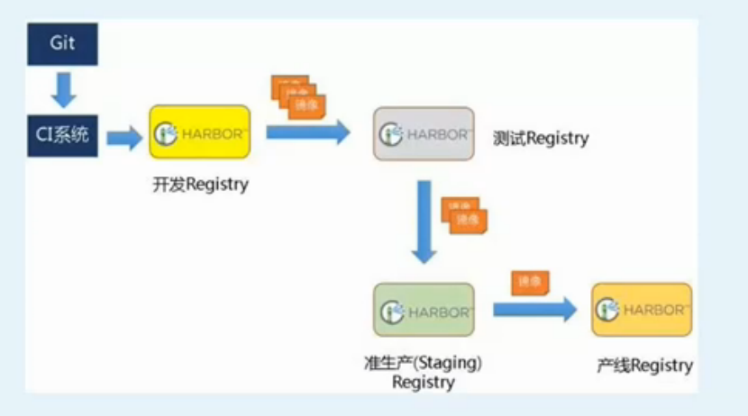

[root@nazeebodan softdb]# wget https://storage.googleapis.com/harbor-releases/harbor-offline-installer-v1.5.2.tgz


安装python-pip
yum install python-pip -y

安装docker-compose
```
[root@nazeebodan ~]# pip install docker-compose
```

harbor默认是使用docker-compose作为编排工具


wget http://harbor.orientsoft.cn/harbor-v1.5.0/harbor-offline-installer-v1.5.0.tgz

```
[root@nazeebodan softdb]# ls
harbor  harbor-offline-installer-v1.5.0.tgz
[root@nazeebodan softdb]# cd harbor
[root@nazeebodan harbor]# ls
common  docker-compose.clair.yml  docker-compose.notary.yml  docker-compose.yml  ha  harbor.cfg  harbor.v1.5.0.tar.gz  install.sh  LICENSE  NOTICE  prepare
[root@nazeebodan harbor]# ll
total 854972
drwxr-xr-x 3 root root      4096 Jul 26 11:33 common
-rw-r--r-- 1 root root      1185 May  2 23:34 docker-compose.clair.yml
-rw-r--r-- 1 root root      1725 May  2 23:34 docker-compose.notary.yml
-rw-r--r-- 1 root root      3596 May  2 23:34 docker-compose.yml
drwxr-xr-x 3 root root      4096 May  2 23:34 ha
-rw-r--r-- 1 root root      6687 May  2 23:34 harbor.cfg
-rw-r--r-- 1 root root 875401338 May  2 23:36 harbor.v1.5.0.tar.gz
-rwxr-xr-x 1 root root      5773 May  2 23:34 install.sh
-rw-r--r-- 1 root root     10771 May  2 23:34 LICENSE
-rw-r--r-- 1 root root       482 May  2 23:34 NOTICE
-rwxr-xr-x 1 root root     27379 May  2 23:34 prepare

```

修改配置文件，主要是修改了主机名和密码

安装
```
[root@nazeebodan harbor]# sh install.sh 

[Step 0]: checking installation environment ...

Note: docker version: 18.06.0

Note: docker-compose version: 1.22.0

[Step 1]: loading Harbor images ...
52ef9064d2e4: Loading layer [==================================================>]  135.9MB/135.9MB
c169f7c7a5ff: Loading layer [==================================================>]  154.2MB/154.2MB
a2194b3a5434: Loading layer [==================================================>]  10.75MB/10.75MB
f3809b773329: Loading layer [==================================================>]  2.048kB/2.048kB
bdd2cd4d5394: Loading layer [==================================================>]  48.13kB/48.13kB
bce61638a813: Loading layer [==================================================>]   10.8MB/10.8MB
Loaded image: vmware/clair-photon:v2.0.1-v1.5.0
0bf5fb4e60f4: Loading layer [==================================================>]     95MB/95MB
9fc876f7ef97: Loading layer [==================================================>]  6.656kB/6.656kB
9f364ae08e7f: Loading layer [==================================================>]  2.048kB/2.048kB
d8e3574f27f2: Loading layer [==================================================>]   7.68kB/7.68kB
Loaded image: vmware/postgresql-photon:v1.5.0
8cb812a02f44: Loading layer [==================================================>]  23.25MB/23.25MB
826629c35871: Loading layer [==================================================>]  15.36MB/15.36MB
68fc630fcd08: Loading layer [==================================================>]  15.36MB/15.36MB
Loaded image: vmware/harbor-adminserver:v1.5.0
fd8233cdfcf0: Loading layer [==================================================>]  23.25MB/23.25MB
7ab0310b3d9d: Loading layer [==================================================>]   2.56kB/2.56kB
75609935cf31: Loading layer [==================================================>]   2.56kB/2.56kB
654b65c0f8ff: Loading layer [==================================================>]  2.048kB/2.048kB
1da5c77da464: Loading layer [==================================================>]   22.8MB/22.8MB
5e9191f65a4c: Loading layer [==================================================>]   22.8MB/22.8MB
Loaded image: vmware/registry-photon:v2.6.2-v1.5.0
Loaded image: vmware/photon:1.0
454c81edbd3b: Loading layer [==================================================>]  135.2MB/135.2MB
e99db1275091: Loading layer [==================================================>]  395.4MB/395.4MB
051e4ee23882: Loading layer [==================================================>]  9.216kB/9.216kB
6cca4437b6f6: Loading layer [==================================================>]  9.216kB/9.216kB
1d48fc08c8bc: Loading layer [==================================================>]   7.68kB/7.68kB
0419724fd942: Loading layer [==================================================>]  1.536kB/1.536kB
543c0c1ee18d: Loading layer [==================================================>]  655.2MB/655.2MB
4190aa7e89b8: Loading layer [==================================================>]  103.9kB/103.9kB
Loaded image: vmware/harbor-migrator:v1.5.0
1736beaf11c8: Loading layer [==================================================>]  23.25MB/23.25MB
3026403c0282: Loading layer [==================================================>]  24.39MB/24.39MB
1aaf4a794824: Loading layer [==================================================>]  7.168kB/7.168kB
b427e1a2dd17: Loading layer [==================================================>]  10.56MB/10.56MB
68906d88fd96: Loading layer [==================================================>]  24.38MB/24.38MB
Loaded image: vmware/harbor-ui:v1.5.0
cf8fe5c86f4b: Loading layer [==================================================>]  78.26MB/78.26MB
d15d127e6aa2: Loading layer [==================================================>]  3.072kB/3.072kB
9d47dbd3d824: Loading layer [==================================================>]   59.9kB/59.9kB
098c90ca59f4: Loading layer [==================================================>]  61.95kB/61.95kB
Loaded image: vmware/redis-photon:v1.5.0
71a9f645bc2d: Loading layer [==================================================>]  4.755MB/4.755MB
Loaded image: vmware/nginx-photon:v1.5.0
c4c015394057: Loading layer [==================================================>]  401.3MB/401.3MB
f9d78b9c2c97: Loading layer [==================================================>]  9.216kB/9.216kB
5cf7df688ef1: Loading layer [==================================================>]  9.216kB/9.216kB
9513efb6efc9: Loading layer [==================================================>]   7.68kB/7.68kB
52252ffb5fc7: Loading layer [==================================================>]  1.536kB/1.536kB
Loaded image: vmware/mariadb-photon:v1.5.0
243e37f674cb: Loading layer [==================================================>]  23.25MB/23.25MB
eb85e1888b13: Loading layer [==================================================>]  10.95MB/10.95MB
7b86ea27af2e: Loading layer [==================================================>]   17.3MB/17.3MB
a876e7e90459: Loading layer [==================================================>]  15.87kB/15.87kB
08c705395182: Loading layer [==================================================>]  3.072kB/3.072kB
2cb9ada082da: Loading layer [==================================================>]  28.24MB/28.24MB
Loaded image: vmware/notary-signer-photon:v0.5.1-v1.5.0
b9abce7219b5: Loading layer [==================================================>]  73.15MB/73.15MB
ee87a4f06084: Loading layer [==================================================>]  3.584kB/3.584kB
ca647be60b60: Loading layer [==================================================>]  3.072kB/3.072kB
aeb4260dd4ca: Loading layer [==================================================>]  4.096kB/4.096kB
4493e8c270cf: Loading layer [==================================================>]  3.584kB/3.584kB
ce532e45f1e6: Loading layer [==================================================>]  9.728kB/9.728kB
Loaded image: vmware/harbor-log:v1.5.0
4de8028cebd0: Loading layer [==================================================>]  11.78kB/11.78kB
b762605dfab6: Loading layer [==================================================>]   2.56kB/2.56kB
bed1e891c86f: Loading layer [==================================================>]  3.072kB/3.072kB
Loaded image: vmware/harbor-db:v1.5.0
820ecb80c0fa: Loading layer [==================================================>]  23.25MB/23.25MB
43ece8a3b461: Loading layer [==================================================>]   20.9MB/20.9MB
e7ac4a143f8d: Loading layer [==================================================>]   20.9MB/20.9MB
Loaded image: vmware/harbor-jobservice:v1.5.0
6ae72c7ad4ac: Loading layer [==================================================>]  12.16MB/12.16MB
1ad34ba80481: Loading layer [==================================================>]   17.3MB/17.3MB
f6ae3aed7f00: Loading layer [==================================================>]  15.87kB/15.87kB
1b77c5882538: Loading layer [==================================================>]  3.072kB/3.072kB
6364681eec7e: Loading layer [==================================================>]  29.46MB/29.46MB
Loaded image: vmware/notary-server-photon:v0.5.1-v1.5.0


[Step 2]: preparing environment ...
Generated and saved secret to file: /data/secretkey
Generated configuration file: ./common/config/nginx/nginx.conf
Generated configuration file: ./common/config/adminserver/env
Generated configuration file: ./common/config/ui/env
Generated configuration file: ./common/config/registry/config.yml
Generated configuration file: ./common/config/db/env
Generated configuration file: ./common/config/jobservice/env
Generated configuration file: ./common/config/jobservice/config.yml
Generated configuration file: ./common/config/log/logrotate.conf
Generated configuration file: ./common/config/jobservice/config.yml
Generated configuration file: ./common/config/ui/app.conf
Generated certificate, key file: ./common/config/ui/private_key.pem, cert file: ./common/config/registry/root.crt
The configuration files are ready, please use docker-compose to start the service.


[Step 3]: checking existing instance of Harbor ...


[Step 4]: starting Harbor ...
Creating network "harbor_harbor" with the default driver
Creating harbor-log ... done
Creating registry           ... done
Creating harbor-adminserver ... done
Creating harbor-db          ... done
Creating redis              ... done
Creating harbor-ui          ... done
Creating nginx              ... done
Creating harbor-jobservice  ... done

✔ ----Harbor has been installed and started successfully.----

Now you should be able to visit the admin portal at http://nazeebo. 
For more details, please visit https://github.com/vmware/harbor .

[root@nazeebodan harbor]# 
```

过了一段时间后，安装成功，可以通过docker-compose命令来查询引入了哪些镜像
```
[root@nazeebodan harbor]# docker-compose ps
       Name                     Command                  State                                    Ports                              
-------------------------------------------------------------------------------------------------------------------------------------
harbor-adminserver   /harbor/start.sh                 Up (healthy)                                                                   
harbor-db            /usr/local/bin/docker-entr ...   Up (healthy)   3306/tcp                                                        
harbor-jobservice    /harbor/start.sh                 Up                                                                             
harbor-log           /bin/sh -c /usr/local/bin/ ...   Up (healthy)   127.0.0.1:1514->10514/tcp                                       
harbor-ui            /harbor/start.sh                 Up (healthy)                                                                   
nginx                nginx -g daemon off;             Up (healthy)   0.0.0.0:443->443/tcp, 0.0.0.0:4443->4443/tcp, 0.0.0.0:80->80/tcp
redis                docker-entrypoint.sh redis ...   Up             6379/tcp                                                        
registry             /entrypoint.sh serve /etc/ ...   Up (healthy)   5000/tcp                                                        
[root@nazeebodan harbor]# 
```

访问：


