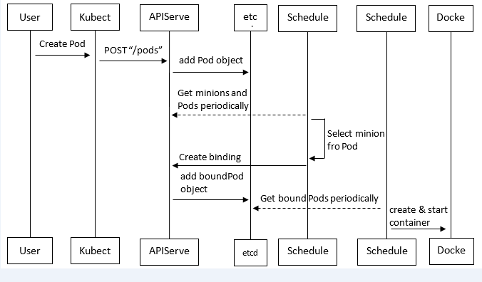

## Kubernetes中pod创建流程
Pod是Kubernetes中最基本的部署调度单元，可以包含container，逻辑上表示某种应用的一个实例。例如一个web站点应用由前端、后端及数据库构建而成，这三个组件将运行在各自的容器中，那么我们可以创建包含三个container的pod。\

具体的创建步骤包括：
1. 客户端提交创建请求，可以通过API Server的Restful API，也可以使用kubectl命令行工具。支持的数据类型包括JSON和YAML。
2. API Server处理用户请求，存储Pod数据到etcd。
3. 调度器通过API Server查看未绑定的Pod。尝试为Pod分配主机。
4. 过滤主机 (调度预选)：调度器用一组规则过滤掉不符合要求的主机。比如Pod指定了所需要的资源量，那么可用资源比Pod需要的资源量少的主机会被过滤掉。
5. 主机打分(调度优选)：对第一步筛选出的符合要求的主机进行打分，在主机打分阶段，调度器会考虑一些整体优化策略，比如把容一个Replication Controller的副本分布到不同的主机上，使用最低负载的主机等。
6. 选择主机：选择打分最高的主机，进行binding操作，结果存储到etcd中。
7. kubelet根据调度结果执行Pod创建操作： 绑定成功后，scheduler会调用APIServer的API在etcd中创建一个boundpod对象，描述在一个工作节点上绑定运行的所有pod信息。运行在每个工作节点上的kubelet也会定期与etcd同步boundpod信息，一旦发现应该在该工作节点上运行的boundpod对象没有更新，则调用Docker API创建并启动pod内的容器。