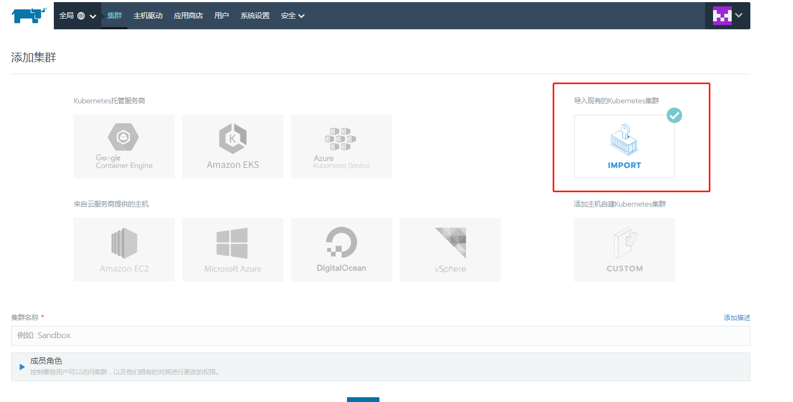
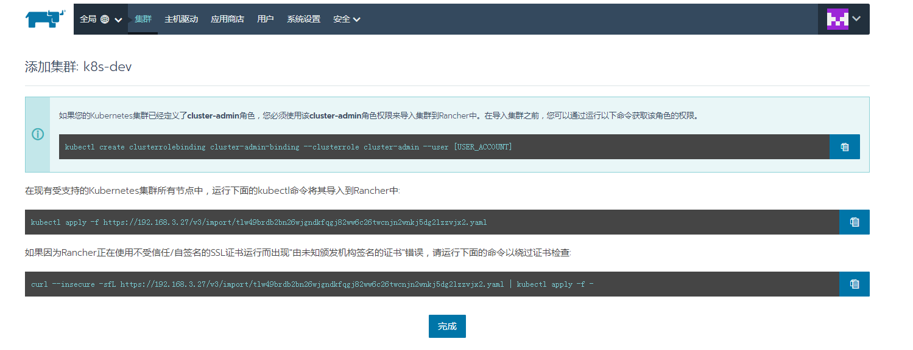
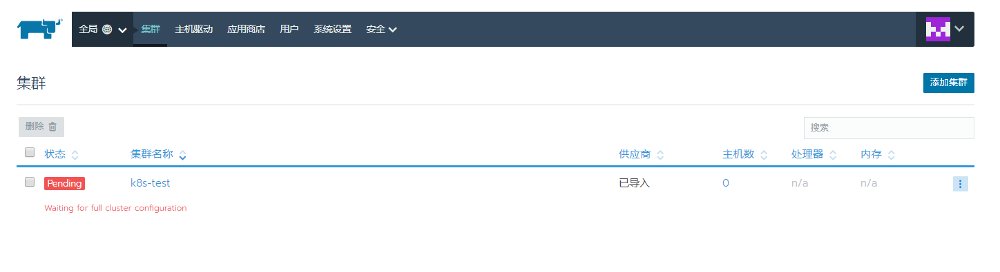
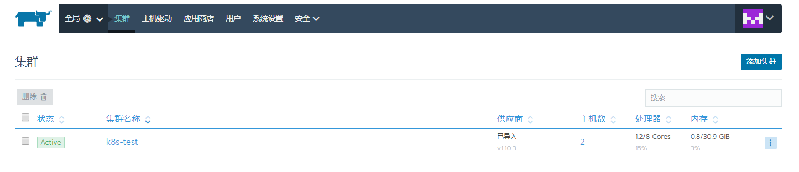
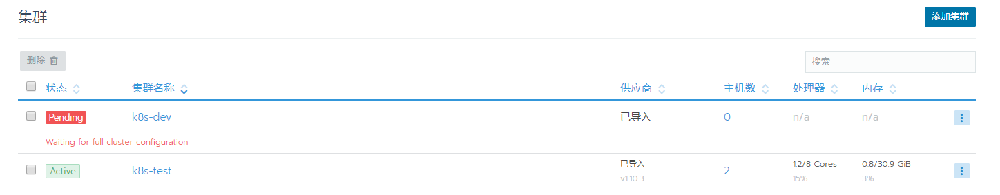
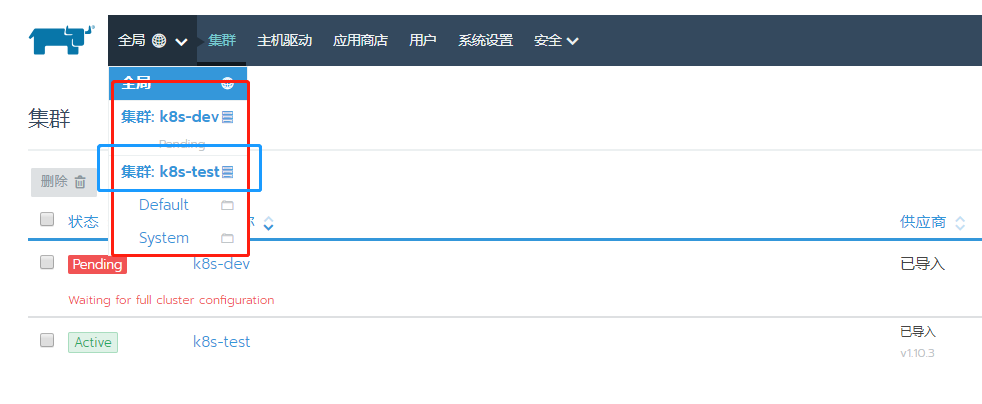
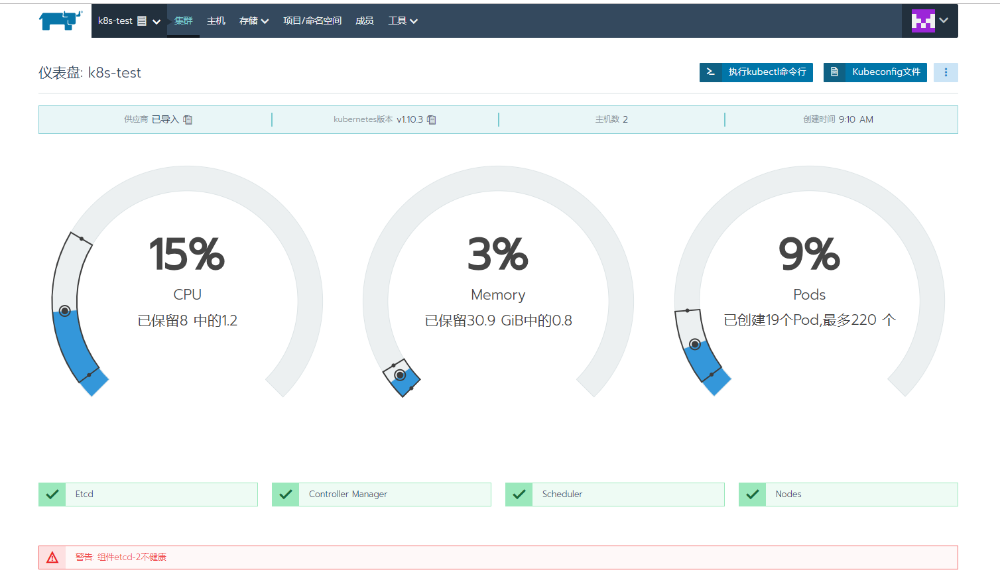
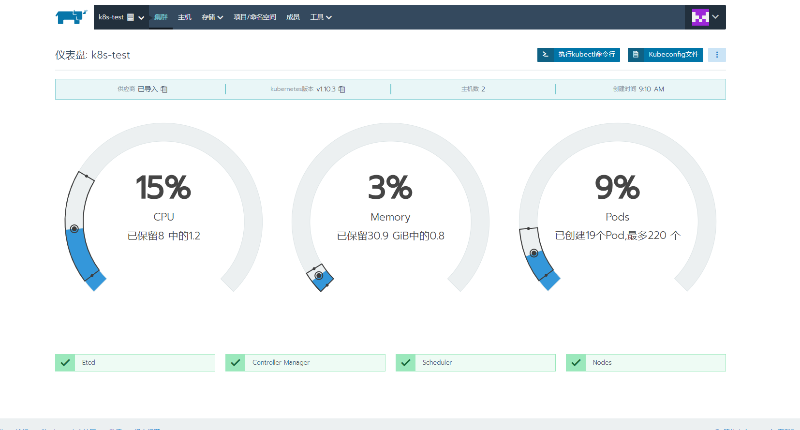

## 导入已有的集群





### 创建角色
```
# kubectl create clusterrolebinding cluster-admin-binding --clusterrole cluster-admin --user [USER_ACCOUNT]
Error from server (AlreadyExists): clusterrolebindings.rbac.authorization.k8s.io "cluster-admin-binding" already exists
```

### 在每个node节点上执行
```
[root@node1 ~]# curl --insecure -sfL https://192.168.3.27/v3/import/74gqt8ksjkv4fwjj67x24zs69d59mxpsddbs4b8g4frh7tgmcj9pcg.yaml | kubectl apply -f -
namespace "cattle-system" configured
serviceaccount "cattle" unchanged
clusterrolebinding.rbac.authorization.k8s.io "cattle-admin-binding" configured
secret "cattle-credentials-c9e9c9a" created
clusterrole.rbac.authorization.k8s.io "cattle-admin" configured
deployment.extensions "cattle-cluster-agent" created
daemonset.extensions "cattle-node-agent" created
```

### 正确导入后的状态
执行完成后，就是`pengding`的状态，过一会儿后就是`active`的状态了,说明已经正确导入了.









## 进去到某个集群中








在这儿发现有个etcd的报错
去查询etcd的状态
```
[root@master ~]#  etcdctl --endpoints=https://192.168.3.27:2379,https://192.168.3.28:2379,https://192.168.3.3:2379 \
>   --ca-file=/opt/kubernetes/ssl/ca.pem \
>   --cert-file=/opt/kubernetes/ssl/etcd.pem \
>   --key-file=/opt/kubernetes/ssl/etcd-key.pem cluster-health
member 2df8ed452a15b52f is healthy: got healthy result from https://192.168.3.28:2379
failed to check the health of member c569b5ea1d5fd6b2 on https://192.168.3.3:2379: Get https://192.168.3.3:2379/health: dial tcp 192.168.3.3:2379: getsockopt: connection refused
member c569b5ea1d5fd6b2 is unreachable: [https://192.168.3.3:2379] are all unreachable
member d4a4a6a1a95915b1 is healthy: got healthy result from https://192.168.3.27:2379
cluster is degraded
```

发现192.168.3.3上的etcd的状态不对
去.3上发现etcd没有启动起来,重启etcd
```
[root@node2 ~]# ps -ef | grep etcd
root     18233 18163  0 11:48 pts/2    00:00:00 grep --color=auto etcd
root     19228     1  0 Dec24 ?        00:00:33 /opt/kubernetes/bin/flanneld -etcd-endpoints=https://192.168.3.27:2379,https://192.168.3.28:2379,https://192.168.3.3:2379 -etcd-prefix=/coreos.com/network --etcd-cafile=/opt/kubernetes/ssl/ca.pem --etcd certfile=/opt/kubernetes/ssl/flanneld.pem --etcd-keyfile=/opt/kubernetes/ssl/flanneld-key.pem
[root@node2 ~]# systemctl start etcd
```

,再次检查状态,就OK了.
```
[root@master ~]#  etcdctl --endpoints=https://192.168.3.27:2379,https://192.168.3.28:2379,https://192.168.3.3:2379   --ca-file=/opt/kubernetes/ssl/ca.pem   --cert-file=/opt/kubernetes/ssl/e
tcd.pem   --key-file=/opt/kubernetes/ssl/etcd-key.pem cluster-healthmember 2df8ed452a15b52f is healthy: got healthy result from https://192.168.3.28:2379
member c569b5ea1d5fd6b2 is healthy: got healthy result from https://192.168.3.3:2379
member d4a4a6a1a95915b1 is healthy: got healthy result from https://192.168.3.27:2379
```



