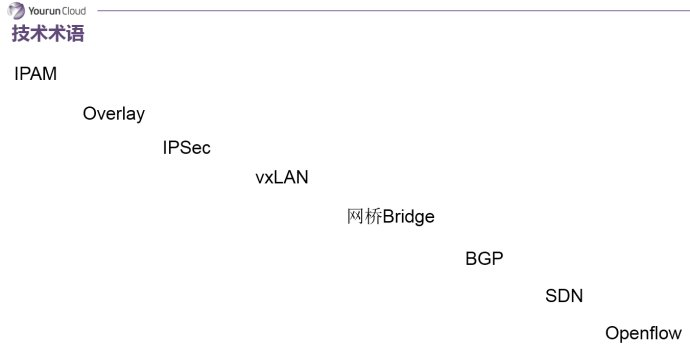
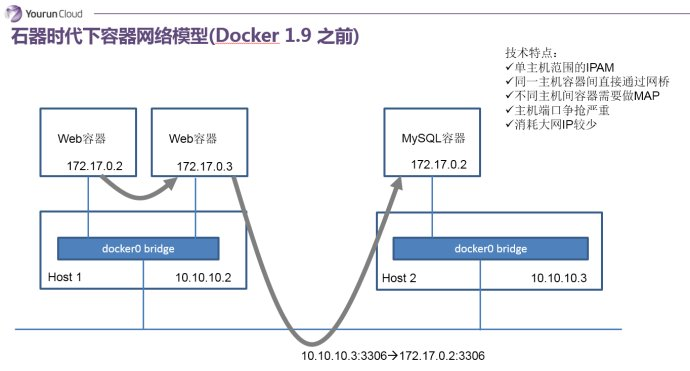
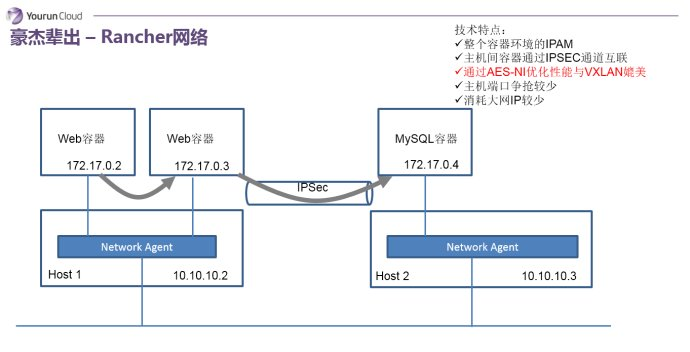
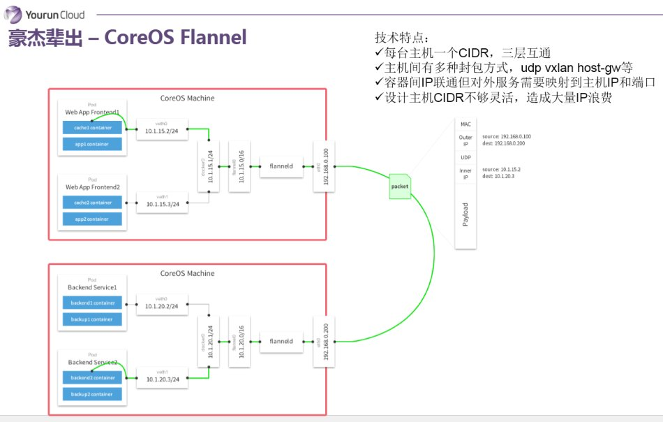
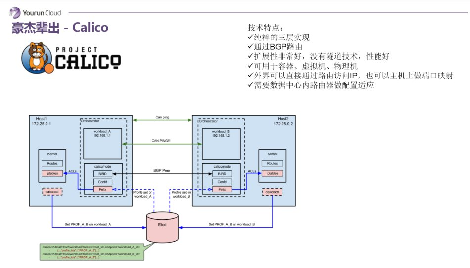
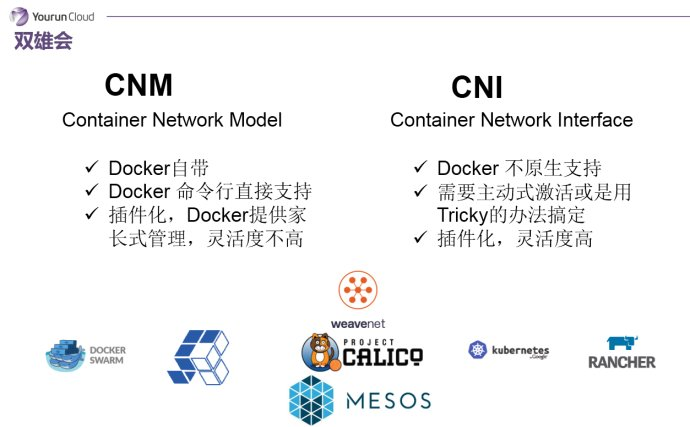

## 容器网络发展经历了三个阶段

第一个阶段是“石器时代”，最早的容器网络模型，就是主机内部的网络，想要把服务暴露出去需要做端口映射，非常原始古老。例如一个主机内有很多Apache容器，每一个Apache要往外抛80的端口，那我怎么办？我需要针对第一个容器和主机80端口做映射，第二个和主机81端口做映射，依此类推，到最后发现非常混乱，没办法管理。这个东西石器时代的网络模型，基本上没办法被企业采用。

 

后来进化到下一个阶段，我们称之为豪杰辈出的解决方案，非常优秀的比如Rancher基于IPSec的网络实现，比如Flannel基于三层路由的网络实现，包括我们国内也有一些开源项目都在做，后续展开详谈。

 

时至今日，容器网络出现了双雄会的格局。一个以Docker领导的和开发的CNM架构，另一个以Google、Kubernetes、CoreOS主导开发的CNI架构。两家各立山头，剩下群雄们自己选择。

## 几个技术术语解释

### IPAM
IP地址管理；这个IP地址管理并不是容器所特有的，传统的网络比如说DHCP其实也是一种IPAM，到了容器时代我们谈IPAM，主流的两种方法： 基于CIDR的IP地址段分配地或者精确为每一个容器分配IP。但总之一旦形成一个容器主机集群之后，上面的容器都要给它分配一个全局唯一的IP地址，这就涉及到IPAM的话题。

### Overlay
在现有二层或三层网络之上再构建起来一个独立的网络，这个网络通常会有自己独立的IP地址空间、交换或者路由的实现
 
### IPSesc
一个点对点的一个加密通信协议，一般会用到Ovrelay网络的数据通道里。

### vxLAN
由VMware、Cisco、RedHat等联合提出的这么一个解决方案，这个解决方案最主要是解决VLAN支持虚拟网络数量（4096）过少的问题。因为在公有云上每一个租户都有不同的VPC，4096明显不够用。就有了vxLAN，它可以支持1600万个虚拟网络，基本上公有云是够用的。

### 网桥Bridge
连接两个对等网络之间的网络设备，但在今天的语境里指的是Linux Bridge，就是大名鼎鼎的Docker0这个网桥。

### BGP
主干网自治网络的路由协议，今天有了互联网，互联网由很多小的自治网络构成的，自治网络之间的三层路由是由BGP实现的。

### SDN、Openflow
软件定义网络里面的一个术语，比如说我们经常听到的流表、控制平面，或者转发平面都是Openflow里的术语。

石器时代下的网络模型

这是石器时代网络模型，我简单说一下。它是Docker1.9之前的容器网络，实现方式是只针对单台主机进行IPAM管理，所有主机上的容器都会连接到主机内部的一个Linux Bridge，叫Docker0，主机的IP它默认会分配172.17网段中的一个IP，因为有Docker0，所以在一个主机上的容器可以实现互联互通。但是因为IP分配的范围是基于单主机的，所以你会发现在其他主机上，也会出现完全相同的IP地址。很明显，这两个地址肯定没办法直接通信。为了解决这个问题，在石器时代我们会用端口映射，实际上就是NAT的方法。比如说我有一个应用，它有Web和Mysql，分别在不同的主机上，Web需要去访问Mysql，我们会把这个Mysql的3306端口映射到主机上的3306这个端口，然后这个服务实际上是去访问主机IP 10.10.10.3 的3306端口，这是过去的石器时代的一个做法。
 

总结一下它的典型技术特征：基于单主机的IPAM；主机之内容器通讯实际上通过一个docker0的Linux Bridge；如果服务想要暴露到外部的话需要做NAT，会导致端口争抢非常严重；当然它有一个好处，对大网IP消耗比较少。这是石器时代。

## Rancher网络

下面进入到豪杰辈出的年代，第一个想讲的是Rancher。在石器蛮荒那个年代，Rancher网络解决方案非常让人眼前一亮。它需要解决两个大的问题：第一分配一个全局唯一的IP地址，第二要实现容器跨主机的通信。首先从第一点它有一个集中数据库，通过数据库协调，为资源池中的每一个容器分配一个独立的IP地址。第二如何实现容器跨主机的通信，是在每一个主机内部会放一个Agent容器，所有容器都会连接到本机的Agent容器上，这个Agent其实就是一个转发器，由它负责将数据包封装并路由到指定的其他主机。比如说172.17.0.3访问到这个172.17.0.4的时候，首先172.17.0.3容器会把数据包丢到本机的Agent，Agent根据内部的元数据，得知172.17.0.4在其他主机上，那么Agent会把数据包封装为IPSec包，通过IPSec发送到对端主机。当对端主机收到IPSec包后，执行解包操作，再发给本机上对应的容器。这个方法实现的很干净很简单，但它有一个大的问题，就是IPSec的通信问题，它很重，效率比较低。依据Rancher的说法，这个问题貌似也没有想象中那么夸张，在Intel的CPU里有一种协处理器，能够处理AES-NI指令，Linux  Kernel的IPSec实现能够使用AES-NI指令来加速IPSec效率，基于此据说IPSec协议可以和VXLAN相媲美。
Rancher网络的特点： 它是全局的IPAM，保证容器IP地址全局唯一；主机通信使用IPSEC；主机端口争抢不会太严重，应用通信不会占用主机端口，但是如果你的服务想要最终暴露出来，你还是要映射到主机上；这就是Rancher，它非常简单非常干净，就像Rancher自身一样开箱即用。

### Flannel

再来看一个网络实现叫Flannel，Flannel是由CoreOS主导并被使用到Kuberenates里。Flannel同样需要解决IP地址分配和跨主机通信两个问题。地址分配的问题，它使用的是CIDR的方式——个人认为并非很聪明的方法——就是为每个主机分配一个地址段，比如24位掩码的一个地址段，那就说明这个主机上可以支持254个容器，每一个主机都会分一个子网IP地址段，这是它解决IP地址分配的问题，这个地址段一旦分配给Docker Deamon之后，Docker Demon可以从中分配IP给容器。第二个问题如何实现跨主机的包交换，它采用的做法是通过三层路由：和传统的做法一样，所有的容器会被连接到Docker0，在Docker0和主机网卡之间被插入一个Flannel0的虚拟设备，这个虚拟设备为Flannel带来很大的灵活性——可以实现不同的封包、隧道协议，比如VXLAN，通过Flannel0设备将数据包封装为VxLan的UDP包。也就是说Flannel0是可以做协议适配的，这是Flonnel的特点，它的一个优势所在。

我再总结一下，Flannel它的每一个主机分配一个地址段，就是分配一个CIDR，然后主机之间可能会有多种封包方式，可以支持udp、vxlan、host-gw等，容器之间IP是可以互相连通的。但是如果一个容器要暴露服务，还是需要映射IP到主机侧的。另外，Flannel基于CIDR的设计比较愚蠢，会造成大量的IP地址浪费。

### Calico

下一个看Calico，它是比较年轻的项目，但是野心很大，可以用到虚拟机、物理机和容器环境中。Calico使用的协议是可能一般人都没有听说过的BGP协议，而且它是完全基于三层路由的，它没有二层的概念。所以你在Calico内部能看到大量的由Linux路由构造的路由表，路由表的变更是通过Calico自有的组件管理的。这种做法的好处在于，容器的IP可以直接对外部访问，可以直接分配到业务IP，而且如果网络设备支持BGP的话，可以用它实现大规模的容器网络。同时这种实现并没有使用隧道，没有NAT，导致没有性能的损耗，性能很好。所以我认为这个Calico从技术角度来讲是非常卓越的。但BGP带给它的好处的同时也带给他的劣势，就是BGP协议在企业内部很少被接受，企业网管不太愿意在跨网络的路由器上开启BGP协议——它的规模优势发挥不出来。这是Calico项目。

总结一下，我们会发现容器网络技术不外乎出自两个技术流派
第一个隧道技术，比如说Rancher的容器网络、Flannel的VXLAN模式。这个技术的特点是对底层的网络没有过高的要求，通常来说唯一的要求就是就是三层可达——你的主机只要是在一个三层可达网络里，就能给你构建出一个基于隧道的容器网络，对网络要求比较低。
但问题在于什么呢？一旦构建了Overlay的网络，目前企业已经构建的网络监控的价值，以及企业网络部门的管理职能就会降低很多，因为传统的网络设备根本看不到你在隧道里面跑了什么样的数据，也就无从监控和管理。同时我们知道所有的Oevrlay网络基本核心的实现点都在主机内部，而网络管的又不是主机，他们管的是下层网络，结果现在必须管一部分主机里的虚拟设备，而传统主机的管理应该是系统部，那么就会出现交叉管理，网络部和系统部出现权责不分的情况，导致很多客户不愿意使用隧道技术。

第二种技术是路由技术，路由技术好处在于很干净，没有NAT，效率比较高，和目前的网络能够融合在一起，每一个容器都可以像虚拟机一样分配一个业务的IP。大家可以用最自然最容易接受的方式使用容器，好像你就分配了一个新的虚拟机一样。但路由网络也有两个问题，一旦使用了路由网络对现有网络设备冲击非常大，现在做网络同志应该知道，路由器的路由表应该有空间限制——两三万条。如果一下子几万新的容器IP冲击到路由表里，导致下层的物理设备没办法承受；同时每一个容器都分配一个业务IP，你的业务IP很快消耗光了。一般大型的企业里IP分配是很有原则的，可能分配给容器平台项目的IP也就是几千个，或者一个段，没有办法让你在每一个容器里都分配一个IP。这就是路由和隧道技术，我们没有看到一个完美的技术，每一个都有优势也都有劣势。

双雄会阶段：

容器网络发展的第三阶段——双雄会的格局。双雄会其实指的就是Docker的CNM和Google、CoreOS、Kuberenates主导的CNI。首先明确一点，CNM和CNI并不是网络实现，他们是网络规范和网络体系，从研发的角度他们就是一堆接口，你底层是用Flannel也好、用Calico也好，他们并不关心，CNM和CNI关心的是网络管理的问题。

 

CNM是Docker自带的，可以通过Docker命令直接管理的网络模型。而CNI并不是Docker原生的，它是为容器技术设计的通用型网络接口。CNI接口从上往下调用是没有问题的，但从下往上支持不太可能，或者实现会非常Tricky，所以这个CNI很难没有办法在docker层面主动去激活。这两个模型全都是插件化的，你都可以去以插件的形式去插入具体的网络实现。这两个插件，CNM要更加家长式一些，灵活度没有那么高。而CNI由于要通用，灵活性相对就比较高了。这是这两个规范的基础特征。

他们搞了这两个标准之后，所有都要面临一个问题：我到底要支持哪个标准？现在各家支持的情况是这样的：Docker Swarm首先是站到了CNM这边，都是Docker公司的。有容云目前支持的是CNM，这样的选择并非技术上的原因，而是因为我们现在的平台也只支持Docker，我们尚没有支持Rocket，如果有一天支持除了Docker之外的容器技术，那么我们可能也会同时支持CNI。 Kubernetes当然支持CNI了。其他的如Calico、Weave、Mesos等属于两边都支持的情况。