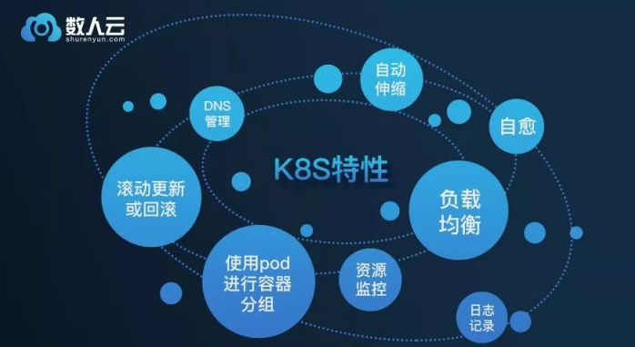
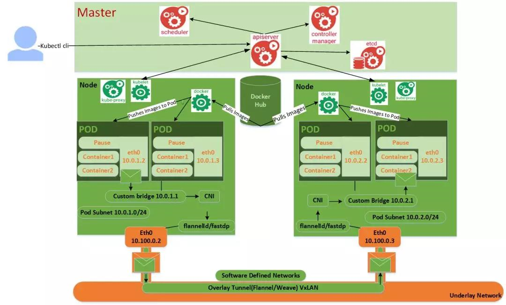

https://www.kubernetes.org.cn/3709.html

K8S提供的一些平台特性是:
使用pod进行容器分组
自愈
自动伸缩
DNS管理
负载均衡
滚动更新或回滚
资源监控和日志记录

Kubernetes的主节点组成部分是:
* API服务器（API Server）：用户通过Rest操作或kubectl cli与manifestyaml交互。它用于所有与API对象相关的操作，如pod创建，它是在etcd中存储所需状态的唯一组件。
* 调度器（Scheduler）：用户使用kubectl cli向API服务器发出一个命令来创建pod。在执行此操作之后，调度程序根据资源需求将pods分配给可用节点。
* 控制器管理器（Controller Manager）：控制器管理器基于集群状态对资源进行操作，并根据清单yaml进行更改，将当前状态应用程序达到所需状态。换句话说，控制器管理器可以将实际状态与所需的状态进行协调。在控制器管理器中有多个专用的控制器，以便简化集群管理。例如，节点控制器检查是否有当前正在运行的节点停机，并采取纠正措施，而复制控制器确保在节点中实际运行所需的pod数量。
* etcd：所有关于集群状态的配置信息都以key/value对的形式存储在etcd中，这个组件由CoreOS实现。这些状态显示了集群中包含的节点和需要在其中运行的pods。
* 插件（Addons）：为了将服务器DNS记录添加到Kubernetes，我们需要一个集群DNS 插件。该插件有助于扩展与Kubernetes集群或节点相关的功能。还有许多其他的插件，比如用于日志记录的fluntd、基于角色访问的rbac等等。

安装在Kubernetes节点中的组件是:
* Docker: Docker守护进程在每个节点中运行。如果容器镜像不存在，那么它将从docker注册中提取并运行。
* Kubelet: Kubelet节点代理定期检查容器内容器的健康状况。此外，它还确保按manifest安装卷，并下载运行容器所需的敏感信息。它还将节点链接到API服务器。
* Kube-proxy: Kube-proxy在每个节点上运行，以便在pod中进行负载分配，并为外部主机提供可用的服务。它使用iptable规则或轮询调度来将请求转发到正确的容器。

Kubernetes通过以下任一种方式实现从Pod到Pod的联网:
1)第2层(切换解决方案)2)第3层(桥接解决方案)3) overlay解决方案(weave andflannel)
它们允许在集群中进行Pod和Pod之间的通信，并为每个Pod提供唯一的IP地址。

k8s的关键特性：
Pod: Collection of Containers容器集