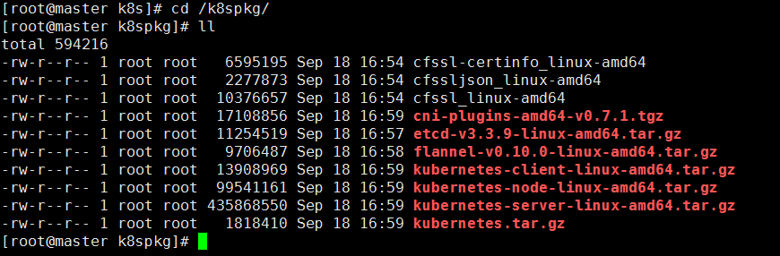

[TOC]

* * * * *
# 一、基础环境配置
## 1.配置ssh

基础环境介绍：
| 主机名   | ip   | 角色   |
| --- | --- | --- |
|   master | 172.18.53.221    | master   |
|   node1 | 172.18.53.223   |  node1  |
|   node2 |  172.18.53.224  |  node2  |

配置方法：
```
首先保证安装了包：openssh openssh-client 

使用方法：
ssh-keygen -t rsa
ssh-copy-id master   
ssh-copy-id node1
ssh-copy-id node2
```
## 2.安装docker（只需要在node节点安装）
获取阿里的docker repo
```
cd /etc/yum.repos.d/
wget https://mirrors.aliyun.com/docker-ce/linux/centos/docker-ce.repo
 ```
 用yum进行安装
 ```
yum install -y docker-ce
...
Complete!
 ```

如果中途出问题的解决方法
```
Error: Package: docker-ce-18.03.1.ce-1.el7.centos.x86_64 (docker-ce-edge)
           Requires: container-selinux >= 2.9
 You could try using --skip-broken to work around the problem
 You could try running: rpm -Va --nofiles --nodigest
----------------------------------------------------------------------------------------------------------------

container-selinux >= 2.9 

这个报错是container-selinux版本低或者是没安装的原因

yum 安装container-selinux 一般的yum源又找不到这个包
需要安装epel源 才能yum安装container-selinux，然后在安装docker-ce就可以了。

wget -O /etc/yum.repos.d/CentOS-Base.repo http://mirrors.aliyun.com/repo/Centos-7.repo  

yum install epel-release   #阿里云上的epel源
然后yum install container-selinux

```
显示docker相关镜像的命令
```
yum list docker-ce.x86_64 --showduplicates | sort -r
```
 
## 3.准备部署的目录
```
mkdir -p /etc/kubernetes/{cfg,bin,ssl,log}
```
在这儿做一个约定：所有的文件存放路径如下：
* cfg：存放配置文件
* bin：存放二进制文件
* ssl：存放证书
* log：存放日志
* 所有的二进制包放在目录 `/usr/local/src/` 

例如：`cfssl`和`kubernetes`的执行文件都放在 `/etc/kubernetes/bin`目录下

## 4.准备软件包
### k8s组件(本次安装以1.11.3为基线)有4个包：
https://github.com/kubernetes/kubernetes/blob/master/CHANGELOG-1.11.md

```
[root@master k8s]# ls -l kube*
-rw-r--r-- 1 root root  13908969 Sep 18 13:52 kubernetes-client-linux-amd64.tar.gz
-rw-r--r-- 1 root root  99541161 Sep 18 13:52 kubernetes-node-linux-amd64.tar.gz
-rw-r--r-- 1 root root 435868550 Sep 18 13:52 kubernetes-server-linux-amd64.tar.gz
-rw-r--r-- 1 root root   1818410 Sep 18 13:52 kubernetes.tar.gz
```

### etcd
https://github.com/etcd-io/etcd/releases

### flannel
https://github.com/coreos/flannel/releases

### cni插件
cni-plugins-amd64-v0.7.1.tgz
https://github.com/containernetworking/plugins/releases
https://github.com/containernetworking/plugins/releases/download/v0.7.1/cni-plugins-amd64-v0.7.1.tgz

### cfssl的三个包
```
wget https://pkg.cfssl.org/R1.2/cfssl_linux-amd64
wget https://pkg.cfssl.org/R1.2/cfssljson_linux-amd64
wget https://pkg.cfssl.org/R1.2/cfssl-certinfo_linux-amd64
```


### 最后的准备的包应该如下：


## 5.解压kubernetes相应的几个包

```
[root@master k8spkg]# mv * /usr/local/src/
[root@master k8spkg]# cd /usr/local/src/
[root@master src]# pwd
/usr/local/src
[root@master src]# ll
total 594220
-rw-r--r-- 1 root root   6595195 Sep 18 16:54 cfssl-certinfo_linux-amd64
-rw-r--r-- 1 root root   2277873 Sep 18 16:54 cfssljson_linux-amd64
-rw-r--r-- 1 root root  10376657 Sep 18 16:54 cfssl_linux-amd64
-rw-r--r-- 1 root root  17108856 Sep 18 16:59 cni-plugins-amd64-v0.7.1.tgz
-rw-r--r-- 1 root root  11254519 Sep 18 16:57 etcd-v3.3.9-linux-amd64.tar.gz
-rw-r--r-- 1 root root   9706487 Sep 18 16:58 flannel-v0.10.0-linux-amd64.tar.gz
-rw-r--r-- 1 root root  13908969 Sep 18 16:59 kubernetes-client-linux-amd64.tar.gz
-rw-r--r-- 1 root root  99541161 Sep 18 16:59 kubernetes-node-linux-amd64.tar.gz
-rw-r--r-- 1 root root 435868550 Sep 18 16:59 kubernetes-server-linux-amd64.tar.gz
-rw-r--r-- 1 root root   1818410 Sep 18 16:59 kubernetes.tar.gz
[root@master src]# tar -zxf kubernetes.tar.gz 
[root@master src]# tar -zxf kubernetes-node-linux-amd64.tar.gz 
[root@master src]# tar -zxf kubernetes-server-linux-amd64.tar.gz 
[root@master src]# tar -zxf kubernetes-client-linux-amd64.tar.gz 
```

将执行文件copy到bin目录
```
[root@master src]# mv cfssl* /etc/kubernetes/bin
[root@master src]# cd  /etc/kubernetes/bin
[root@master bin]# 
[root@master bin]# ls
cfssl-certinfo_linux-amd64  cfssljson_linux-amd64  cfssl_linux-amd64
[root@master bin]# chmod +x *
[root@master bin]# mv cfssl-certinfo_linux-amd64 cfssl-certinfo
[root@master bin]# mv cfssljson_linux-amd64 cfssljson
[root@master bin]# mv cfssl_linux-amd64 cfssl
[root@master bin]# ll
total 18808
-rwxr-xr-x 1 root root 10376657 Sep 18 16:54 cfssl
-rwxr-xr-x 1 root root  6595195 Sep 18 16:54 cfssl-certinfo
-rwxr-xr-x 1 root root  2277873 Sep 18 16:54 cfssljson
```
