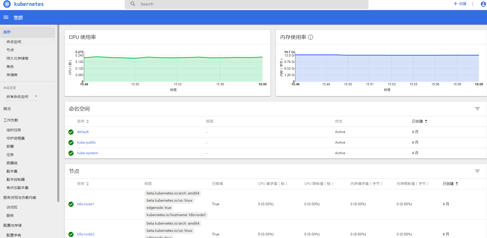
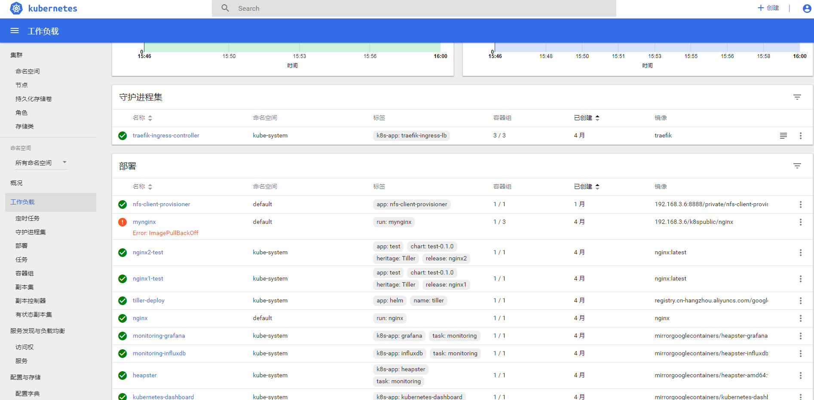
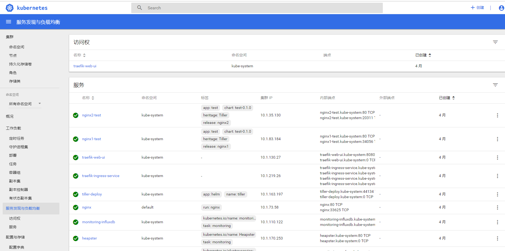
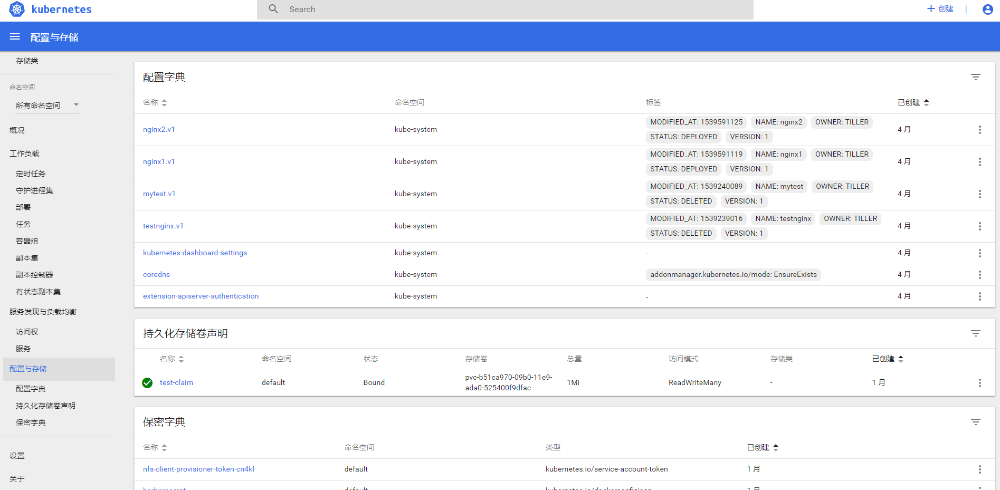

## 安装
要想使用 Dashboard，首先我们需要安装它，而 Dashboard 的安装其实也很简单。不过对于国内用户需要注意的是需要解决网络问题，或替换镜像地址等。

对于已经解决网络问题的用户：


## 访问Dashboard
```
# kubectl cluster-info
Kubernetes master is running at https://192.168.3.27:6443
CoreDNS is running at https://192.168.3.27:6443/api/v1/namespaces/kube-system/services/coredns:dns/proxy
kubernetes-dashboard is running at https://192.168.3.27:6443/api/v1/namespaces/kube-system/services/https:kubernetes-dashboard:/proxy
monitoring-grafana is running at https://192.168.3.27:6443/api/v1/namespaces/kube-system/services/monitoring-grafana/proxy

To further debug and diagnose cluster problems, use 'kubectl cluster-info dump'.
```
看这一行:
kubernetes-dashboard is running at https://192.168.3.27:6443/api/v1/namespaces/kube-system/services/https:kubernetes-dashboard:/proxy


用户名:admin  密码：admin 选择Token令牌模式登录。


## 获取Token
```
kubectl -n kube-system describe secret $(kubectl -n kube-system get secret | grep admin-user | awk '{print $1}')
```

登录后进入,可以看到:
概况:


集群:


workload:


服务发现与负载均衡:


配置与存储:



>PS:如果要换成英文显示,只需要设置浏览器的默认语言为英文即可


## 解决网络问题遇到的访问错误
通过浏览器进行dashboard的访问，跳转的时候报错：

```
Error: 'dial tcp 10.2.16.52:8443: getsockopt: connection timed out'
```

检查集群的相关信息：`depoloyment`,`service`,`pod`,`endpoint`都是正常的,如下：
```
[root@master ~]# kubectl get deploy,pod,svc,ep -n kube-system  -o wide | grep dash
deployment.extensions/kubernetes-dashboard   1         1         1            1           46d       kubernetes-dashboard   mirrorgooglecontainers/kubernetes-dashboard-amd64
:v1.8.3             k8s-app=kubernetes-dashboard
pod/kubernetes-dashboard-66c9d98865-wwst6   1/1       Running   0          46d       10.2.16.52     192.168.3.3

service/kubernetes-dashboard   NodePort    10.1.232.248   <none>        443:34939/TCP   46d       k8s-app=kubernetes-dashboard

endpoints/kubernetes-dashboard      10.2.16.52:8443                                         46d
```

接着检查关键的几个进程，最后发现是因为master节点的flannel没有启动起来，当启动起来后就可以正常进行访问了。同时，`kubectl top node` 这个命令也可以正常的执行了。


## 总结dashboard不能访问的排查步骤

- 1.需要检查apiserver的地址设置的是否正确（重启apiserver和kubenets）,然后就是flannel是否配置启动
- 2.配置Kubernetes网络，在master和nodes上都需要安装flannel 检查master和node上配置文件是否一致
- 3.检查iptables -L -n ，检查node节点上的FORWARD 查看转发是否是drop，如果是drop，则开启
- 4.如果是更高版本的网络，会用ipvs来代替iptables，那么就应该去查看ipvsadm的信息
