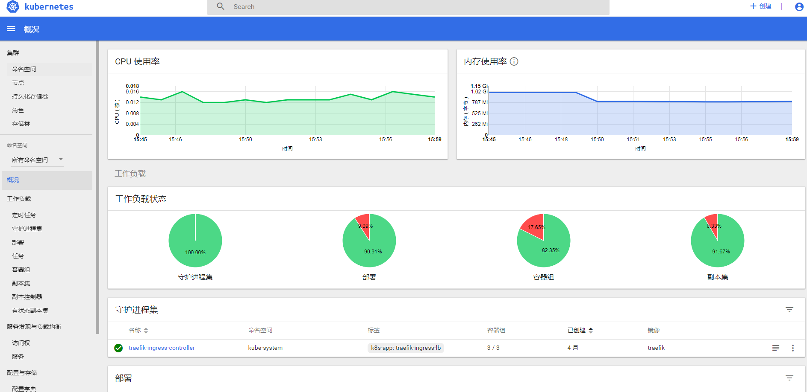
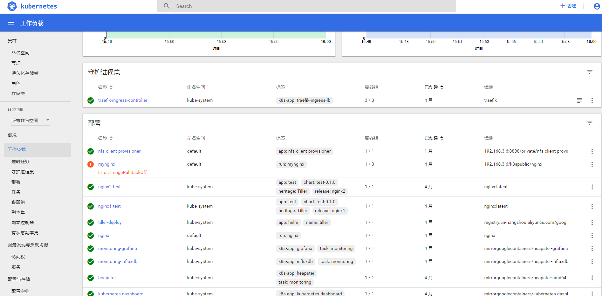
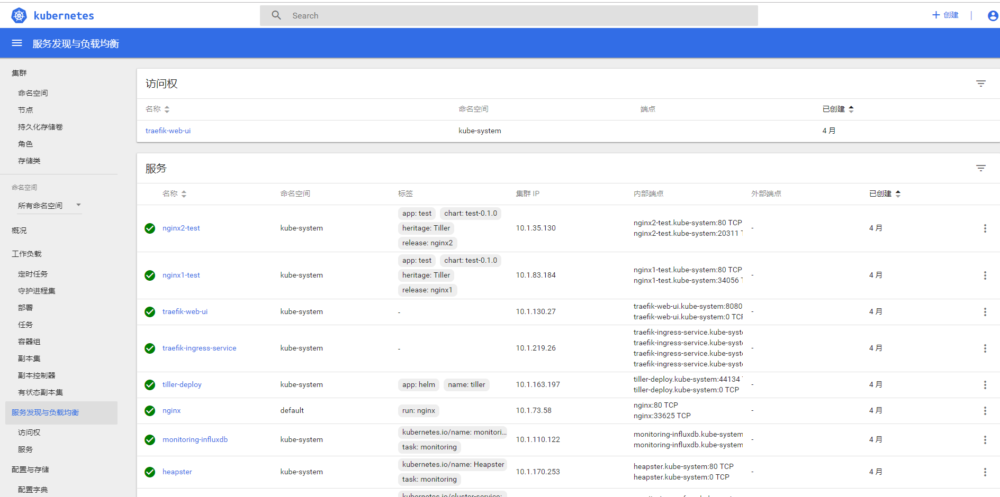
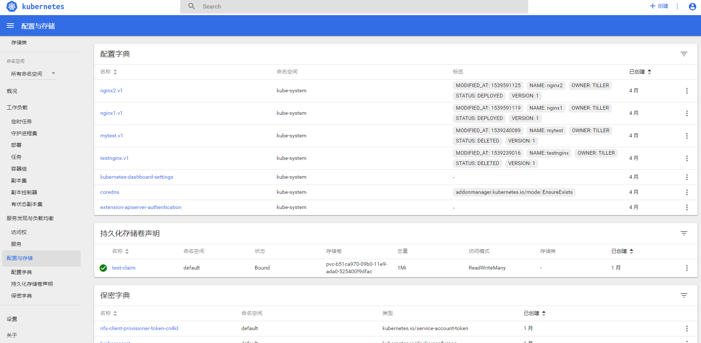

## 安装
要想使用 Dashboard，首先我们需要安装它，而 Dashboard 的安装其实也很简单。不过对于国内用户需要注意的是需要解决网络问题，或替换镜像地址等。

对于已经解决网络问题的用户：


## 访问Dashboard
```
# kubectl cluster-info
Kubernetes master is running at https://192.168.3.27:6443
CoreDNS is running at https://192.168.3.27:6443/api/v1/namespaces/kube-system/services/coredns:dns/proxy
kubernetes-dashboard is running at https://192.168.3.27:6443/api/v1/namespaces/kube-system/services/https:kubernetes-dashboard:/proxy
monitoring-grafana is running at https://192.168.3.27:6443/api/v1/namespaces/kube-system/services/monitoring-grafana/proxy

To further debug and diagnose cluster problems, use 'kubectl cluster-info dump'.
```
看这一行:
kubernetes-dashboard is running at https://192.168.3.27:6443/api/v1/namespaces/kube-system/services/https:kubernetes-dashboard:/proxy


用户名:admin  密码：admin 选择Token令牌模式登录。


## 获取Token
```
kubectl -n kube-system describe secret $(kubectl -n kube-system get secret | grep admin-user | awk '{print $1}')
```

登录后进入,可以看到:
概况:



集群:


workload:


服务发现与负载均衡:


配置与存储:



>PS:如果要换成英文显示,只需要设置浏览器的默认语言为英文即可
