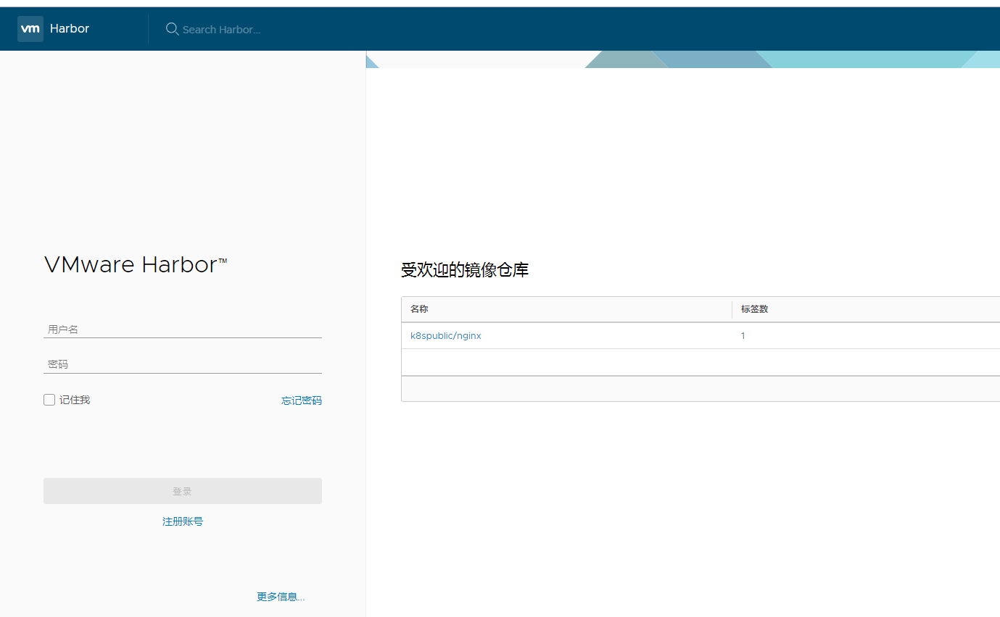
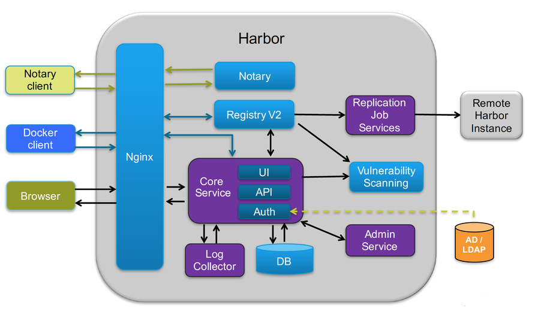

<!-- toc -->

>harbor的地址: https://github.com/vmware/harbor/releases


## 一、harbor的安装
安装harbor的步骤：
1. 下载安装docker-compose
2. 生成harbor的pem相关文件
3. 设置docker证书
4. 配置harcfg文件（修改密码，域名，协议[https]等）
5. 执行`install.sh` 进行安装
6. 进行验证

接下来，我将准备把harbor部署到`192.168.3.6`这个节点上。
### 1. 下载安装docker-compose
```
pip install docker-compose
wget https://github.com/docker/compose/releases/download/1.23.0-rc2/docker-compose-Linux-x86_64
chmod a+x docker-compose-Linux-x86_64
mv docker-compose-Linux-x86_64 /etc/kubernetes/bin/docker-compose
```
### 2. 生成harbor的pem相关文件
```
[root@k8s-master temp]# cat harbor-csr.jso
{
  "CN": "harbor",
  "hosts": [
    "127.0.0.1",
    "192.168.3.6"
  ],
  "key": {
    "algo": "rsa",
    "size": 2048
  },
  "names": [
    {
      "C": "CN",
      "ST": "BeiJing",
      "L": "BeiJing",
      "O": "k8s",
      "OU": "System"
    }
  ]
}
```

```
cfssl gencert -ca=/etc/kubernetes/ssl/ca.pem \
  -ca-key=/etc/kubernetes/ssl/ca-key.pem \
  -config=/etc/kubernetes/ssl/ca-config.json \
  -profile=kubernetes harbor-csr.json | cfssljson -bare harbor
```

```
[root@k8s-master temp]# ls -l ha*
-rw-r--r-- 1 root root 1050 Oct 15 14:51 harbor.csr
-rw-r--r-- 1 root root  258 Oct 15 14:49 harbor-csr.json
-rw------- 1 root root 1679 Oct 15 14:51 harbor-key.pem
-rw-r--r-- 1 root root 1419 Oct 15 14:51 harbor.pem
```

### 3.设置docker证书
这一步是在配置ssl访问才会有的，把ca.pem放在这个目录中
```
如果如下目录不存在，请创建，如果有域名请按此格式依次创建
mkdir -p /etc/docker/certs.d/192.168.3.6
# mkdir -p /etc/docker/certs.d/[IP2]
# mkdir -p /etc/docker/certs.d/[example1.com]

如果端口为443，则不需要指定。如果为自定义端口，请指定端口
# /etc/docker/certs.d/yourdomain.com:port

# 将ca根证书依次复制到上述创建的目录中
cp /etckubernetes/ssl/ca.pem /etc/docker/certs.d/192.168.3.6/
```
### 4. 配置harcfg文件（修改密码，域名，协议[https]等）
```
[root@k8s-master harbor]# pwd
/usr/local/src/harbor
[root@k8s-master harbor]# ll
total 854960
drwxr-xr-x 3 root root        23 Oct 15 14:53 common
-rw-r--r-- 1 root root      1185 May  2 23:34 docker-compose.clair.yml
-rw-r--r-- 1 root root      1725 May  2 23:34 docker-compose.notary.yml
-rw-r--r-- 1 root root      3596 May  2 23:34 docker-compose.yml
drwxr-xr-x 3 root root       156 May  2 23:34 ha
-rw-r--r-- 1 root root      6687 May  2 23:34 harbor.cfg
-rw-r--r-- 1 root root 875401338 May  2 23:36 harbor.v1.5.0.tar.gz
-rwxr-xr-x 1 root root      5773 May  2 23:34 install.sh
-rw-r--r-- 1 root root     10771 May  2 23:34 LICENSE
-rw-r--r-- 1 root root       482 May  2 23:34 NOTICE
-rwxr-xr-x 1 root root     27379 May  2 23:34 prepare
```
修改harbor.cfg中的配置信息，主要是修改密码，域名，协议[https]等

如果要改默认的端口80，那么要改2个地方：
1. harbor.cfg中的hostname=192.168.x.x:8888
2. docker-compose.yml 对应的ports
prepare
### 5.执行`install.sh`进行安装

```
[root@k8s-master harbor]# ./install.sh

[Step 0]: checking installation environment ...

Note: docker version: 18.06.1

Note: docker-compose version: 1.23.0

[Step 1]: loading Harbor images ...
...
[Step 2]: preparing environment ...
...
[Step 3]: checking existing instance of Harbor ...
...

[Step 4]: starting Harbor ...
Creating network "harbor_harbor" with the default driver
Creating harbor-log ... done
Creating registry           ... done
Creating redis              ... done
Creating harbor-adminserver ... done
Creating harbor-db          ... done
Creating harbor-ui          ... done
Creating harbor-jobservice  ... done
Creating nginx              ... done

✔ ----Harbor has been installed and started successfully.----

Now you should be able to visit the admin portal at http://192.168.3.6 .
For more details, please visit https://github.com/vmware/harbor .
```

### 6. 进行验证
首先进行login登录验证
发现有报错，如下：
```
[root@k8s-master mysql]# docker login 192.168.3.6
Username: admin
Password:
Error response from daemon: Get https://192.168.3.6/v2/: dial tcp 192.168.3
.6:443: connect: connection refused
```
原因是安装的时候使用的是http协议，所以需要改成https协议
先关闭harbor
```
[root@k8s-master harbor]# docker-compose down -v
```

vi harbor.cfg
修改`ui_url_protocol `为`https`
```
  #set ui_url_protocol
  ui_url_protocol = https
```
修改完后prepare，再启动harbor
```
[root@k8s-master harbor]# vim harbor.cfg
[root@k8s-master harbor]# ./prepare
[root@k8s-master harbor]# docker-compose up -d
Creating network "harbor_harbor" with the default driver
Creating harbor-log ... done
Creating redis              ... done
Creating harbor-adminserver ... done
Creating harbor-db          ... done
Creating registry           ... done
Creating harbor-ui          ... done
Creating nginx              ... done
Creating harbor-jobservice  ... done
```
再次登录，成功：
```
[root@k8s-master /]# docker login 192.168.3.6
Username: admin
Password:
WARNING! Your password will be stored unencrypted in /root/.docker/config.json.
Configure a credential helper to remove this warning. See
https://docs.docker.com/engine/reference/commandline/login/#credentials-store

Login Succeeded

```

> 注意：
> 登录成功后，认证信息自动保存到 ~/.docker/config.json 文件


```
[root@k8s-master 192.168.3.6]# cat ~/.docker/config.json
{
	"auths": {
		"192.168.3.6": {
			"auth": "YWRtaW46U3RhcioyMDE0"
		}
	},
	"HttpHeaders": {
		"User-Agent": "Docker-Client/18.06.1-ce (linux)"
	}
}
```

在其他节点同样登录，失败了！！！
```
[root@k8s-node3 ~]# docker login 192.168.3.6
Authenticating with existing credentials...
Login did not succeed, error: Error response from daemon: Get https://192.168.3.6/v2/: x509: certificate signed by unknown authority
Username (admin): admin
Password:
Error response from daemon: Get https://192.168.3.6/v2/: x509: certificate signed by unknown authority
```
这个应该是CA证书的问题，网上找了找方法没有解决到。

最终还是使用http协议作为非安全的方式进行访问 ：（ ，修改：
```
[root@k8s-node3~]#  vim /etc/docker/daemon.json
{
  "registry-mirrors": ["https://re0o947o.mirror.aliyuncs.com"],
  "insecure-registries":["192.168.3.6"]
}
```

使用ssl的方式留在后面来研究。。。。。。。。。。。。。。。。

通过web端进行登录：


## 二、harbor使用

### 1.harbor的业务架构
harbor的业务架构：用户->仓库，其中仓库又分为公共仓库和私有仓库
* 私有仓库需要登录才能有访问的权限
* 公共仓库直接可以进行访问

### 2.api访问的方式
#### http：
```
curl -u "admin:Star*2014" -X GET -H "Content-Type: application/json" "http://192.168.3.6/api/projects/k8spublic"
```

#### https：
```
curl -k --cert /etc/kubernetes/ssl/harbor.pem --key /etc/kubernetes/ssl/harbor-key.pem -X GET -H "Content-Type: application/json" "https://192.168.3.6/api/projects/k8spublic"
```

### 3.harbor的生命周期管理
可以使用docker-compose来管理Harbor的生命周期。在harbor的安装目录下，执行相关命令。

```
docker-compose ps  查看
docker-compose stop  停止
docker-compose start 启动
docker-compose down  删除，利用./install.sh可以重新安装
```

## 三、harbor与k8s结合
在docker环境下直接使用,分为三步:
```
docker login
docker tag
docker push
```

在k8s中使用harbor分为两种，一种是使用公共仓库的镜像，一种是使用私有仓库的镜像。
### 1.镜像创建的步骤
1. 创建用户
2. 创建项目
3. 将镜像打标签
    ```
    docker tag 192.168.3.6/k8spublic/nginx 192.168.3.6/k8sprivate/nginx
    ```
4. 将镜像push到仓库中去
    ```
    [root@k8s-master ~]# docker push 192.168.3.6/k8sprivate/nginx
    ```


拉取镜像对于公共仓库和私有仓库就有区别了：
### 2.公有仓库的镜像可以直接拉取
参考一个yaml文件的例子：
```
apiVersion: extensions/v1beta1
kind: Deployment
metadata:
  labels:
    run: mynginx
  name: mynginx
  namespace: default
spec:
  replicas: 3
  selector:
    matchLabels:
      run: mynginx
  template:
    metadata:
      labels:
        run: mynginx
    spec:
      containers:
      - image: 192.168.3.6/k8spublic/nginx
        imagePullPolicy: Always
        name: mynginx
        resources:
          requests:
            cpu: 100m
        terminationMessagePath: /dev/termination-log
        terminationMessagePolicy: File
      dnsPolicy: ClusterFirst
      restartPolicy: Always
      schedulerName: default-scheduler
      securityContext: {}
      terminationGracePeriodSeconds: 30
```
可以看到镜像是`192.168.3.6/k8spublic/nginx`，而这个镜像是属于共有仓库的，所以创建pod的时候可以直接被拉取下来。如果镜像是非共有的，那么创建pod的时候，会报错：
```
[root@k8s-master doc]# kubectl get pod
NAME                       READY     STATUS             RESTARTS   AGE
mynginx-7f9dc98fd8-49jlk   0/1       ImagePullBackOff   0          5s
mynginx-7f9dc98fd8-lhkqm   0/1       ImagePullBackOff   0          5s
mynginx-7f9dc98fd8-pvzjv   0/1       ImagePullBackOff   0          5s
```
troublshooting一下：
```
Events:
  Type     Reason     Age                From                Message
  ----     ------     ----               ----                -------
  Normal   Scheduled  18s                default-scheduler   Successfully assigned default/mynginx-7f9dc98fd8-49jlk to k8s-node3
  Normal   BackOff    12s (x2 over 13s)  kubelet, k8s-node3  Back-off pulling image "192.168.3.6/k8sprivate/nginx"
  Warning  Failed     12s (x2 over 13s)  kubelet, k8s-node3  Error: ImagePullBackOff
  Normal   Pulling    1s (x2 over 15s)   kubelet, k8s-node3  pulling image "192.168.3.6/k8sprivate/nginx"
  Warning  Failed     1s (x2 over 15s)   kubelet, k8s-node3  Failed to pull image "192.168.3.6/k8sprivate/nginx": rpc error: code = Unknown desc = Error response from daemon: pull access denied for 192.168.3.6/k8sprivate/nginx, repository does not exist or may require 'docker login'  Warning  Failed     1s (x2 over 15s)   kubelet, k8s-node3  Error: ErrImagePull
```
会有提示报错: `pull access denied for 192.168.3.6/k8sprivate/nginx, repository does not exist or may require 'docker login'  Warning  Failed`,这个说明需要先login

### 3.私有仓库镜的拉取
所以私有仓库镜像在k8s中的正确的拉取方式是：
#### 3.1 首先获取用户名和密码信息，并以base64的方式进行转码

```
[root@k8s-master doc]# cat /root/.docker/config.json | base64 -w 0
ewoJImF1dGhzIjogewoJCSIxOTIuMTY4LjMuNiI6IHsKCQkJImF1dGgiOiAiWVdSdGFXNDZVM1JoY2lveU1ERTAiCgkJfQoJfSwKCSJIdHRwSGVhZGVycyI6IHsKCQkiVXNlci1BZ2VudCI6ICJEb2NrZXItQ2xpZW50LzE4LjA2LjEtY2UgKGxpbnV4KSIKCX0KfQ==
```
#### 3.2 然后将harbor的用户名和密码以secret的方式创建
```
apiVersion: v1
kind: Secret
metadata:
  name: harborsecret
data:
  .dockerconfigjson:   ewoJImF1dGhzIjogewoJCSIxOTIuMTY4LjMuNiI6IHsKCQkJImF1dGgiOiAiWVdSdGFXNDZVM1JoY2lveU1ERTAiCgkJfQoJfSwKCSJIdHRwSGVhZGVycyI6IHsKCQkiVXNlci1BZ2VudCI6ICJEb2NrZXItQ2xpZW50LzE4LjA2LjEtY2UgKGxpbnV4KSIKCX0KfQ==
type: kubernetes.io/dockerconfigjson
```
#### 3.3 在拉取的时候加上`imagePullSecrets`
```
[root@k8s-master doc]# cat deploy-secret.yaml
apiVersion: extensions/v1beta1
kind: Deployment
metadata:
  labels:
    run: mynginx
  name: mynginx
  namespace: default
spec:
  replicas: 3
  selector:
    matchLabels:
      run: mynginx
  template:
    metadata:
      labels:
        run: mynginx
    spec:
      containers:
      - image: 192.168.3.6/k8spublic/nginx
        imagePullPolicy: Always
        name: mynginx
        resources:
          requests:
            cpu: 100m
        terminationMessagePath: /dev/termination-log
        terminationMessagePolicy: File
      dnsPolicy: ClusterFirst
      restartPolicy: Always
      schedulerName: default-scheduler
      securityContext: {}
      terminationGracePeriodSeconds: 30
      imagePullSecrets:
      - name: harborsecret
```
注意最后的`imagePullSecrets: - name: harborsecret`
特别注意,如果harbor配置的是http模式,那么所有节点的/etc/docker/daemon.json配置中都要把harbor的地址加上去。在docker1.13后，默认的模式https!
否则会报类似的错误:
```
Failed to pull image "192.168.3.6:8888/private/nfs-client-provisioner:latest": rpc error: code = Unknown desc = Error response f
rom daemon: Get https://192.168.3.6:8888/v2/: http: server gave HTTP response to HTTPS client
```
