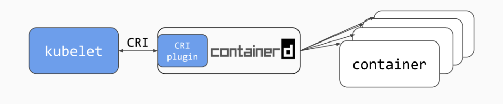
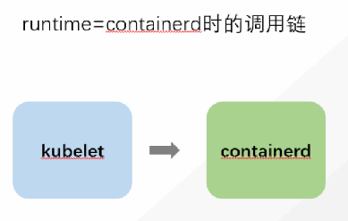
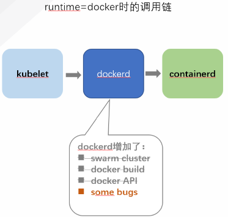

# containerd和docker的调用链

kubelet在调用dockerd启动容器时的流程是 kubelet->dockerd->containerd

dockerd相较于containerd，增加了swarm cluster，docker build，docker API等，以及一些bug。所以，我们可以绕过dockerd，通过kubelet直接调用containerd。

## 优缺点

优点：
- 更轻量，占用资源更少。首先，containerd比dockerd少了很多插件，其次kubelet调用链少了一层，我做过一个测试，在同时启动100个nginx的pod时，containerd的平均负载比dockerd的小一半（创建过程中，pod running后，平均负载差不多）。
- 安全性提高，一是，containerd比dockerd少了一些插件，这些插件的安全性就不用再关注，二是，containerd比dockerd命令更少，以及不如docker普遍，提高了攻击者的攻击难度。

缺点：
- 对维护人员要求更高，需要熟练掌握containerd的相关操作。
- 一些功能不再支持，比如 与构建镜像相关的操作。所以，在将k8s作为流水线的执行环境时，构建镜像需要使用dind的方式。
- containerd将不再能看到contianer的运行情况，需要使用crictl相关命令查看。但是crictl是从kubelet的视角上看到的，它操作的对象级别是pod，而不是单个容器。

# crictl和ctr命令
对比参考：
https://cloud.tencent.com/developer/article/1450788
