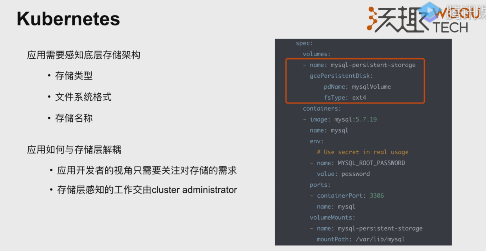
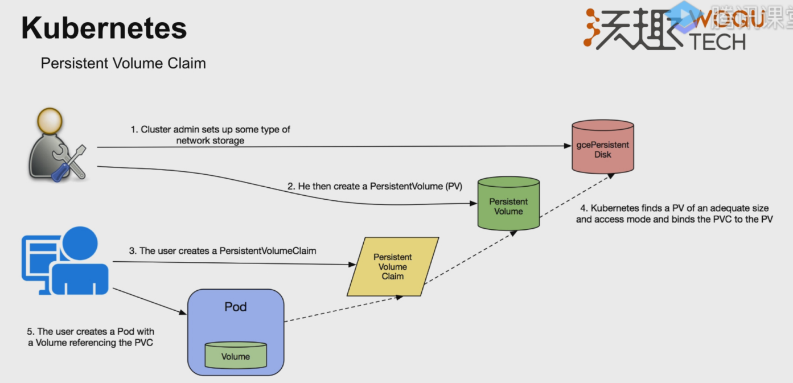
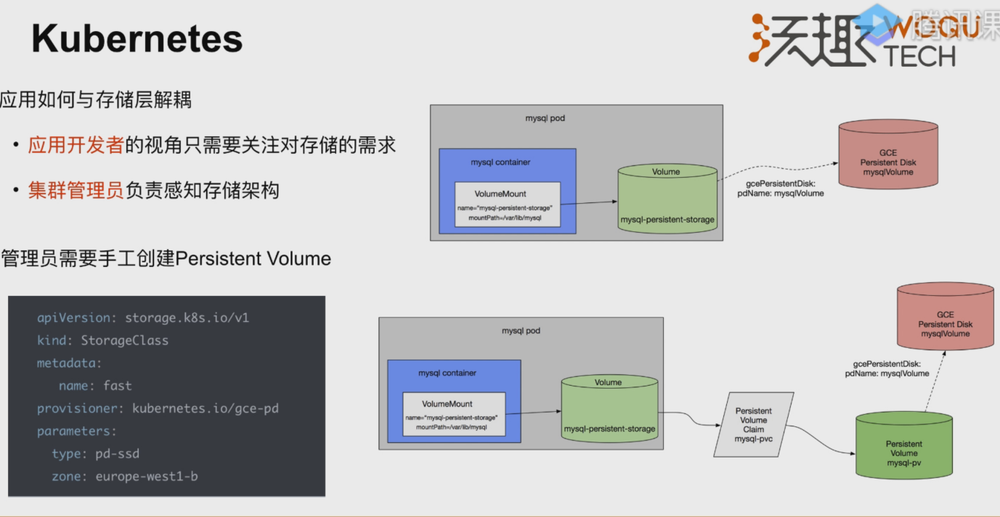
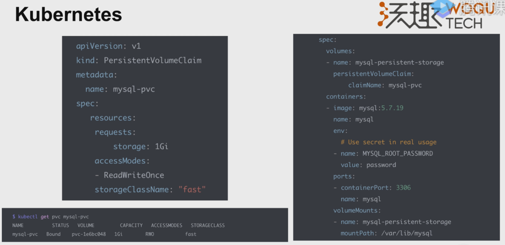
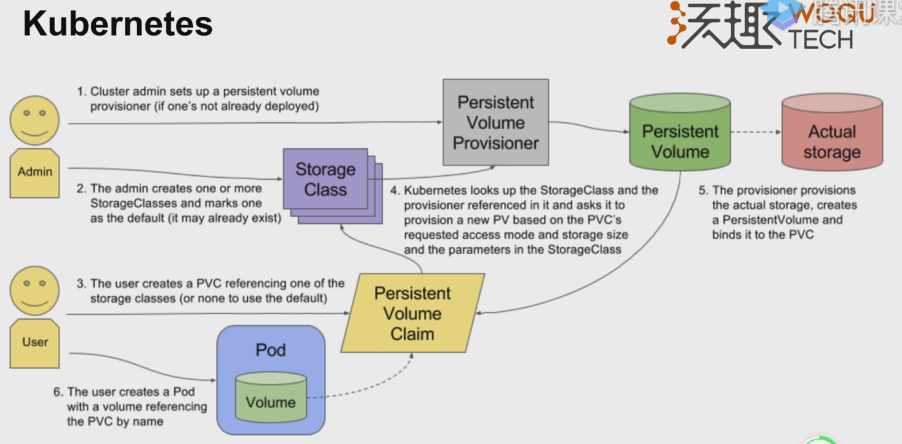
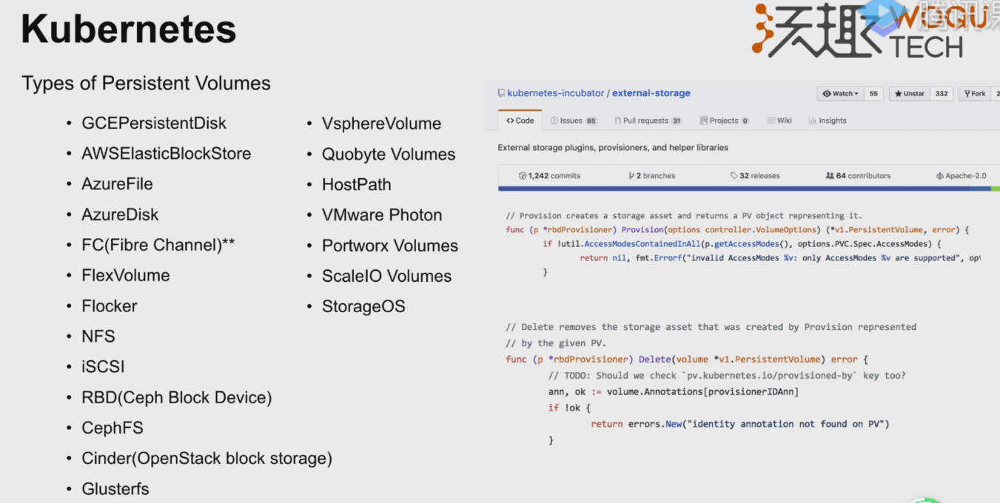
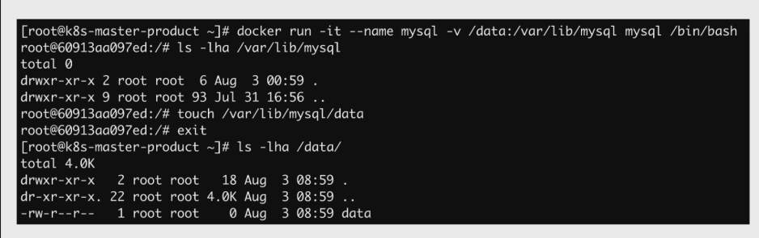
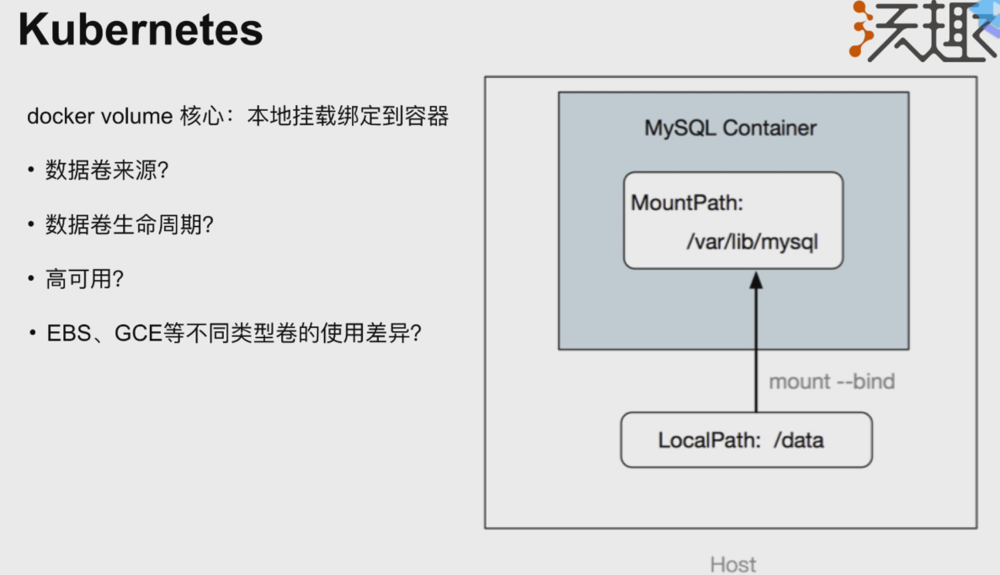
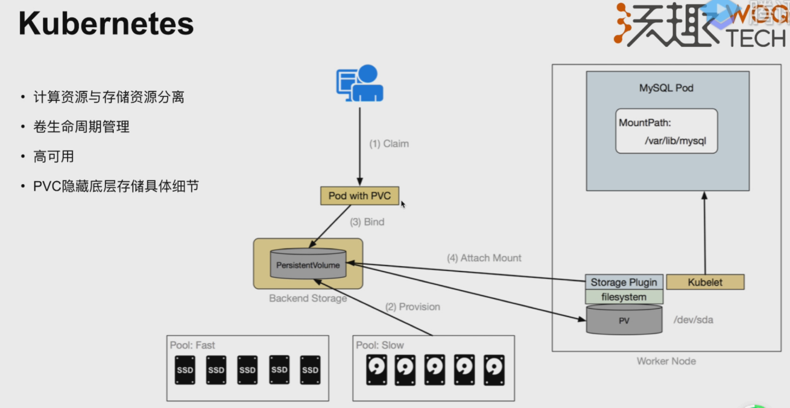
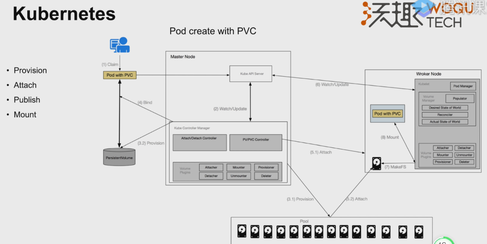

# pv、pvc 、sc的由来

卷直接绑定给pod使用。

但是问题是：需要填写具体的磁盘类型

k8s提供了视角的解耦

开发者和管理员的不同行为

开发者不用关注底层的配置

上面的还是有个问题，就是开发者使用pvc的时候，需要管理员先把pv给建出来，所以接下来就是要解决自动的创建pv。

strorageclass来了。

开发者可以不用关注具体存储实现的细节。

# k8s提供的扩展

因为存储的种类太多了，也有可能会用到我们自己定义的存储，所以k8s在github的仓库，预留了这一块的实现，我们也可以根据这些来实现。

# 卷管理方案
## docker的卷使用

docker使用卷的过程。本质就是把宿主机的卷挂在容器中。

但我们要注意下面几个地方：

## k8s的卷架构

# k8s的卷使用步骤

4个步骤：
provision 分配卷
attach 挂载卷
publish 创建文件系统
mount 将卷映射到容器的文件系统中

涉及到的核心组件2个：
- controller-manager
  - attach/detach controller 用于挂载卷和卸载卷
  - pv/pvc controller 用于创建和删除卷
- kubelet
  - Pod manager 他会去调用内置的volumn plugin组件
  - volumn plugin 实现了很多存储厂商实现的具体的存储的driver
