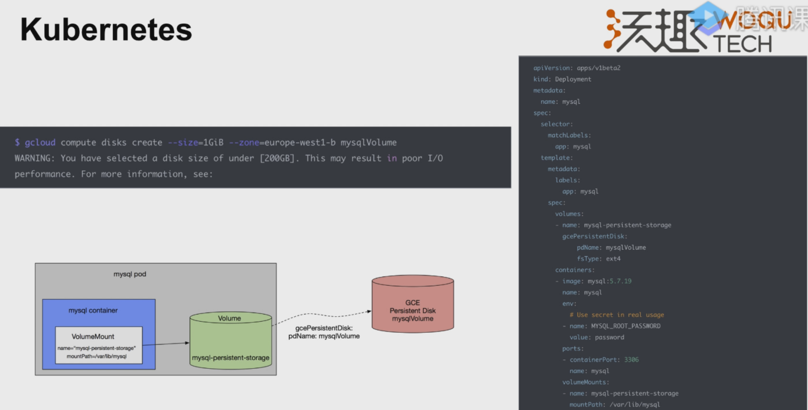
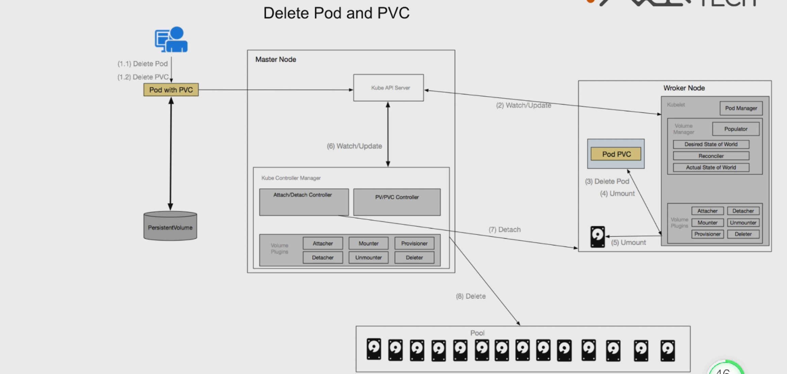

# pv、pvc 、sc的由来

卷直接绑定给pod使用。

但是问题是：需要填写具体的磁盘类型

k8s提供了视角的解耦

开发者和管理员的不同行为

开发者不用关注底层的配置

上面的还是有个问题，就是开发者使用pvc的时候，需要管理员先把pv给建出来，所以接下来就是要解决自动的创建pv。

strorageclass来了。

开发者可以不用关注具体存储实现的细节。

# k8s提供的扩展

因为存储的种类太多了，也有可能会用到我们自己定义的存储，所以k8s在github的仓库，预留了这一块的实现，我们也可以根据这些来实现。

# 卷管理方案
## docker的卷使用

docker使用卷的过程。本质就是把宿主机的卷挂在容器中。

但我们要注意下面几个地方：

## k8s的卷架构

# k8s的卷使用步骤

4个步骤：
provision 分配卷
attach 挂载卷
publish 创建文件系统
mount 将卷映射到容器的文件系统中

涉及到的核心组件2个：
- controller-manager
  - attach/detach controller 用于挂载卷和卸载卷
  - pv/pvc controller 用于创建和删除卷
- kubelet
  - Pod manager 他会去调用内置的volumn plugin组件
  - volumn plugin 实现了很多存储厂商实现的具体的存储的driver

创建pod和卷的具体步骤说明：
1. kubectl或者客户端发送创建pod和卷的请求给apiserver
2. controller-manager哦那个的pv/pvc controller 会watch到apiserver中的add pvc的事件
3. pv/pvc controller拿到pvc的spec并没有绑定到具体的pv，然后从pvc的spec拿到对应的storageclass
4. 通过storageclass找到对应的provisioner，然后调用provisioner来创建一个pv
5. 创建pv有2个步骤：调用真实的接口去存储池中创建存储卷，当卷创建成功后在k8s中生成对应的pv资源
6. pv创建成功后，将pv和pvc进行绑定，以上k8s就完成了pv和pvc的创建工作。
7. 接下来，scheduler指定pod调度到某个节点上去，pv也会被指定到某个节点上去，此时attach/detach controller会去调用volumn plugin中的attach插件 ，将卷挂载到对应的node上
8. 当卷挂载完成后，kubelet中的Pod manager会启动mount流程，将卷格式化并挂载到container对应的目录
9. kubelet确认pod所需要的卷全部ready后，才会去启动pod。

删除的流程：

