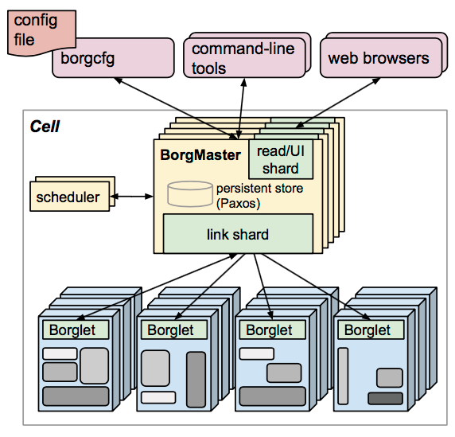
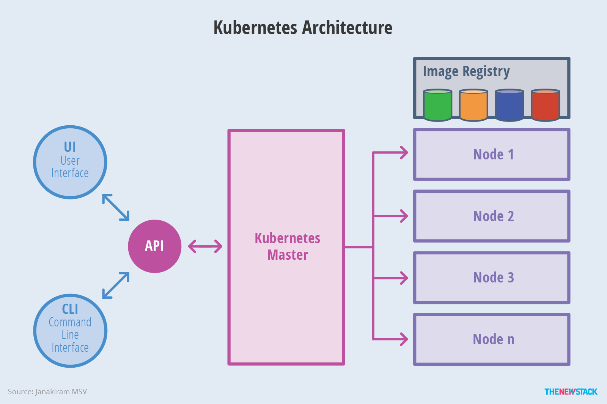
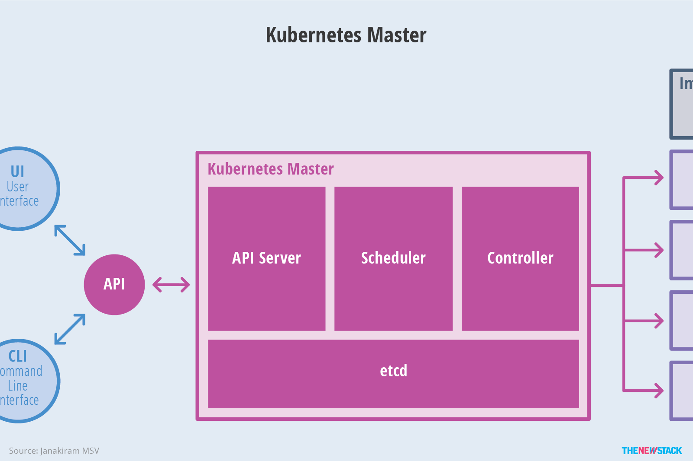

<!-- toc -->
## 一、Borg 架构
Borg 是谷歌内部的大规模集群管理系统，负责对谷歌内部很多核心服务的调度和管理。Borg的目的是让用户能够不必操心资源管理的问题，让他们专注于自己的核心业务，并且做到跨多个数据中心的资源利用率最大化。
Borg主要由BorgMaster、Borglet、borgcfg和Scheduler组成，如下图所示：

- BorgMaster是整个集群的大脑，负责维护整个集群的状态，并将数据持久化到Paxos存储中；
- Scheduer负责任务的调度，根据应用的特点将其调度到具体的机器上去；
- Borglet负责真正运行任务（在容器中）；
- borgcfg是Borg的命令行工具，用于跟Borg系统交互，一般通过一个配置文件来提交任务。

## 二、kubernetes 架构
Kubernetes借鉴了Borg的设计理念，比如Pod、Service、Labels和单Pod单IP等。Kubernetes的整体架构跟Borg非常像，如下图所示：

Kubernetes主要由以下几个核心组件组成：

- etcd保存了整个集群的状态；
- apiserver提供了资源操作的唯一入口，并提供认证、授权、访问控制、API注册和发现等机制；
- controller manager负责维护集群的状态，比如故障检测、自动扩展、滚动更新等；
- scheduler负责资源的调度，按照预定的调度策略将Pod调度到相应的机器上；
- kubelet负责维护容器的生命周期，同时也负责Volume（CSI）和网络（CNI）的管理；
- 容器运行时负责镜像管理以及Pod和容器的真正运行（CRI）；
- kube-proxy负责为Service提供cluster内部的服务发现和负载均衡；

除了核心组件，还有一些推荐的Addons：
- kube-dns负责为整个集群提供DNS服务，1.10开始用core-dns代替
- Ingress Controller为服务提供外网入口
- Heapster提供资源监控
- Dashboard提供GUI
- Federation提供跨可用区的集群

上图看起来较为抽象，来个简化版的：

## 三、k8s组件间的通信
下图非常清晰的展示了组件间的通信和相关的协议

## 四、master架构

## 五、node架构

