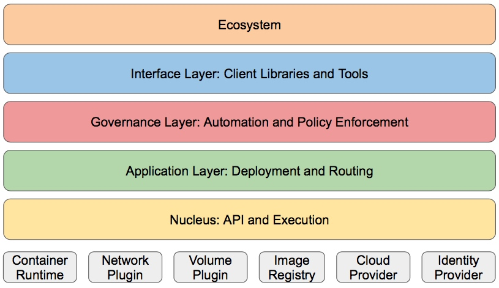

<!-- toc -->
*****
## 一、分层架构
Kubernetes设计理念和功能其实就是一个类似Linux的分层架构，如下图所示:

- 核心层：Kubernetes最核心的功能，对外提供API构建高层的应用，对内提供插件式应用执行环境
- 应用层：
  - 部署（无状态应用、有状态应用、批处理任务、集群应用等）
  - 路由（服务发现、DNS解析等）
- 管理层：
  - 系统度量（如基础设施、容器和网络的度量）
  - 自动化（如自动扩展、动态Provision等）
  - 策略管理（RBAC、Quota、PSP、NetworkPolicy等）

- 接口层：
  - kubectl命令行工具
  - 客户端SDK
  - 集群联邦
- 生态系统：在接口层之上的庞大容器集群管理调度的生态系统，可以划分为两个范畴
  - Kubernetes外部：日志、监控、配置管理、CI、CD、Workflow、FaaS、OTS应用、ChatOps等
  - Kubernetes内部：CRI、CNI、CVI、镜像仓库、Cloud Provider、集群自身的配置和管理等

## 二、API设计原则
* 所有API应该是声明式的
* API对象是彼此互补而且可组合的
* 高层API以操作意图为基础设计
* 低层API根据高层API的控制需要设计
* 尽量避免简单封装，不要有在外部API无法显式知道的内部隐藏的机制
* API操作复杂度与对象数量成正比
* API对象状态不能依赖于网络连接状态
* 尽量避免让操作机制依赖于全局状态，因为在分布式系统中要保证全局状态的同步是非常困难的

## 三、控制机制设计原则
- 控制逻辑应该只依赖于当前状态
- 假设任何错误的可能，并做容错处理
- 尽量避免复杂状态机，控制逻辑不要依赖无法监控的内部状态
- 假设任何操作都可能被任何操作对象拒绝，甚至被错误解析
- 每个模块都可以在出错后自动恢复
- 每个模块都可以在必要时优雅地降级服务
