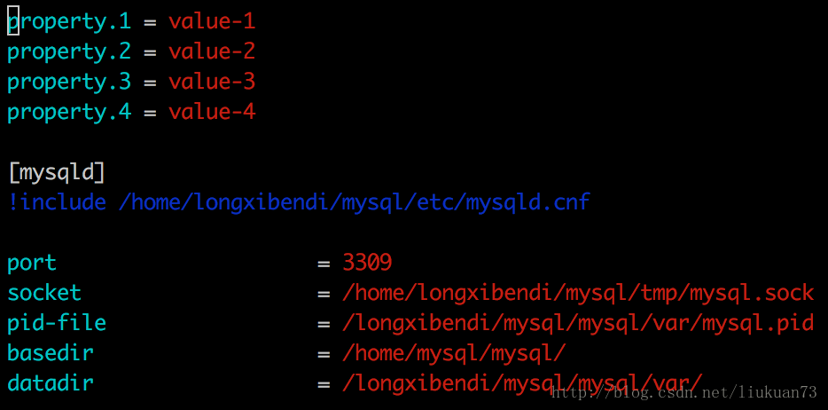
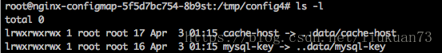

## Configmap
介绍
镜像使用的过程中，经常需要利用配置文件、启动脚本等方式来影响容器的运行方式，如果仅有少量配置，我们可以使用环境变量的方式来进行配置。然而对于一些较为复杂的配置，k8s提供了configmap解决方案。　
ConfigMap API资源存储键/值对配置数据，这些数据可以在pods里使用。
ConfigMap跟Secrets类似，但是ConfigMap可以更方便的处理不包含敏感信息的字符串。
当ConfigMap以数据卷的形式挂载进Pod的时，这时更新ConfigMap（或删掉重建ConfigMap），Pod内挂载的配置信息会热更新。这时可以增加一些监测配置文件变更的脚本，然后reload对应服务
ConfigMap的API概念上来说是很简单的。从数据角度来看，ConfigMap的类型只是键值组。应用可以从不同角度来配置。在一个pod里面使用ConfigMap大致有三种方式：
1、命令行参数
2、环境变量
3、数据卷文件

## 创建ConfigMap的方式有4种：
通过直接在命令行中指定configmap参数创建，即--from-literal
通过指定文件创建，即将一个配置文件创建为一个ConfigMap--from-file=<文件>
通过指定目录创建，即将一个目录下的所有配置文件创建为一个ConfigMap，--from-file=<目录>
事先写好标准的configmap的yaml文件，然后kubectl create -f 创建

### 通过命令行参数--from-literal创建
```
kubectl create configmap test-config1 --from-literal=db.host=10.5.10.116 --from-listeral=db.port='3306'
```
### 指定文件创建
配置文件app.properties的内容： 

创建命令（可以有多个--from-file）：

```
kubectl create configmap test-config2 --from-file=./app.properties
```


可以看到指定文件创建时configmap会创建一个key/value对，key是文件名，value是文件内容。

假如不想configmap中的key为默认的文件名，还可以在创建时指定key名字：
```
kubectl create configmap game-config-3 --from-file=<my-key-name>=<path-to-file>
```


### 指定目录创建
configs 目录下的config-1和config-2内容如下所示： 

创建命令：
```
kubectl create configmap test-config3 --from-file=./configs
```

可以看到指定目录创建时configmap内容中的各个文件会创建一个key/value对，key是文件名，value是文件内容。


那假如目录中还包含子目录呢？继续做实验： 
在上一步的configs目录下创建子目录subconfigs，并在subconfigs下面创建两个配置文件，指定目录configs创建名为test-config4的configmap:
```
kubectl create configmap test-config4 --from-file=./configs
```


结果说明指定目录时只会识别其中的文件，忽略子目录

### 通过事先写好configmap的标准yaml文件创建


注意其中一个key的value有多行内容时的写法


## 使用ConfigMap
使用ConfigMap有三种方式:

* 第一种是通过环境变量的方式，直接传递给pod 
    * 使用configmap中指定的key
    * 使用configmap中所有的key
* 第二种是通过在pod的命令行下运行的方式(启动命令中)
* 第三种是作为volume的方式挂载到pod内

### 通过环境变量使用
(1)使用valueFrom、configMapKeyRef、name、key指定要用的key:


```
apiVersion: v1
kind: Pod
metadata:
  name: dapi-test-pod
spec:
  containers:
    - name: test-container
      image: k8s.gcr.io/busybox
      command: [ "/bin/sh", "-c", "env" ]
      env:
        - name: SPECIAL_LEVEL_KEY
          valueFrom:
            configMapKeyRef:
              name: special-config
              key: special.how
        - name: LOG_LEVEL
          valueFrom:
            configMapKeyRef:
              name: env-config
              key: log_level
  restartPolicy: Never
```

(2)还可以通过envFrom、configMapRef、name使得configmap中的所有key/value对都自动变成环境变量：

```
apiVersion: v1
kind: Pod
metadata:
  name: dapi-test-pod
spec:
  containers:
    - name: test-container
      image: k8s.gcr.io/busybox
      command: [ "/bin/sh", "-c", "env" ]
      envFrom:
      - configMapRef:
          name: special-config
  restartPolicy: Never
```

### 在启动命令中引用
在命令行下引用时，需要先设置为环境变量，之后可以通过$(VAR_NAME)设置容器启动命令的启动参数：

```
apiVersion: v1
kind: Pod
metadata:
  name: dapi-test-pod
spec:
  containers:
    - name: test-container
      image: k8s.gcr.io/busybox
      command: [ "/bin/sh", "-c", "echo $(SPECIAL_LEVEL_KEY) $(SPECIAL_TYPE_KEY)" ]
      env:
        - name: SPECIAL_LEVEL_KEY
          valueFrom:
            configMapKeyRef:
              name: special-config
              key: SPECIAL_LEVEL
        - name: SPECIAL_TYPE_KEY
          valueFrom:
            configMapKeyRef:
              name: special-config
              key: SPECIAL_TYPE
  restartPolicy: Never
```

作为volume挂载使用
把1.4中test-config4所有key/value挂载进来：
```
apiVersion: extensions/v1beta1
kind: Deployment
metadata:
  name: nginx-configmap
spec:
  replicas: 1
  template:
    metadata:
      labels:
        app: nginx-configmap
    spec:
      containers:
      - name: nginx-configmap
        image: nginx
        ports:
        - containerPort: 80
        volumeMounts:     
        - name: config-volume4
          mountPath: /tmp/config4
      volumes:
      - name: config-volume4
        configMap:
          name: test-config4
```

(2)假如不想以key名作为配置文件名可以引入items 字段，在其中逐个指定要用相对路径path替换的key：
```
volumes:
      - name: config-volume4
        configMap:
          name: test-config4
          items:
          - key: my.cnf
            path: mysql-key
          - key: cache_host
            path: cache-host
```

备注：

删除configmap后原pod不受影响；然后再删除pod后，重启的pod的events会报找不到cofigmap的volume；
pod起来后再通过kubectl edit configmap …修改configmap，过一会pod内部的配置也会刷新。
在容器内部修改挂进去的配置文件后，过一会内容会再次被刷新为原始configmap内容
(3)还可以为以configmap挂载进的volume添加subPath字段:

```
        volumeMounts:
        - name: config-volume5
          mountPath: /tmp/my
          subPath: my.cnf
        - name: config-volume5
          mountPath: /tmp/host
          subPath: cache_host
        - name: config-volume5
          mountPath: /tmp/port
          subPath: cache_port
        - name: config-volume5
          mountPath: /tmp/prefix
          subPath: cache_prefix
      volumes:
      - name: config-volume5
        configMap:
          name: test-config4
```


注意在容器中的形式与（2）中的不同，（2）中是个链接，链到..data/<key-name>。 
备注：

删除configmap后原pod不受影响；然后再删除pod后，重启的pod的events会报找不到cofigmap的volume。
pod起来后再通过kubectl edit configmap …修改configmap，pod内部的配置也会自动刷新。
在容器内部修改挂进去的配置文件后，内容可以持久保存，除非杀掉再重启pod才会刷回原始configmap的内容。
subPath必须要与configmap中的key同名。
mountPath如/tmp/prefix： 
<1>当/tmp/prefix不存在时(备注：此时/tmp/prefix和/tmp/prefix/无异)，会自动创建prefix文件并把value写进去； 
<2>当/tmp/prefix存在且是个文件时，里面内容会被configmap覆盖； 
<3>当/tmp/prefix存在且是文件夹时，无论写/tmp/prefix还是/tmp/prefix/都会报错。

### Configmap的热更新研究

更新 ConfigMap 后：

使用该 ConfigMap 挂载的 Env 不会同步更新
使用该 ConfigMap 挂载的 Volume 中的数据需要一段时间（实测大概10秒）才能同步更新
ENV 是在容器启动的时候注入的，启动之后 kubernetes 就不会再改变环境变量的值，且同一个 namespace 中的 pod 的环境变量是不断累加的，参考 Kubernetes中的服务发现与docker容器间的环境变量传递源码探究。为了更新容器中使用 ConfigMap 挂载的配置，可以通过滚动更新 pod 的方式来强制重新挂载 ConfigMap，也可以在更新了 ConfigMap 后，先将副本数设置为 0，然后再扩容。

　　当ConfigMap以数据卷的形式挂载进Pod的时，这时更新ConfigMap（或删掉重建ConfigMap），Pod内挂载的配置信息会热更新。这时可以增加一些监测配置文件变更的脚本，然后reload对应服务。


参考：
1.https://kubernetes.io/docs/tasks/configure-pod-container/configure-pod-configmap/ 
2.https://www.cnblogs.com/breezey/p/6582082.html 
3.https://kubernetes.io/docs/concepts/storage/volumes/ 
4.https://www.kubernetes.org.cn/3138.html

