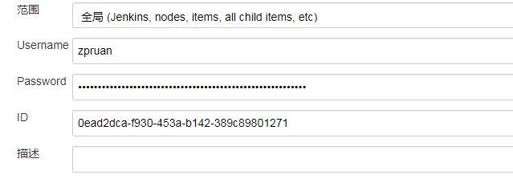
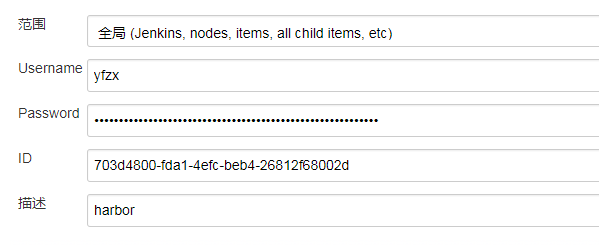
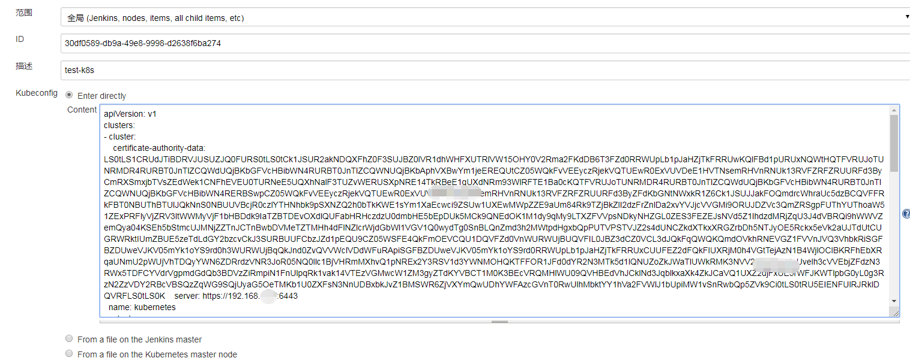
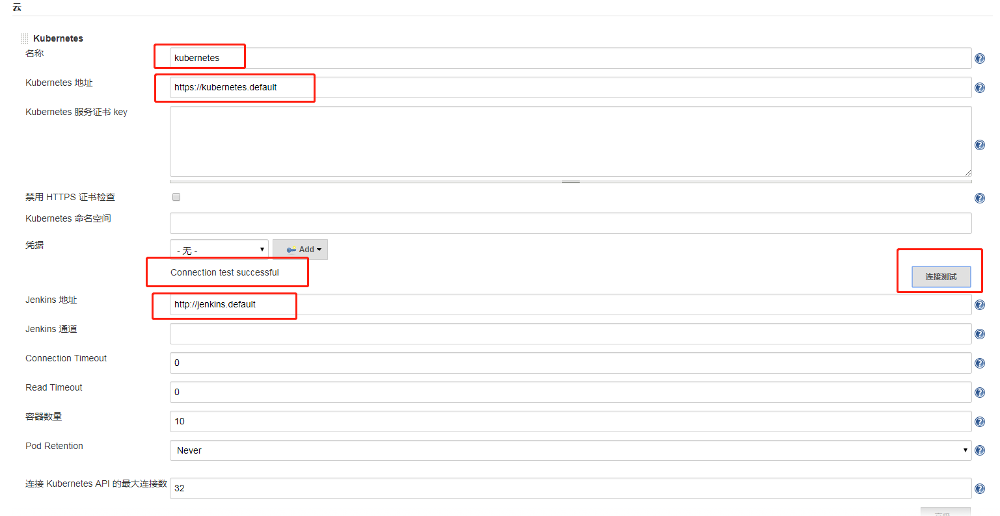

<!-- toc -->
# 配置jenkins-master

## 配置所需的插件
- Kubernetes Continuous Deploy
- Kubernetes
- Extended Choice Parameter
- pipeline scm

## 配置全局凭据
### 用于svn的checkout代码的密码

### 用于harbor的pull的密码

### kubectl的config

## 在jenkins中配置k8s集群的信息
在jenkins的`系统管理-系统设置中配置`

需要做一个测试,测试成功说明配置正确。
其他的暂时不用配置，会在后面的jenkinsfile中说明。
