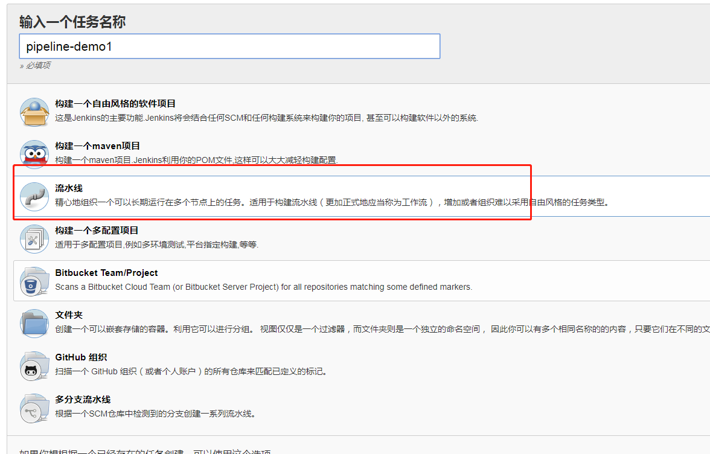
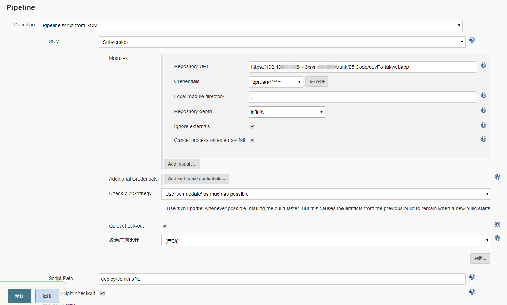
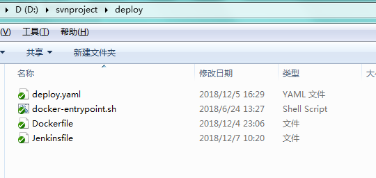

<!-- toc -->
## 在新建任务的地方创建pipeline的任务

## 创建后进去编辑任务的信息:

进入项目配置的地方,只需要写一个要打包项目的svn地址,因为我们将采用jenkinsfile的方式,将所有的流程信息都写入到这个配置文件中。当我们编译这个项目的时候，首先是去SVN上获取到jenkinsfile，然后根据里面编写的流程再来进行流程的执行。

在SVN的项目下,有个文件夹叫:deploy,下面的文件如下:

