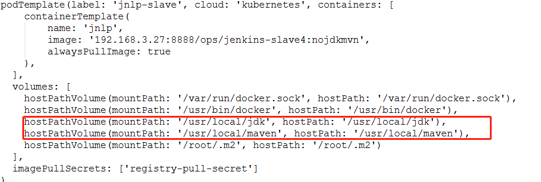
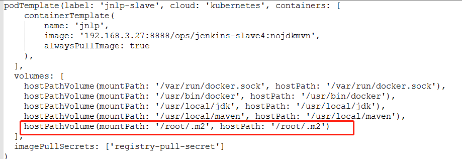
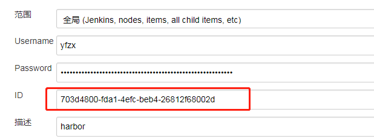
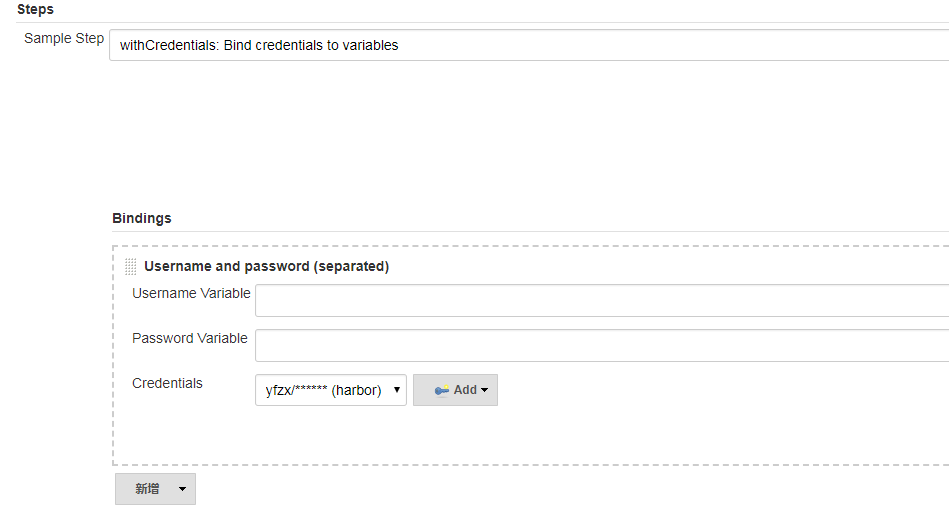

# 优化改进

## 制作镜像的过程
最初打包是把slave和基础镜像放在一起的,编译一次大概花一个小时


## 镜像的大小


```
# docker images
REPOSITORY                             TAG                 IMAGE ID            CREATED             SIZE
192.168.3.27:8888/ops/jenkins-slave4   nojdkmvn            f23c25c4f035        8 days ago          994MB
192.168.3.27:8888/ops/jenkins-slave4   latest              28b9adee04a7        8 days ago          1.39GB
```

## 代码仓库的共享





## 安全性
```
stage('Build and Push Image'){
          sh '''
          docker login -u yfzx -p abcdefg123456 192.168.3.27:8888
          docker build -t 192.168.3.27:8888/project/devportal -f deploy/Dockerfile .
          docker push 192.168.3.27:8888/project/devportal
          '''
      }
```







```
stage('Build and Push Image'){
		withCredentials([usernamePassword(credentialsId: '703d4800-fda1-4efc-beb4-26812f68002d', passwordVariable: 'harborpassword', usernameVariable: 'harborusername')]) {
			sh '''
			docker login -u ${harborusername} -p ${harborpassword} 192.168.3.27:8888
			docker build -t 192.168.3.27:8888/project/devportal -f deploy/Dockerfile .
			docker push 192.168.3.27:8888/project/devportal
			'''
		}
      }
```
