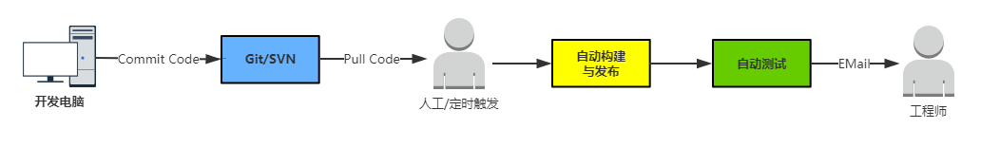
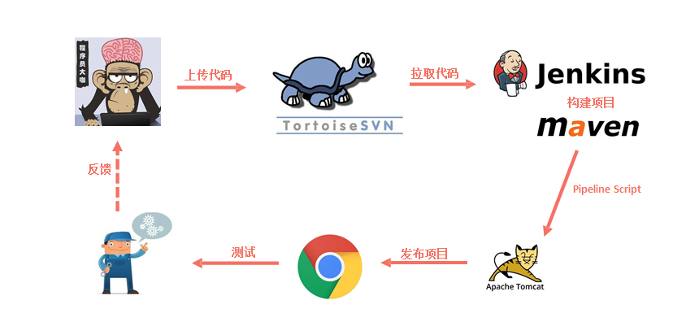
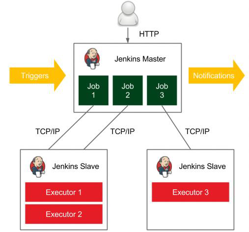
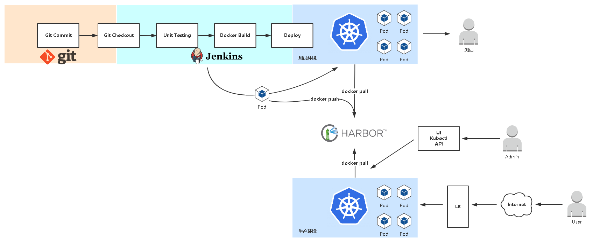
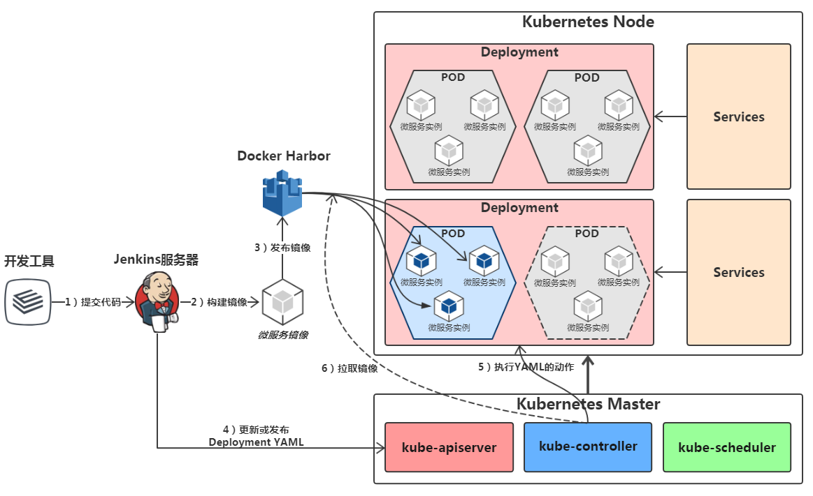
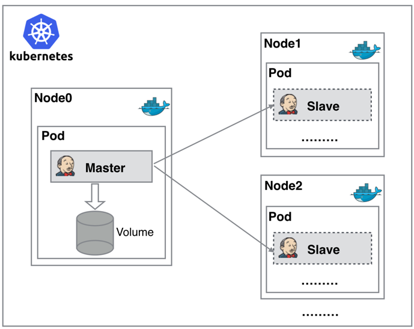

<!-- toc -->
# 利用k8s + jenkins打造CI/CD

## CI/CD概念

- 持续集成（ContinuousIntegration，CI）：代码合并、构建、部署、测试都在一起，不断地执行这个过程，并对结果反馈。
- 持续部署（ContinuousDeployment，CD）：部署到测试环境、预生产环境、生产环境。
- 持续交付（ContinuousDelivery，CD）：将最终产品发布到生产环境，给用户使用。

## 传统的CI/CD流程

### 传统的CI/CD的基于jenkins master-slave的改进

- Master/Slave相当于Server和agent的概念
- Master提供web接口让用户来管理job和slave，job可以运行在master本机或者被分配到slave上运行。
- 一个master可以关联多个slave用来为不同的job或相同的job的不同配置来服务。

## 基于k8s的CI/CD流程

### 传统方式的痛点
传统的 Jenkins Master-Slave 一主多从会存在一些痛点，例如：
- 主Master发生单点故障时，整个流程都不可用了
- 每个Slave的配置环境不一样，来完成不同语言的编译打包等操作，但是这些差异化的配置导致管理起来非常不方便，维护起来也是比较费劲
- 资源分配不均衡，有的Slave要运行的job出现排队等待，而有的Slave处于空闲状态
- 资源有浪费，每 Slave可能是物理机或者虚拟机，当Slave处于空闲状态时，也不会完全释放掉资源

### 基于k8s的CI/CD的优势
正因为上面的这些痛点，我们希望有一种更高效更可靠的方式来完成这个 CI/CD 流程，而 Docker 技术能很好的解决这个痛点，又特别是在 k8s 集群环境下面能够更好来解决上面的问题，下图是基于 k8s 搭建 Jenkins master-slave 的示意图：

从图中可以看到 Jenkins Master 和 Jenkins Slave 以 Pod 形式运行在 k8s 的 Node 上，Master 运行在其中一个节点(也可以是statefulset)，并且将其配置数据存储到一个 PV 上去(这个需要共享存储)，Slave 被调度在各个节点上，并且它不是一直处于运行状态，它会按照jenkins pipeline或者其他配置 动态的创建运行完job后再自动删除。

这种模式的工作流程大致为：
当 Jenkins Master 接受到 Build 请求时，会根据配置的 Label 动态创建一个运行在 Pod 中的 Jenkins Slave 并注册到 Master 上，当运行完 Job 后，这个 Slave 会被注销并且这个 Pod 也会自动删除，恢复到最初状态。

这种模式带来的好处:
- 服务高可用:
  - 当 Jenkins Master 出现故障时， 根据k8s自身的架构特点会自动创建一个新的 Jenkins Master 容器，并且将 之前创建好的 PV 分配给新创建的容器，保证数据不丢失，从而达到集群服务高可用。
  - 或者直接将master部署为`statefulset`的形式, 让每个节点都部署一个从而达到高可用
- 动态伸缩
  - master节点可以部署为`deployment + HPA`的形式,当master的使用率过高或者过低时,动态扩展或收缩
  - 合理使用资源，每次运行 Job 时，会自动创建一个 Jenkins Slave
  - Job 完成后，Slave 自动注销并删除容器，资源自动释放，
  - Kubernetes 根据每个资源的使用情况，动态分配 Slave 到空闲的节点上创建，合理利用资源
- 扩展性好
  - 当 node资 源严重不足而导致 Job 排队等待时，可以较容易的添加一个 Node 到集群中，从而实现扩展。

## 前置条件:
- 已经部署好了一套K8S
- 已经搭建好了私有仓库
- 已经部署好了共享网络存储(如NFS/CEPH等)，可以创建PV/PVC/SC

## 玩转CI/CD步骤:
1. 部署jenkins-master
2. 配置jenkins-master
3. 制作jenkins-slave
4. 创建pipeline项目
5. 编写jenkinsfile文件
6. 验证
7. 优化改进
8. 最终交付物
