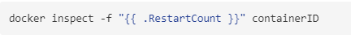

<!--toc-->

> 参考:
https://docs.docker.com/engine/reference/run/

# docker容器的重启策略

docker通过--restart选项，可以设置容器的重启策略，用于决定在容器退出时docker守护进程是否重启刚刚退出的容器。

- no 默认策略，在容器退出时不重启容器
- on-failure 在容器非正常退出时（退出状态非0），才会重启容器
- on-failure:3 在容器非正常退出时重启容器，最多重启3次
- always 在容器退出时总是重启容器
- unless-stopped 在容器退出时总是重启容器，但是不考虑在Docker守护进程启动时就已经停止了的容器

```
docker run -d --restart=always nginx
docker run -d --restart=on-failure:10 nginx
```

注意:
> - --restart选项通常只用于detached模式的容器。
> - --restart选项不能与--rm选项同时使用。显然，--restart选项适用于detached模式的容器，而--rm选项适用于foreground模式的容器


# 其他补充

## docker 的退出代码
- 0 表示正常退出
- 非0，表示异常退出（退出状态码采用chroot标准）
  - 125，Docker守护进程本身的错误
  - 126，容器启动后，要执行的默认命令无法调用
  - 127，容器启动后，要执行的默认命令不存在
  - 其他命令状态码，容器启动后正常执行命令，退出命令时该命令的返回状态码作为容器的退出状态码


## 查看容器重启次数



## 查看容器最后一次的启动时间
