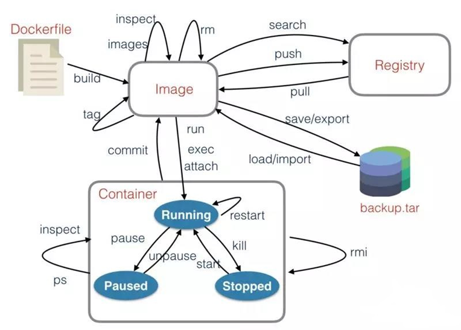

tips:
1.启动一个应用，后台运行,命名为`mydevportal`，端口映射为`9527`
```
docker run -d -p 9527:9527 --name mydevportal 192.168.3.27:8888/project/devportal
```

2.批量删除标签为<none>的镜像
```
docker rmi -f `docker images | grep '<none>' | awk '{print $3}'`
```

3.Docker释放空间
```
docker system prune -a
```

清理所有不被使用的，正在使用的镜像和容器是不会被删除的，但是这个命令要慎用，因为它把整个docker空间都释放掉，有可能你忘记起哪个服务，使用之后会发现这个镜像没有了，就要重新构建镜像。
