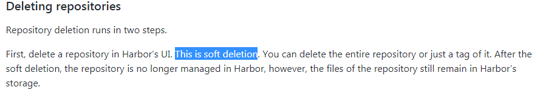

<!-- toc -->
>参考：[harbor的用户指南](https://github.com/goharbor/harbor/blob/master/docs/user_guide.md)


## 物理删除harbor中不要的镜像


在harbor的UI端删除镜像的操作是逻辑删除的,需要物理删除不要的镜像达到**释放空间**的目的,是需要将harbor停下来再删除的。
步骤如下：
### 查看harbor相关镜像的名称
```
[root@master harbor]# docker images
REPOSITORY                             TAG                 IMAGE ID            CREATED             SIZE
ubuntu                                 latest              93fd78260bd1        3 weeks ago         86.2MB
debian                                 stretch             4879790bd60d        3 weeks ago         101MB
jenkins/jenkins                        lts-alpine          bcc31d32159f        4 weeks ago         221MB
centos                                 latest              75835a67d134        2 months ago        200MB
vmware/redis-photon                    v1.5.0              7c03076402d9        7 months ago        207MB
vmware/clair-photon                    v2.0.1-v1.5.0       7ae4e0670a3f        7 months ago        301MB
vmware/notary-server-photon            v0.5.1-v1.5.0       0b2b23300552        7 months ago        211MB
vmware/notary-signer-photon            v0.5.1-v1.5.0       67c41b4a1283        7 months ago        209MB
vmware/registry-photon                 v2.6.2-v1.5.0       3059f44f4b9a        7 months ago        198MB
vmware/nginx-photon                    v1.5.0              e100456182fc        7 months ago        135MB
vmware/harbor-log                      v1.5.0              62bb6b8350d9        7 months ago        200MB
vmware/harbor-jobservice               v1.5.0              aca9fd2e867f        7 months ago        194MB
vmware/harbor-ui                       v1.5.0              1055166068d0        7 months ago        212MB
vmware/harbor-adminserver              v1.5.0              019bc4544829        7 months ago        183MB
vmware/harbor-db                       v1.5.0              82354dcf564f        7 months ago        526MB
vmware/mariadb-photon                  v1.5.0              403e7e656499        7 months ago        526MB
vmware/postgresql-photon               v1.5.0              35c891dea9cf        7 months ago        221MB
vmware/harbor-migrator                 v1.5.0              466c57ab0dc3        7 months ago        1.16GB
vmware/photon                          1.0                 4b481ecbef2a        7 months ago        130MB
```
注意:我们接下来将用到的镜像是`vmware/registry-photon:v2.6.2-v1.5.0`

### 停止harbor
```
[root@master harbor]# docker-compose stop
Stopping nginx              ... done
Stopping harbor-jobservice  ... done
Stopping harbor-ui          ... done
Stopping registry           ... done
Stopping harbor-adminserver ... done
Stopping harbor-db          ... done
Stopping redis              ... done
Stopping harbor-log         ... done
```

### 物理删除
```
docker run -it --name gc --rm --volumes-from registry vmware/registry-photon:v2.6.2-v1.5.0 garbage-collect  /etc/registry/config.yml
```

注意,如果只想看下会删除哪些镜像而不是真正的去删除,则需要加上选项`--dry-run`
如下:
```
docker run -it --name gc --rm --volumes-from registry vmware/registry-photon:v2.6.2-v1.5.0 garbage-collect --dry-run /etc/registry/config.yml
```

### 启动harbor
```
[root@master harbor]# docker-compose up -d
Creating network "harbor_harbor" with the default driver
Creating harbor-log ... done
Creating registry           ... done
Creating harbor-adminserver ... done
Creating redis              ... done
Creating harbor-db          ... done
Creating harbor-ui          ... done
Creating harbor-jobservice  ... done
Creating nginx              ... done
[root@master harbor]# docker-compose ps
       Name                     Command                       State                                          Ports
-------------------------------------------------------------------------------------------------------------------------------------------------
harbor-adminserver   /harbor/start.sh                 Up (health: starting)
harbor-db            /usr/local/bin/docker-entr ...   Up (health: starting)   3306/tcp
harbor-jobservice    /harbor/start.sh                 Up
harbor-log           /bin/sh -c /usr/local/bin/ ...   Up (health: starting)   127.0.0.1:1514->10514/tcp
harbor-ui            /harbor/start.sh                 Up (health: starting)
nginx                nginx -g daemon off;             Up (health: starting)   0.0.0.0:8443->443/tcp, 0.0.0.0:4443->4443/tcp, 0.0.0.0:8888->80/tcp
redis                docker-entrypoint.sh redis ...   Up                      6379/tcp
registry             /entrypoint.sh serve /etc/ ...   Up (health: starting)   5000/tcp
```

### 再次查看空间
```
df -h /harbor的初始化目录
```

## harbor配置charts
