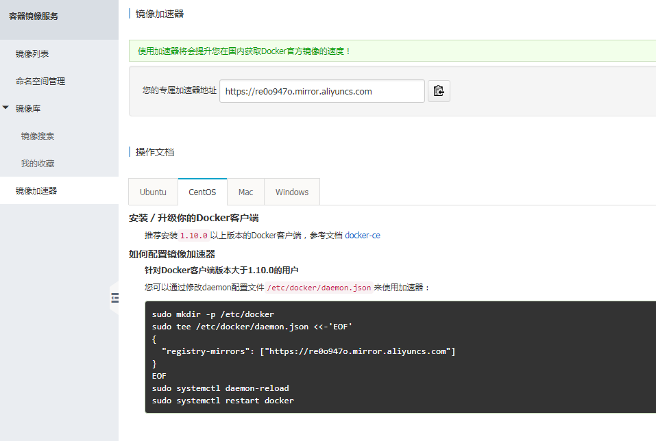

## 有
```
cd /etc/yum.repos.d/
wget  https://mirrors.aliyun.com/docker-ce/linux/centos/docker-ce.repo
yum install docker-ce -y
```

```
[root@nazeebodan yum.repos.d]# systemctl start docker
[root@nazeebodan yum.repos.d]# docker info
Containers: 0
 Running: 0
 Paused: 0
 Stopped: 0
Images: 0
Server Version: 18.06.0-ce
Storage Driver: overlay2
 Backing Filesystem: extfs
 Supports d_type: true
 Native Overlay Diff: true
Logging Driver: json-file
Cgroup Driver: cgroupfs
Plugins:
 Volume: local
 Network: bridge host macvlan null overlay
 Log: awslogs fluentd gcplogs gelf journald json-file logentries splunk syslog
Swarm: inactive
Runtimes: runc
Default Runtime: runc
Init Binary: docker-init
containerd version: d64c661f1d51c48782c9cec8fda7604785f93587
runc version: 69663f0bd4b60df09991c08812a60108003fa340
init version: fec3683
Security Options:
 seccomp
  Profile: default
Kernel Version: 3.10.0-693.2.2.el7.x86_64
Operating System: CentOS Linux 7 (Core)
OSType: linux
Architecture: x86_64
CPUs: 2
Total Memory: 3.702GiB
Name: nazeebodan
ID: YRUC:F42Z:PJ3T:CENP:73ZJ:DTKP:T33U:EO66:PBXK:MB7K:V4EN:VWH5
Docker Root Dir: /var/lib/docker
Debug Mode (client): false
Debug Mode (server): false
Registry: https://index.docker.io/v1/
Labels:
Experimental: false
Insecure Registries:
 127.0.0.0/8
Live Restore Enabled: false
```

```
[root@nazeebodan yum.repos.d]# systemctl enable docker
Created symlink from /etc/systemd/system/multi-user.target.wants/docker.service to /usr/lib/systemd/system/docker.service.
[root@nazeebodan yum.repos.d]# 
```


docker官方镜像仓库
https://hub.docker.com/


docker search centos

docker中的centos --这种是没有内核的。有些时候可以用内核的特性是因为依赖于宿主机的内核的原因


配置镜像加速
注册阿里云
https://dev.aliyun.com/search.html
点击“创建我的容器镜像”，创建完成后再镜像加速器就有相关的操作提示了。

