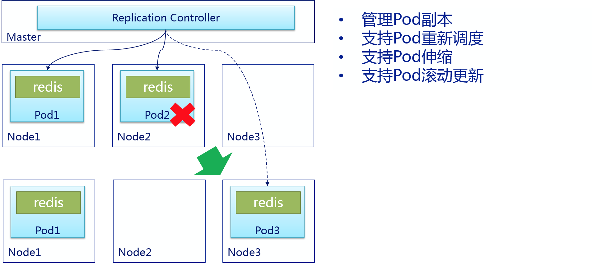

<!-- toc -->
## Replication Controller

是否手动创建Pod，如果想要创建同一个容器的多份拷贝，需要一个个分别创建出来么，能否将Pods划到逻辑组里？

Replication Controller确保任意时间都有指定数量的Pod“副本”在运行。如果为某个Pod创建了Replication Controller并且指定3个副本，它会创建3个Pod，并且持续监控它们。如果某个Pod不响应，那么Replication Controller会替换它，保持总数为3.如下面的动画所示：
如果之前不响应的Pod恢复了，现在就有4个Pod了，那么Replication Controller会将其中一个终止保持总数为3。如果在运行中将副本总数改为5，Replication Controller会立刻启动2个新Pod，保证总数为5。还可以按照这样的方式缩小Pod，这个特性在执行滚动升级时很有用。

当创建Replication Controller时，需要指定两个东西：
Pod模板：用来创建Pod副本的模板
Label：Replication Controller需要监控的Pod的标签。


Replication Controller核心作用是确保在任何时候集群中一个RC所关联的Pod都保持一定数量的副本处于正常运行状态。如果该Pod的副本数量太多，则Replication Controller会销毁一些Pod副本；反之Replication Controller会添加副本，直到Pod的副本数量达到预设的副本数量。

最好不要越过RC直接创建Pod，因为Replication Controller会通过RC管理Pod副本，实现自动创建、补足、替换、删除Pod副本，这样就能提高应用的容灾能力，减少由于节点崩溃等意外状况造成的损失。即使应用程序只有一个Pod副本，也强烈建议使用RC来定义Pod。

- pod通过RC创建：当Pod通过RC创建后，即使修改RC的模板定义，也不会影响到已经创建的Pod。此外Pod可以通过修改标签来实现脱离RC的管控，该方法可以用于将Pod从集群中迁移、数据修复等调试。对于被迁移的Pod副本，RC会自动创建一个新副本替换被迁移的副本。需要注意的是，通过kubectl删除RC时会一起删掉RC所创建的Pod副本，但是通过REST API删除时，需要将replicas设置为0，等到Pod删除后再删除RC。

- 重新调度：如前面所说，不论是想运行1个副本还是1000个副本，Replication Controller都能确保指定数量的副本存在于集群中，即使发生节点故障或Pod副本被终止运行等意外情况。

- 伸缩：修改Replication Controller的replicas的属性值，可以非常容易的实现扩大或缩小副本的数量。例如，通过下列命令可以实现手工修改名为foo的RC副本数量为3：
```
kubectl scale –replicas=3 rc/foo
```

- 滚动更新：副本控制器被设计成通过逐个替换Pod的方式来辅助服务的滚动更新。推荐的方法是创建一个新的只有一个副本的RC，若新的RC副本数量加1，则旧的RC副本数量减1，直到这个旧的RC副本数量为0，然后删除旧的RC。这样即使在滚动更新的过程中发生了不可预测的错误，Pod集合的更新也都在可控范围之内。在理想情况下，滚动更新控制器需要将准备就绪的应用考虑在内，保证在集群中任何时刻都有足够数量的可用的Pod（https://github.com/kubernetes/kubernetes/issues/1353）
