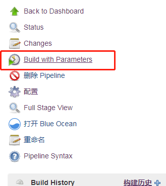
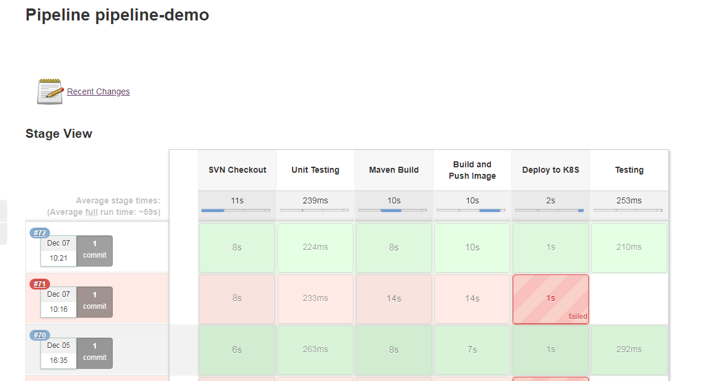

验证

:





```
[root@master jenkins_slave_2]# kubectl get deploy,pod
NAME                                           DESIRED   CURRENT   UP-TO-DATE   AVAILABLE   AGE
deployment.extensions/devportal-web            1         1         1            1           8d
deployment.extensions/nfs-client-provisioner   1         1         1            1           46d

NAME                                          READY     STATUS    RESTARTS   AGE
pod/devportal-web-b8645fdfc-kwb6f             1/1       Running   0          3d
pod/devportal-web-b8645fdfc-vrzcg             1/1       Unknown   0          5d
pod/jenkins-0                                 1/1       Running   1          4d
pod/nfs-client-provisioner-6db86bc775-5zbn7   1/1       Unknown   21         23d
pod/nfs-client-provisioner-6db86bc775-lb945   1/1       Running   7          3d
```
