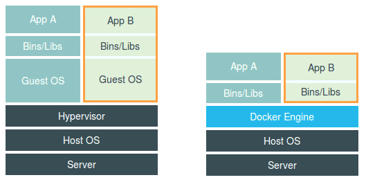
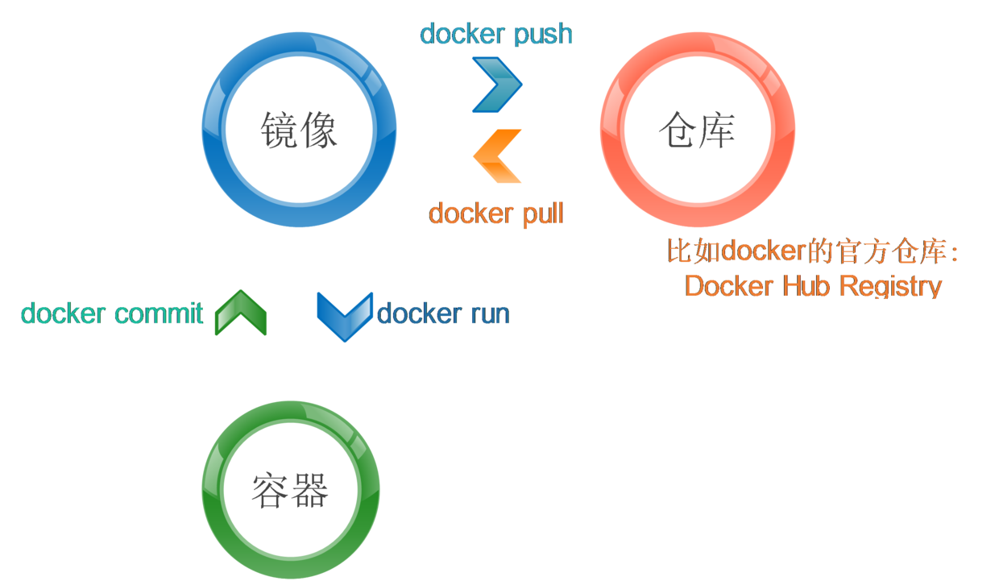
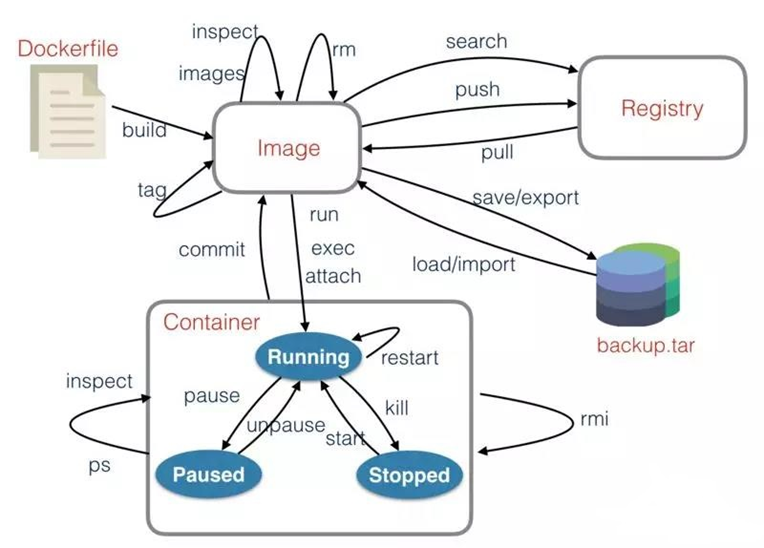

# 二、docker
## 1. docker架构


容器就是一种沙盒技术，顾名思义，沙盒就是能够像一个集装箱一样，把应用装起来的技术。这样一来，应用与应用之间，就因为有了边界而不至于相互干扰；而被装进集装箱的应用，也可以被方便的搬来搬去
容器技术的核心功能，就是通过约束和修改进程的动态表现，从而为其创造出一个“边界”。
对于 Docker 等大多数 Linux 容器来说，Cgroups 技术是用来制造约束的主要手段，而Namespace技术则是用来修改进程视图的方法。

要理解docker，最核心的是理解三个概念，分别是：
- 仓库（Registry）
- 镜像（image）
- 容器（Container）

### 1.1 仓库
所谓仓库，其实是个镜像仓库，里面有很多别人已经打包好的镜像，可以直接使用`docker pull`命令将仓库中的镜像拉到本地，默认的仓库Docker的官方仓库`Docker Hub Registry`,我们推荐使用harbor这个项目。
harbor项目的地址: https://github.com/vmware/harbor/releases
具体安装不再详细叙述。

### 1.2 镜像
通过docker images命令可以看到本地已有的镜像：
```
# docker images
REPOSITORY                             TAG                 IMAGE ID            CREATED             SIZE
360cloud/wayne                         latest              10e7881a6c1a        13 days ago         272MB
rancher/rancher                        latest              2dac31d410a2        2 weeks ago         546MB
192.168.3.27:8888/ops/jenkins-slave4   nojdkmvn            f23c25c4f035        4 weeks ago         994MB
192.168.3.27:8888/ops/jenkins-slave4   latest              28b9adee04a7        4 weeks ago         1.39GB
192.168.3.27:8888/ops/os2              latest              ad5f8110ab8a        4 weeks ago         939MB
<none>                                 <none>              ee41fb6f1c77        4 weeks ago         556MB
192.168.3.27:8888/ops/tomcat-85        latest              2adb591ff718        4 weeks ago         146MB
192.168.3.27:8888/ops/jenkins          lts-alpine          6e18c3eeb70e        5 weeks ago         221MB
192.168.3.27:8888/ops/jenkins-slave    latest              ad7c7c42cafd        5 weeks ago         297MB
ubuntu                                 latest              93fd78260bd1        6 weeks ago         86.2MB
debian                                 stretch             4879790bd60d        7 weeks ago         101MB
jenkins/jenkins                        lts-alpine          bcc31d32159f        7 weeks ago         221MB
mysql                                  5.6.41              085b9b6ec8a9        2 months ago        256MB
centos                                 latest              75835a67d134        2 months ago        200MB
192.168.3.27:8888/ops/jenkins          jnlp                d68e6cfb2be2        6 months ago        1.29GB
vmware/redis-photon                    v1.5.0              7c03076402d9        8 months ago        207MB
vmware/clair-photon                    v2.0.1-v1.5.0       7ae4e0670a3f        8 months ago        301MB
vmware/notary-server-photon            v0.5.1-v1.5.0       0b2b23300552        8 months ago        211MB
vmware/notary-signer-photon            v0.5.1-v1.5.0       67c41b4a1283        8 months ago        209MB
vmware/registry-photon                 v2.6.2-v1.5.0       3059f44f4b9a        8 months ago        198MB
vmware/nginx-photon                    v1.5.0              e100456182fc        8 months ago        135MB
vmware/harbor-log                      v1.5.0              62bb6b8350d9        8 months ago        200MB
vmware/harbor-jobservice               v1.5.0              aca9fd2e867f        8 months ago        194MB
vmware/harbor-ui                       v1.5.0              1055166068d0        8 months ago        212MB
vmware/harbor-adminserver              v1.5.0              019bc4544829        8 months ago        183MB
vmware/harbor-db                       v1.5.0              82354dcf564f        8 months ago        526MB
vmware/mariadb-photon                  v1.5.0              403e7e656499        8 months ago        526MB
vmware/postgresql-photon               v1.5.0              35c891dea9cf        8 months ago        221MB
vmware/harbor-migrator                 v1.5.0              466c57ab0dc3        8 months ago        1.16GB
vmware/photon                          1.0                 4b481ecbef2a        8 months ago        130MB
192.168.3.27:8888/ops/java             latest              d23bdf5b1b1b        23 months ago       643MB
```
每个镜像都有一个IMAGE ID作为唯一标识，使用镜像的id可以将它删除，命令如下：
```
docker rmi 镜像id
```
### 1.3 容器（Container）
使用docker run来运行镜像,运行之后镜像就变成一个容器
```
# docker ps
CONTAINER ID        IMAGE                                  COMMAND                  CREATED             STATUS                 PORTS
ee8507c5efe8     rancher/rancher:latest                 "entrypoint.sh"          9 days ago          Up 2 days              0.0.0.0:80->80/tcp, 0.0.0.0:443->443/tcp
```

每个容器也会有一个ID作为唯一标识，从上面的输出中可以看出CONTAINER ID是`ee8507c5efe8`


有了上面的简单叙述，它们三者的关系可以用一张图来总结：



## 2. docker相关命令
用一张图可以高度总结有关docker的常用命令



## 3. dockerfile的编写及最佳实践
如果想要从一个基础镜像开始建立一个自定义镜像，可以选择一步一步进行构建，也可以选择写一个配置文件，然后一条命令（docker build）完成构建，显然配置文件的方式可以更好地应对需求的变更，这个配置文件就是Dockerfile。

Dockerfile 的设计思想，是使用一些标准的原语（即大写高亮的词语），描述我们所要构建的 Docker 镜像。并且这些原语，都是按顺序处理的。

我们的研究重点其实也在怎么编写好dockerfile，来为自己的代码打包成镜像。

下面介绍下dockerfile常用的命令

### 3.1 build命令
和dockerfile配套使用的指令,根据dockerfile进行进行打包。
```
Usage:  docker build [OPTIONS] PATH | URL | -
OPTIONS：
-t， --tag list  #指定构建的镜像名称和标记名称
-f， --file string #指定Dockerfiile文件路径
```
示例：
1. `docker build .` #不指定镜像名称的话，将会默认以<none>作为镜像名称和标记名称
2. `docker build -t myip:v1 .` #镜像名称为nginx，标记名称为v1
3. `docker build -t myip:v1 -f /path/Dockerfile` /path #指定dockerfile文件路径

> 说明：
在构建镜像时，Docker daemon会首先将Dockerfile所在的目录构建成一个context（上下文），然后通过Dockerfile里的COPY或者ADD语句将context里的文件复制到指定的镜像目录里。
所以需要复制到镜像里的文件，无论是脚本、安装包还是配置文件，都需要跟Dockerfile文件放在同一个目录下。
当执行docker build命令后，返回的第一条信息便是在构建上下文。

### 3.2 Dockerfile的基本指令
基本指令有十多个，分别是：
* FROM
* MAINTAINER
* ENV
* RUN
* CMD
* EXPOSE
* ARG
* ADD
* COPY
* ENTRYPOINT
* VOLUME
* USER
* WORKDIR
* HEALTHCHECK
* ONBUILD

#### FROM
语法：
```
FROM <image>
```
>说明：第一个指令必须是FROM了，其指定一个构建镜像的基础源镜像，如果本地没有就会从公共库中拉取，没有指定镜像的标签会使用默认的latest标签，可以出现多次，如果需要在一个Dockerfile中构建多个镜像。

#### MAINTAINER
语法：
```
MAINTAINER <name> <email>
```
>说明：描述镜像的创建者，名称和邮箱

#### ENV
用法：
```
ENV <key> <value>   #设置一个环境变量
ENV <key1>=<value1> <key2>=<value2>...   #设置多个环境变量
```
>
说明：设置容器的环境变量，可以让其后面的RUN命令使用，容器运行的时候这个变量也会保留。

#### RUN
语法：
```
RUN <command>
RUN ["executable", "param1", "param2" ...]
```

说明：构建镜像时运行的shell命令
例如：`RUN yum install httpd`或者`RUN ["yum", "install", "httpd"]`
Dockerfile中每一个指令都会建立一层，RUN也不例外。多少个RUN就构建了多少层镜像，多个RUN会产生非常臃肿、多层的镜像，不仅仅增加了构建部署的时间，还容易出错。我们在写Dockerfile的时候，要尽量避免使用多个RUN，尽量将需要执行的命令都写在一个RUN里。多条命令可使用\来换行，换行的命令前面加上&&，最后还需要将不需要的文件及目录删除，比如安装包、临时目录等，减少容器的大小。
注：Union FS是有最大层数限制的，比如AUFS，曾经是最大不得超过42层，现在是不得超过127层。

#### CMD
用法：
```
CMD <命令>
CMD ["可执行文件", "参数1", "参数2"...]
```
>说明：
CMD在Dockerfile中只能出现一次，有多个，只有最后一个会有效。其作用是在启动容器的时候提供一个默认的命令项。如果用户执行docker run的时候提供了命令项，就会覆盖掉这个命令。没提供就会使用构建时的命令。
容器运行时执行的shell命令，CMD指令一般应为Dockerfile文件的最后一行。
例如：`CMD echo $HOME`或者`CMD [ "sh", "-c", "echo $HOME" ]`
举个例子，启动nginx服务不能使用`CMD systemctl start nginx`，而应该使用`CMD ["nginx", "-g", "daemon off;"]`。因为docker会将`CMD systemctl start nginx`命令理解为`CMD ["sh", "-c", "systemctl start nginx"]`，主进程实际上是sh，当systemctl start nginx命令执行完后，sh作为主进程退出了，自然容器也会退出。这就是为什么使用`CMD systemctl start nginx`指令，容器运行不起来的原因。正确的作法是将nginx以前台形式运行，即`CMD ["nginx", "-g", "daemon off;"]`。

#### EXPOSE
语法：
```
EXPOSE <port> [<port>...]
```
>说明：告诉Docker服务器容器对外映射的容器端口号，在docker run -p的时候生效。

#### ARG
语法：
```
ARG <参数名>   #不设置默认值的话，需要使用--build-arg来设置参数的值
ARG <参数名>[=<默认值>]   #设置参数的默认值
```

>说明：
定义参数，即临时变量，只限于构建镜像时使用，容器运行后是不会存在的。
例如：`ARG APT=apt-get`
注：在构建命令docker build中用--build-arg <参数名>=<值> 可以覆盖此参数的值。
例如：docker build --build-arg APT=yum -t myip:v1 .

#### ADD
语法：
```
ADD <源路径>... <目标路径>
ADD ["<源路径1>",... "<目标路径>"]
```

>说明：
复制本机文件或目录或远程文件，添加到指定的容器目录，支持GO的正则模糊匹配。路径是绝对路径，不存在会自动创建。
如果源是一个目录，只会复制目录下的内容，目录本身不会复制。
ADD命令会将复制的压缩文件夹自动解压，这也是与COPY命令最大的不同。
源路径是一个压缩文件的话，将会解压到容器的目标路径下；源路径是一个URL的话，会下载或者解压到容器的目标路径下

#### COPY
语法：
```
COPY <源路径>... <目标路径>
COPY ["<源路径1>",... "<目标路径>"]
```
> 说明：
源路径可以是多个，甚至可以使用通配符
COPY除了不能自动解压，也不能复制网络文件。其它功能和ADD相同。

#### ENTRYPOINT
语法：
```
ENTRYPOINT <命令>
ENTRYPOINT ["可执行文件", "参数1", "参数2"...]
```

> 说明：
这个命令和CMD命令一样，唯一的区别是不能被docker run命令的执行命令覆盖，如果要覆盖需要带上选项--entrypoint，如果有多个选项，只有最后一个会生效。

#### VOLUME
语法：
```
VOLUME <路径>
VOLUME ["<路径1>", "<路径2>"...]
```
>
说明：
在主机上创建一个挂载，挂载到容器的指定路径。docker run -v命令也能完成这个操作，而且更强大。这个命令不能指定主机的需要挂载到容器的文件夹路径。但docker run -v可以，而且其还可以挂载数据容器。

#### USER
语法：
```
USER daemon
```
> 说明：指定运行容器时的用户名或UID，后续的RUN、CMD、ENTRYPOINT也会使用指定的用户运行命令。

#### WORKDIR
语法：
```
WORKDIR path
```
> 说明：为RUN、CMD、ENTRYPOINT指令配置工作目录。可以使用多个WORKDIR指令，后续参数如果是相对路径，则会基于之前的命令指定的路径。如：WORKDIR  /home　　WORKDIR test 。最终的路径就是/home/test。path路径也可以是环境变量，比如有环境变量HOME=/home，WORKDIR $HOME/test也就是/home/test。

#### HEALTHCHECK
语法:
```
HEALTHCHECK [选项] CMD <命令>
HEALTHCHECK NONE   #如果基础镜像有健康检查指令，使用这行可以取消健康检查指令
```
>说明：容器健康状态检查指令
例如：`HEALTHCHECK --interval=5s --timeout=3s CMD curl -fs http://localhost/ || exit 1`

HEALTHCHECK的选项有：
```
--interval=<间隔>：两次健康检查的间隔时间，默认为30秒
--timeout=<时长>：每次检查的超时时间，超过这个时间，本次检查就视为失败，默认30秒
--retries=<次数>：指定健康检查的次数，默认3次，如果指定次数都失败后，则容器的健康状态为unhealthy（不健康）
```

#### ONBUILD
语法：
```
ONBUILD [INSTRUCTION]
```
>
说明：
指定以当前镜像为基础镜像构建的下一级镜像运行的命令
配置当前所创建的镜像作为其它新创建镜像的基础镜像时，所执行的操作指令。
换句话说，就是这个镜像创建后，如果其它镜像以这个镜像为基础，会先执行这个镜像的ONBUILD命令。

### 4. dockerfile实践
我将镜像的制作分为三类
- 基础镜像
- 运行环境镜像
- app镜像


#### 4.1 制作基础镜像
##### 制作一个安装了扩展操作系统的基础镜像
```
FROM debian:stretch
MAINTAINER suredandan xrzp@qq.com

ENV TIMEZONE=Asia/Shanghai \
    LANG=zh_CN.UTF-8

RUN echo "${TIMEZONE}" > /etc/timezone \
    && echo "$LANG UTF-8" > /etc/locale.gen \
    && apt-get update -q \
    && ln -sf /usr/share/zoneinfo/${TIMEZONE} /etc/localtime \
    && mkdir -p /home/jenkins/.jenkins \
    && mkdir -p /home/jenkins/agent \
    && mkdir -p /usr/share/jenkins

# COPY chhostname.sh /usr/local/bin/chhostname.sh

# java/locale/DinD/svn/jnlp
RUN  DEBIAN_FRONTEND=noninteractive apt-get install -yq vim wget curl apt-utils dialog locales apt-transport-https build-essential bzip2 ca-certificates sudo jq unzip zip gnupg2 software-properties-common \
     && update-locale LANG=$LANG \
     && locale-gen $LANG \
     && DEBIAN_FRONTEND=noninteractive dpkg-reconfigure locales \
     && curl -fsSL https://mirrors.aliyun.com/docker-ce/linux/debian/gpg | sudo apt-key add - \
     && add-apt-repository "deb [arch=amd64] https://mirrors.aliyun.com/docker-ce/linux/debian $(lsb_release -cs) stable" \
     && apt-get update -y \
     && apt-get install -y docker-ce \
     && apt-get install -y subversion \
     && groupadd -g 10000 jenkins \
     && useradd -c "Jenkins user" -d $HOME -u 10000 -g 10000 -m jenkins \
     && usermod -a -G docker jenkins \
     && sed -i '/^root/a\jenkins    ALL=(ALL:ALL) NOPASSWD:ALL' /etc/sudoers

USER root

WORKDIR /home/jenkins
```

推送到私有镜像仓库中:
`docker build -t 192.168.3.27:8888/ops/os2 .`

##### 基于这个基础镜像`os2`制作jenkins的slave镜像

```
FROM 192.168.3.27:8888/ops/os2
MAINTAINER suredandan xrzp@qq.com

RUN mkdir -p /usr/local/maven \
    && mkdir -p /usr/local/jdk \
    && mkdir -p /root/.kube

COPY jdk /usr/local/jdk
COPY maven /usr/local/maven
COPY kubectl /usr/local/bin/kubectl
COPY jenkins-slave /usr/local/bin/jenkins-slave
COPY slave.jar /usr/share/jenkins
COPY config /root/.kube/

ENV JAVA_HOME=/usr/local/jdk \
    MAVEN_HOME=/usr/local/maven \
    PATH=/usr/local/jdk/bin:/usr/local/maven/bin:$PATH

ENTRYPOINT ["jenkins-slave"]
```

#### 4.2 制作运行环境镜像

##### 直接拖取已有的java运行环境镜像
```
docker pull java
docker tag java 192.168.3.27:8888/ops/java
```

#####  制作tomcat镜像
```
FROM ubuntu
MAINTAINER xrzp@qq.com

ENV VERSION=8.5.31

ENV JAVA_HOME /usr/local/jdk
COPY apache-tomcat-8.5.31.tar.gz .
RUN apt-get update && \
    apt-get install wget curl unzip iproute2 net-tools -y && \
    apt-get clean all && \
    tar zxf apache-tomcat-${VERSION}.tar.gz && \
    mv apache-tomcat-${VERSION} /usr/local/tomcat && \
    rm -rf apache-tomcat-${VERSION}.tar.gz /usr/local/tomcat/webapps/* && \
    sed -i '1a JAVA_OPTS="-Djava.security.egd=file:/dev/./urandom"' /usr/local/tomcat/bin/catalina.sh && \
    ln -sf /usr/share/zoneinfo/Asia/Shanghai /etc/localtime

WORKDIR /usr/local/tomcat

EXPOSE 8080
CMD ["./bin/catalina.sh", "run"]
```
将镜像推送到私有镜像仓库
`docker build -t 192.168.3.27:8888/ops/tomcat85`

##### 直接从基础镜像制作nginx镜像
```
FROM centos:7
MAINTAINER xrzp@qq.com
RUN yum install -y gcc gcc-c++ make \
    openssl-devel pcre-devel gd-devel libxslt-devel \
    iproute net-tools telnet wget curl && \
    yum clean all && \
    rm -rf /var/cache/yum/*
RUN wget http://nginx.org/download/nginx-1.15.6.tar.gz && \
    tar zxf nginx-1.15.6.tar.gz && \
    cd nginx-1.15.6 && \
    ./configure --prefix=/usr/local/nginx \
    --with-http_ssl_module \
    --with-http_v2_module \
    --with-http_realip_module \
    --with-http_image_filter_module \
    --with-http_gunzip_module \
    --with-http_gzip_static_module \
    --with-http_secure_link_module \
    --with-http_stub_status_module \
    --with-stream \
    --with-stream_ssl_module && \
    make -j 4 && make install && \
    mkdir -p /usr/local/nginx/conf/vhost && \
    rm -rf /usr/local/nginx/html/* && \
    echo "ok" >> /usr/local/nginx/html/status.html && \
    cd / && rm -rf nginx-1.15.6*
ENV PATH $PATH:/usr/local/nginx/sbin
WORKDIR /usr/local/nginx
EXPOSE 80
CMD ["nginx", "-g", "daemon off;"]
```
将镜像推送到私有镜像仓库
`docker build -t 192.168.3.27:8888/ops/nginx`

##### 制作php镜像
```
FROM centos:7
MAINTAINER xrzp@qq.com
RUN yum install epel-release -y && \
    yum install -y gcc gcc-c++ make gd-devel libxml2-devel \
    libcurl-devel libjpeg-devel libpng-devel openssl-devel \
    libmcrypt-devel libxslt-devel libtidy-devel autoconf \
    iproute net-tools telnet wget curl && \
    yum clean all && \
    rm -rf /var/cache/yum/*

RUN wget http://docs.php.net/distributions/php-5.6.36.tar.gz && \
    tar zxf php-5.6.36.tar.gz && \
    cd php-5.6.36 && \
    ./configure --prefix=/usr/local/php \
    --with-config-file-path=/usr/local/php/etc \
    --with-config-file-scan-dir=/usr/local/php/etc/php.d \
    --enable-fpm --enable-opcache --enable-static=no \
    --with-mysql --with-mysqli --with-pdo-mysql \
    --enable-phar --with-pear --enable-session \
    --enable-sysvshm --with-tidy --with-openssl \
    --with-zlib --with-curl --with-gd --enable-bcmath \
    --with-jpeg-dir --with-png-dir --with-freetype-dir \
    --with-iconv --enable-posix --enable-zip \
    --enable-mbstring --with-mhash --with-mcrypt --enable-hash \
    --enable-xml --enable-libxml --enable-debug=no && \
    make -j 4 && make install && \
    cp php.ini-production /usr/local/php/etc/php.ini && \
    cp sapi/fpm/php-fpm.conf /usr/local/php/etc/php-fpm.conf && \
    sed -i "90a \daemonize = no" /usr/local/php/etc/php-fpm.conf && \
    mkdir /usr/local/php/log && \
    cd / && rm -rf php*

ENV PATH $PATH:/usr/local/php/sbin
WORKDIR /usr/local/php
EXPOSE 9000
CMD ["php-fpm"]
```

#### 4.3 制作app镜像
##### 利用上面制作好的`tomcat85`镜像部署应用
```
FROM 192.168.3.27:8888/ops/tomcat85
ADD target/solo.war /tmp
RUN unzip -q /tmp/solo.war -d /usr/local/tomcat/webapps/ROOT

COPY deploy/docker-entrypoint.sh /usr/bin/docker-entrypoint.sh
ENTRYPOINT ["docker-entrypoint.sh"]

EXPOSE 8080
CMD ["./bin/catalina.sh", "run"]
```

##### 将应用部署到`java`运行环境的镜像
利用上面的java 镜像 部署我们的java应用
```
FROM 192.168.3.27:8888/ops/java
MAINTAINER suredandan xrzp@qq.com

ADD target/devPortal-web-1.0.0-SNAPSHOT.jar /tmp

EXPOSE 9527
ENTRYPOINT java -jar /tmp/devPortal-web-1.0.0-SNAPSHOT.jar
```
### 5. dockerfile最佳实践
经过大量的dockerfile编写后，总结了如下的一些最佳实践：
* 构建出来的镜像尽可能“小”
  * 选择适合的尽量小的基础镜像
    - 尽量让每个镜像的用途都比较集中、单一，避免构造大而复杂、多功能的镜像
    - 过大的基础镜像会造成构建出臃肿的镜像，一般推荐比较小巧的镜像作为基础镜像
  * 提供详细的注释和维护者信息
    -  Dockerfile也是一种代码，需要考虑方便后续扩展和他人使用
    - 使用明确的具体数字信息的版本号信息，而非latest，可以避免无法确认具体版本号，统一环境
  * 尽量减少镜像层的数目
    - 减少镜像层数建议尽量合并RUN指令，可以将多条RUN指令的内容通过&&连接
  * 不要安装不必要的包
  * 构建后删除临时的包 

- 让构建镜像过程尽可能“快”
  - 使用清洁的构建上下文(build context)
    - 及时删除临时和缓存文件，避免构造的镜像过于臃肿，并且这些缓存文件并没有实际用途；
  - 利用构建时缓存(build cache)
    - 合理使用缓存、减少目录下的使用文件，使用.dockeringore文件等
    - 在开启缓存的情况下，内容不变的指令尽量放在前面，这样可以提高指令的复用性；

- 让镜像变得“好用”
  - 选择官方基础镜像
  - 设置正确的程序入口点
  - 不要加入不必要的限制

- 让构建镜像变得”省事、省心“
  - 选择高级别基础镜像
    - 如果确实要从外部引入数据，需要制定持久的地址，并带有版本信息，让他人可以重复使用而不出错。
  - 保持Dockerfile尽可能简单
  - 使用经过安全扫描的基础镜像
