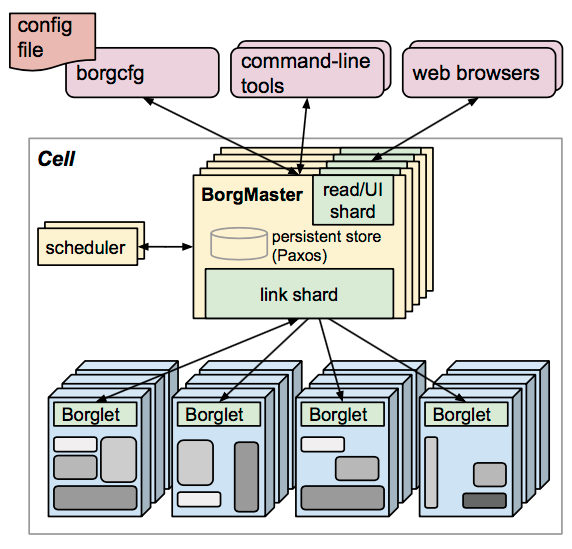
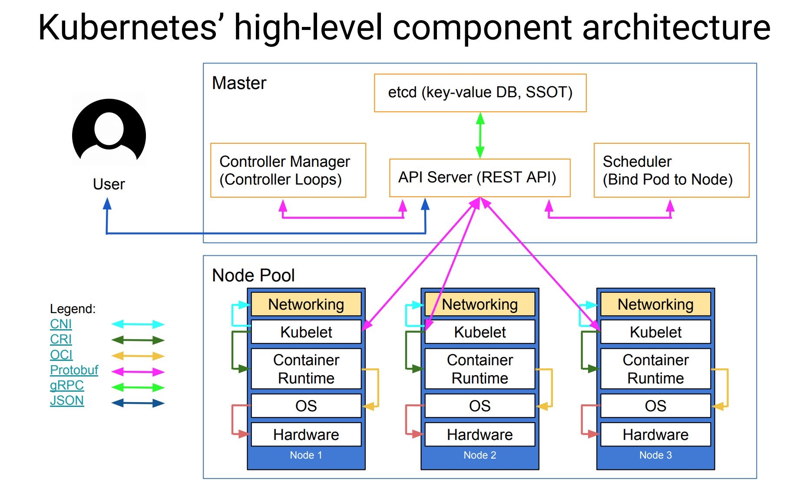
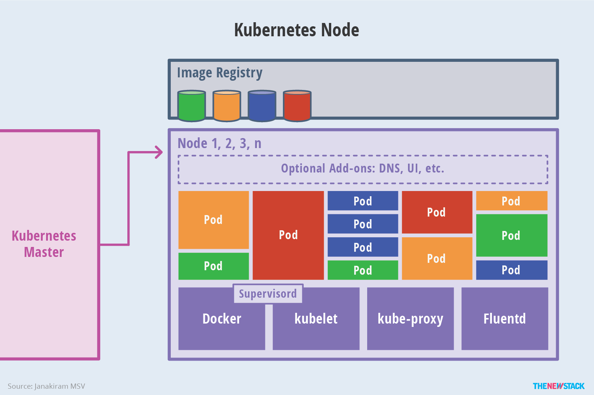
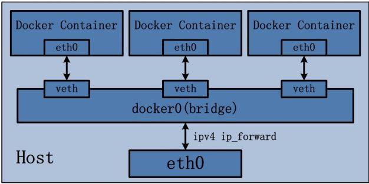
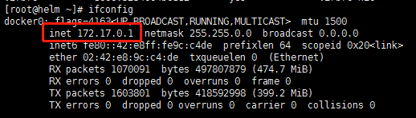
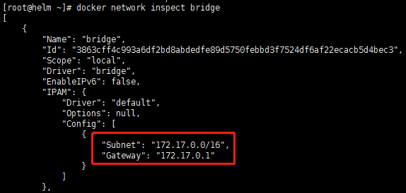
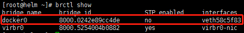

<!-- toc -->


# 一、基于容器的基础服务构建之落地相关研究报告

在整个研究过程中，我们分为了三个阶段：
- 1.研究以docker为主的容器运行时
- 2.研究容器的编排工具kubernetes
- 3.研究基于kubernetes的基础组件构建方式及使用
- 4.基于MySQL的

接下来，将分别介绍这三个阶段的研究成果。


# 三、kubernetes
## 1. kubernetes的介绍架构
在有了容器运行时这个基石，我们接下来的研究对象是容器的编排工具kubernetes。
把容器比作一个一个集装箱，而docker是驮着集装箱的船，那么kubernetes就是掌舵的船长。

### 1.1 Borg
首先介绍下kubernetes的前身--borg
Borg 是谷歌内部的大规模集群管理系统，负责对谷歌内部很多核心服务的调度和管理。Borg的目的是让用户能够不必操心资源管理的问题，让他们专注于自己的核心业务，并且做到跨多个数据中心的资源利用率最大化。
Borg主要由BorgMaster、Borglet、borgcfg和Scheduler组成，如下图所示：



- BorgMaster是整个集群的大脑，负责维护整个集群的状态，并将数据持久化到Paxos存储中；
- Scheduer负责任务的调度，根据应用的特点将其调度到具体的机器上去；
- Borglet负责真正运行任务（在容器中）；
- borgcfg是Borg的命令行工具，用于跟Borg系统交互，一般通过一个配置文件来提交任务。

### 1.2 kubernetes 架构
Kubernetes借鉴了Borg的设计理念，比如Pod、Service、Labels和单Pod单IP等。Kubernetes的整体架构跟Borg非常像，如下图所示：


Kubernetes主要由以下几个核心组件组成：

- etcd保存了整个集群的状态；
- apiserver提供了资源操作的唯一入口，并提供认证、授权、访问控制、API注册和发现等机制；
- controller manager负责维护集群的状态，比如故障检测、自动扩展、滚动更新等；
- scheduler负责资源的调度，按照预定的调度策略将Pod调度到相应的机器上；
- kubelet负责维护容器的生命周期，同时也负责Volume（CSI）和网络（CNI）的管理；
- 容器运行时负责镜像管理以及Pod和容器的真正运行（CRI）；
- kube-proxy负责为Service提供cluster内部的服务发现和负载均衡；

除了核心组件，还有一些推荐的Addons：
- kube-dns负责为整个集群提供DNS服务，1.10开始用core-dns代替
- Ingress Controller为服务提供外网入口
- Heapster提供资源监控
- Dashboard提供GUI
- Federation提供跨可用区的集群


### 1.3 k8s组件间的通信
下图非常清晰的展示了组件间的通信和相关的协议



### 1.4 master 与 Node 架构
master架构:


node架构:


## 2. 网络

### 2.1 docker的网络
在说Kubernetes网络之前，先来看一下Docker网络。Docker采用插件化的网络模式，默认提供bridge、host、none、overlay、maclan和Network plugins这几种网络模式，运行容器时可以通过–network参数设置具体使用那一种模式。



* bridge：这是Docker默认的网络驱动，此模式会为每一个容器分配Network Namespace和设置IP等，并将容器连接到一个虚拟网桥上。如果未指定网络驱动，这默认使用此驱动。
* host：此网络驱动直接使用宿主机的网络。
* none：此驱动不构造网络环境。采用了none 网络驱动，那么就只能使用loopback网络设备，容器只能使用127.0.0.1的本机网络。
* overlay：此网络驱动可以使多个Docker daemons连接在一起，并能够使用swarm服务之间进行通讯。也可以使用overlay网络进行swarm服务和容器之间、容器之间进行通讯，
* macvlan：此网络允许为容器指定一个MAC地址，允许容器作为网络中的物理设备，这样Docker daemon就可以通过MAC地址进行访问的路由。对于希望直接连接网络网络的遗留应用，这种网络驱动有时可能是最好的选择。
* Network plugins：可以安装和使用第三方的网络插件。可以在Docker Store或第三方供应商处获取这些插件。

#### 2.1.1 bridge网络的构建过程如下：
）安装Docker时，创建一个名为docke0的虚拟网桥，虚拟网桥使用“10.0.0.0 -10.255.255.255 “、”172.16.0.0-172.31.255.255″和“192.168.0.0——192.168.255.255”这三个私有网络的地址范围。

通过 ifconfig 命令可以查看docker0网桥的信息:



通过 docker network inspect bridge 可以查看网桥的子网网络范围和网关：



运行容器时，在宿主机上创建虚拟网卡veth pair设备，veth pair设备是成对出现的，从而组成一个数据通道，数据从一个设备进入，就会从另一个设备出来。将veth pair设备的一端放在新创建的容器中，命名为eth0；另一端放在宿主机的docker0中，以veth为前缀的名字命名。通过 brctl show 命令查看放在docker0中的veth pair设备



#### 2.1.2 外部访问
bridge的docker0是虚拟出来的网桥，因此无法被外部的网络访问。因此需要在运行容器时通过-p和-P参数对将容器的端口映射到宿主机的端口。实际上Docker是采用 NAT的 方式，将容器内部的服务监听端口与宿主机的某一个端口port 进行绑定，使得宿主机外部可以将网络报文发送至容器。

- 通过-P参数，将容器的端口映射到宿主机的随机端口：
```
$ docker run -P {images}
```

- 通过-p参数，将容器的端口映射到宿主机的制定端口：
```
$ docker run -p {hostPort}:{containerPort} {images}
```
### 2.2 kubernetes的网络
Kubernetes与Docker网络有些不同。Kubernetes网络需要解决下面的4个问题：

- 集群内：
  - 容器与容器之间的通信
  - Pod和Pod之间的通信
  - Pod和服务之间的通信
- 集群外：
  - 外部应用与服务之间的通信


## 3.存储
### 3.1 基本概念
容器中的存储都是临时的，因此Pod重启的时候，内部的数据会发生丢失。实际应用中，我们有些应用是无状态，有些应用则需要保持状态数据，确保Pod重启之后能够读取到之前的状态数据，有些应用则作为集群提供服务。这三种服务归纳为无状态服务、有状态服务以及有状态的集群服务，其中后面两个存在数据保存与共享的需求，因此就要采用容器外的存储方案。下图为存储的概念图：


### 3.2 Kubernetes中存储中有四个重要的概念：
* Volume
    * Volumes是最基础的存储抽象，其支持多种类型，包括本地存储、NFS、FC以及众多的云存储，也可以编写自己的存储插件来支持特定的存储系统。Volume可以被Pod直接使用，也可以被PV使用。普通的Volume和Pod之间是一种静态的绑定关系，在定义Pod的同时，通过volume属性来定义存储的类型，通过volumeMount来定义容器内的挂载点。
* PV (PersistentVolume )
    * 与普通的Volume不同，PV是Kubernetes中的一个资源对象，创建一个PV相当于创建了一个存储资源对象，这个资源的使用要通过PVC来请求。
* PVC (PersistentVolumeClaim )
    * PVC是用户对存储资源PV的请求，根据PVC中指定的条件Kubernetes动态的寻找系统中的PV资源并进行绑定。目前PVC与PV匹配可以通过`StorageClassName`、`matchLabels`或者`matchExpressions`三种方式。
* StorageClass
    * PV与PVC的绑定的前提是需要先将PV创建出来，否则pvc的状态一直会是`pending`。如果需要动态的进行PV的创建的时候，我们就可以使用storageclass了。

### 3.3 POD使用存储的方法：
* 可以直接使用存储
* 可以使用PVC+PV+存储
* 可以使用PVC+SC+PV+存储

### 3.4 用通俗易懂的话讲volume：
* Volume就是存储，和pod同生共死的。Volume有很多种类，包括：emptydir、hostpath、local。对于需要持久化的业务需求，基本不能满足要求。
* PV就是包装了一层的存储，独立于pod的生命周期，专注于分布式存储，满足需要持久化的需求。
* PVC就是用户的请求，和PV进行绑定，在没有使用SC的情况下需要PV创建了才会绑定，否则状态一直是`pending`，(绑定的时候判断依据是访问方式和容量大小)。
* SC就是用来支持动态的创建PV，当有用户创建的PVC后，动态创建PV自动与PVC进行绑定(绑定的时候判断依据是访问方式和容量大小)。

## 4.


# 不足与未来的研究方向
