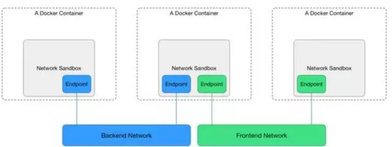

<!-- toc -->

## 网络要解决的问题
Kubernetes中将容器的联网通过插件的方式来实现，那么该如何解决容器的联网问题呢？

如果在本地单台机器上运行docker容器的话会注意到所有容器都会处在docker0网桥自动分配的一个网络IP段内（172.17.0.1/16）。该值可以通过docker启动参数--bip来设置。这样所有本地的所有的容器都拥有了一个IP地址，而且还是在一个网段内彼此就可以互相通信了。

但是Kubernetes管理的是集群，Kubernetes中的网络要解决的核心问题就是每台主机的IP地址网段划分，以及单个容器的IP地址分配。概括为：

* 保证每个Pod拥有一个集群内唯一的IP地址
* 保证不同节点的IP地址划分不会重复
* 保证跨节点的Pod可以互相通信
* 保证不同节点的Pod可以与跨节点的主机互相通信

## 网络方案
在网络概念上，Kubernetes中有两种核心IP：
- POD IP：有CNI实现提供，Kubernetes不管这个IP是否可达，只负责使用这个IP实现配置iptables、做健康检查等功能。默认情况下，这个IP在Kubernetes集群范围内都是可达的，并且可以进行ping等操作。
- cluster IP：即服务IP，这个IP在Kubernetes中只是用于实现服务交互通信，本质上只是iptables上的几条DNAT规则。默认情况下，这个IP上只能提供服务端口的访问，且不可ping。

k8s本身不集成网络， 它需要外部的插件支持。 它支持cni网络模型，基于cni网络模型的常用的解决方案有 weave，flannel， calico, openvswitch等。 各种技术方案的部署难易程度不通， 性能上也有所差别。

k8s对集群的网络有如下要求：
1. 所有的容器都可以在不用nat的情况下和别的容器通信
2. 所有的节点都可以在不用nat的情况下同所有容器通信， 反之亦然
3. 容器的地址和别人看到的地址是同一个地址

kubernetes的网络通信中和原生的docker有些不一样， 它有四个问题要解决：
1. container-to-container， 容器到容器的访问（这个是由pod来解决， 同一个pod的容器共享同一网络空间）
2. Pod-to-Pod ， pod到pod的通信（这个由各种不同的网络方案，如flannel等来处理）
3. Pod-to-Service ， pod到service的通信（这个由service组件， 即kubeproxy处理）
4. External-to-Service（这个由service组件， 即kubeproxy处理）

## CNI VS CNM
首先，需要先说说网络方案的两大阵营：CNN与CNM
Kubernetes所选择的CNI网络接口，简单介绍下网络实现的背景。

### CNI阵营
CNI即Container Network Interface，是一套容器网络的定义规范，包括方法规范、参数规范、响应规范等等。CNI只要求在容器创建时为容器分配网络资源、删除容器时释放网络资源。CNI与调用者之间的整个交互过程如下图所示：

CNI实现与外界的交互都通过进程参数和环境变量传递，也只要求输出结果符合CNI规范即可，与实现语言也没什么特殊要求。比如Calico早期版本就使用Python实现了CNI规范，为Kubernetes提供了网络实现。常见的环境变量设置如下：

- CNI_COMMAND：调用指定CNI动作，ADD表示增加网卡，DEL表示释放网卡
- CNI_CONTAINERID：容器ID
- CNI_NETNS：容器网络命名空间文件位置
- CNI_ARGS：额外传递的参数
- CNI_IFNAME：设置的容器网卡名称，如eth0

正因如此，CNI规范实现起来非常容易扩展，除了CNI自带的Bridge、Macvlan等基本实现以外，还有大量的第三方实现可供选择，包括Calico、Romana、Flannel等常用实现。同时CNI支持多种容器运行时，包括Docker、rkt、Mesos、Hyper等容器引擎都可以使用。这也是Kubernetes选择使用CNI的一大重要原因。

### CNM阵营
相对的，Docker提出的CNM（Cotainer Network Model）模型实现就比较复杂，但更为完善，比较接近传统的网络概念。如下图所示：

Sandbox就是容器的网络命名空间，Endpoint为容器连接到网络中的一张网卡，而网络则是一组相互通信的Endpoint的集合，比较接近Neutron中的网络定义。

在CNM中，docker engine通过HTTP REST API调用网络实现，为容器配置网络。这些API接口涵盖网络管理、容器管理、创建endpoint等十几个接口。同时CNM模型还隐含在docker自身附带的service机制、dns机制等附加约束，因此可以在一定程度上说，CNM模型只是专为docker容器实现的，对别的容器运行时并不友好。

由于上面这些技术上的原因以及一些商业上的原因，Kubernetes最终选择了CNI作为自己的网络接口。

当然，Kubernetes也提供一些取巧的方法，将CNI接口转化为对CNM模型的调用，从而实现两种模型的通用。例如to_docker，这个脚本就将Kubernetes对CNI的调用转换为Docker CNM网络的对应操作，从而实现CNI到CNM的转换。

>  参考 [基于Neutron的Kubernetes SDN实践经验之谈](http://mp.weixin.qq.com/s?__biz=MzA5OTAyNzQ2OA==&amp;mid=2649693914&amp;idx=1&amp;sn=19fda53b4afd626bdc8ad0141e9f7a9b&amp;chksm=889321b9bfe4a8af3c4d9b78e8c299893e49d33e71d878d3fbb0324f468aebaf08efa7b35deb&amp;mpshare=1&amp;scene=1&amp;srcid=0428luoASGP9HYZD8M0mjgIW#rd)

## k8s支持的网络解决方案

Kubernetes社区中，比较常见的几种网络实现主要是以下两种：
- 基于Overlay网络：以Flannel、Weave为代表。Flannel是CoreOS为Kubernetes专门定制实现的Overlay网络方案，也是Kubernetes默认的网络实现。它基于VXLAN或者UDP整个集群的Overlay网络，从而实现容器在集群上的通信，满足Kubernetes网络模型的三大基本约束。由于在通信过程中存在数据包的封包解包等额外损耗，性能较差，但已经基本满足使用。
- 以L3路由为基础实现网络：以Calico、Romana为代表。其中，Calico是广泛流传的性能最好的Kubernetes网络实现，基于纯三层的路由实现网络通信，结合iptables实现的安全控制，可以满足大多数云的性能需求。但是由于它要求主机上必须打开BGP形成路由拓扑，在一些数据中心上可能不会被允许。同时，Calico还比较早地支持了Network Policy，并且可以将Calico自身的数据直接托管在Kubernetes中，从而实现与Kubernetes的深度集成。

kubernetes的网络通信中和原生的docker有些不一样， 它有四个问题要解决：
1. container-to-container， 容器到容器的访问（这个是由pod来解决， 同一个pod的容器共享同一网络空间）
2. Pod-to-Pod ， pod到pod的通信（这个由各种不同的网络方案，如flannel等来处理）
3. Pod-to-Service ， pod到service的通信（这个由service组件， 即kubeproxy处理）
4. External-to-Service（这个由service组件， 即kubeproxy处理）

为了解决该问题，出现了一系列开源的Kubernetes中的网络插件与方案，如：
* flannel
* calico
* contiv
* weave net
* kube-router
* cilium
* canal

参考资料：
[官方文档之网络](https://kubernetes.io/docs/concepts/cluster-administration/networking/)

[Kubernetes网络插件CNI学习整理](https://blog.csdn.net/u010129347/article/details/78800065)
[Kubernetes-基于flannel的集群网络](https://www.kubernetes.org.cn/4105.html)
