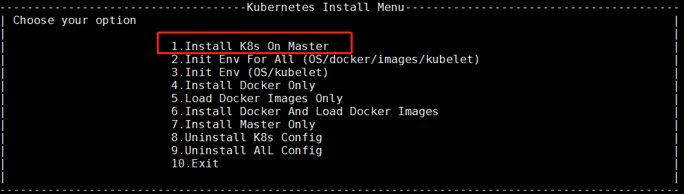

## 一、规划

### 节点规划
|节点   | IP  | 角色  |部署软件|
|---|---|---|---|
| k8s-sc-harbor  |  192.168.3.9 | harbor仓库  |docker、docker-compose、harbor|
| k8s-sc-master  | 192.168.3.94  |  master |docker、kubelt、kubeadm、kubectl、helm|
| k8s-sc-node1  | 192.168.3.124  |  node1 |docker、kubelet、kubeadm|
| k8s-sc-node2  |  192.168.3.129| node2 |docker、kubelet、kubeadm|
| k8s-sc-node3  |  192.168.3.131|node3 |docker、kubelet、kubeadm|

### 1.目录规划
docker的根目录位置: /dockerdata
harbor的暴露端口: 8888
harbor的根目录: /harbordata
软件下载目录: /softdb
软件安装目录: /usr/local/src

### 2.软件及版本
|软件名称 |软件版本 | 说明|
|---|---|---|
|harbor   |   | |
|docker | | |
|docker-compose   |   |   |
|kubelet | |  |
|kube-proxy | | |
|kube-apiserver | | |
|kube-schduler | |  |
|kube-controller | | |
|core-dns | | |
| flannel| | |


## 环境准备
### 禁掉所有的swap分区
```
swapoff -a
vim /etc/fstab
#把这行注释： /dev/mapper/centos-swap swap
free -m
Swap:             0           0           0
```

### 关闭防火墙
```
systemctl status firewalld
systemctl stop firewalld.service
systemctl disable firewalld.service
```

###  关闭 SELinux
把 SELinux设为 permissive 模式。否则容器不能访问宿主机文件系统。
```
setenforce 0
sed -i 's/^SELINUX=enforcing$/SELINUX=permissive/' /etc/selinux/config
```

### 开启桥接网络支持
```
cat <<EOF >  /etc/sysctl.d/k8s.conf
net.bridge.bridge-nf-call-ip6tables = 1
net.bridge.bridge-nf-call-iptables = 1
net.ipv4.ip_forward = 1
EOF
sysctl -p /etc/sysctl.d/k8s.conf
```

### 软件安装(基础的rpm包的安装)


2.安装docker(每台)
```
#wget https://download.docker.com/linux/static/stable/x86_64/docker-18.09.5.tgz
cd /usr/local/
tar -zxvf docker-18.09.5.tgz
cp docker/* /usr/local/bin
```
编写systemd文件
```
cd /usr/lib/systemd/system
cat > docker.service <<EOF
[Unit]
Description=Docker Application Container Engine
Documentation=http://docs.docker.io

[Service]
Environment="PATH=/usr/local/bin:/bin:/sbin:/usr/bin:/usr/sbin"
EnvironmentFile=-/run/flannel/docker
ExecStart=/usr/local/bin/dockerd --log-level=error $DOCKER_NETWORK_OPTIONS
ExecReload=/bin/kill -s HUP $MAINPID
Restart=on-failure
RestartSec=5
LimitNOFILE=infinity
LimitNPROC=infinity
LimitCORE=infinity
Delegate=yes
KillMode=process

[Install]
WantedBy=multi-user.target
EOF
```

启动docker服务
```
systemctl daemon-reload
systemctl enable docker
systemctl start docker
docker info
```

3.部署harbor


4.准备镜像
```
docker tag k8s.gcr.io/google_containers/kube-proxy:v1.14.1                k8s.gcr.io/kube-proxy:v1.14.1
docker tag k8s.gcr.io/google_containers/kube-apiserver:v1.14.1            k8s.gcr.io/kube-apiserver:v1.14.1
docker tag k8s.gcr.io/google_containers/kube-controller-manager:v1.14.1   k8s.gcr.io/kube-controller-manager:v1.14.1
docker tag k8s.gcr.io/google_containers/kube-scheduler:v1.14.1            k8s.gcr.io/kube-scheduler:v1.14.1
docker tag quay.io/coreos/flannel:v0.11.0-amd64 quay.io/coreos/flannel:v0.11.0-amd64
docker tag k8s.gcr.io/google_containers/coredns:1.3.1 k8s.gcr.io/coredns:1.3.1
docker tag k8s.gcr.io/google_containers/etcd:3.3.10 k8s.gcr.io/etcd:3.3.10
docker tag k8s.gcr.io/google_containers/pause:3.1 k8s.gcr.io/pause:3.1


docker save  k8s.gcr.io/kube-proxy:v1.14.1  > kube-proxy.tar
docker save  k8s.gcr.io/kube-apiserver:v1.14.1 > kube-apiserver.tar
docker save  k8s.gcr.io/kube-controller-manager:v1.14.1 > kube-controller-manager.tar
docker save  k8s.gcr.io/kube-scheduler:v1.14.1 >  kube-scheduler.tar
docker save  quay.io/coreos/flannel:v0.11.0-amd64 > flannel.tar
docker save  k8s.gcr.io/coredns:1.3.1 > coredns.tar
docker save  k8s.gcr.io/etcd:3.3.10 > etcd.tar
docker save  k8s.gcr.io/pause:3.1 > pause.tar


docker rmi k8s.gcr.io/google_containers/kube-proxy:v1.14.1
docker rmi k8s.gcr.io/google_containers/kube-apiserver:v1.14.1
docker rmi k8s.gcr.io/google_containers/kube-controller-manager:v1.14.1
docker rmi k8s.gcr.io/google_containers/kube-scheduler:v1.14.1
docker rmi k8s.gcr.io/google_containers/coredns:1.3.1
docker rmi k8s.gcr.io/google_containers/etcd:3.3.10
docker rmi k8s.gcr.io/google_containers/pause:3.1
```

5.部署master




注意修改/etc/hosts 和 kubeedge.ini对应的apiserver的地址
```
cd /etc/kubernetes/manifests/
vi kube-apiserver.yaml
```
添加:`--service-node-port-range=10000-32767`

6.部署node

7.测试
