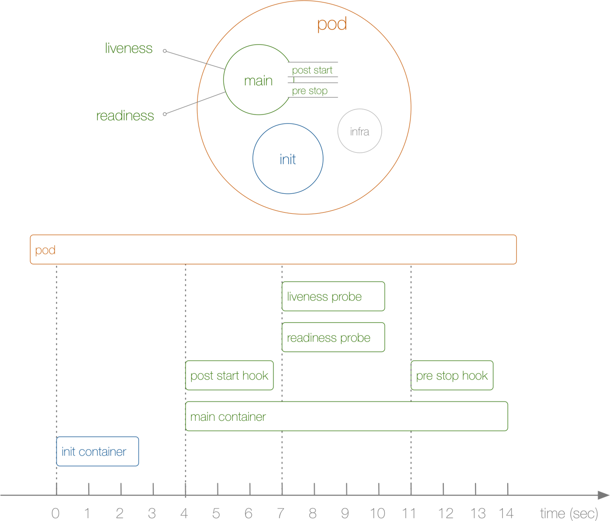

<!-- toc -->

# init容器的使用

## init container 概述
Init Container就是用来做初始化工作的容器，可以是一个或者多个，如果有多个的话，这些容器会按定义的顺序依次执行，只有所有的Init Container执行完后，主容器才会被启动。我们知道一个Pod里面的所有容器是共享数据卷和网络命名空间的，所以Init Container里面产生的数据可以被主容器使用到的。




init container / main container 的生命周期

从上面这张图可以直观的看到PostStart和PreStop包括liveness和readiness是属于主容器的生命周期范围内的，而Init Container是独立于主容器之外的，当然它们都属于Pod的生命周期范畴之内的。

## 应用场景
- 等待其他服务Ready：这个可以用来解决服务之间的依赖问题，比如我们有一个 Web 服务，该服务又依赖于另外一个数据库服务，但是在我们启动这个 Web 服务的时候我们并不能保证依赖的这个数据库服务就已经启动起来了，所以可能会出现一段时间内 Web 服务连接数据库异常。要解决这个问题的话我们就可以在 Web 服务的 Pod 中使用一个 InitContainer，在这个初始化容器中去检查数据库是否已经准备好了，准备好了过后初始化容器就结束退出，然后我们的主容器 Web 服务被启动起来，这个时候去连接数据库就不会有问题了。
- 做初始化配置：比如集群里检测所有已经存在的成员节点，为主容器准备好集群的配置信息，这样主容器起来后就能用这个配置信息加入集群。
- 其它场景：如将 pod 注册到一个中央数据库、配置中心等。


## 示例
```
apiVersion: v1
kind: Pod
metadata:
  name: myapp-pod
  labels:
    app: myapp
spec:
  containers:
  - name: myapp-container
    image: busybox:1.28
    command: ['sh', '-c', 'echo The app is running! && sleep 3600']
  initContainers:
  - name: init-myservice
    image: busybox:1.28
    command: ['sh', '-c', 'until nslookup myservice; do echo waiting for myservice; sleep 2; done;']
  - name: init-mydb
    image: busybox:1.28
    command: ['sh', '-c', 'until nslookup mydb; do echo waiting for mydb; sleep 2; done;']
```

```
kubectl describe -f myapp.yaml

Name:          myapp-pod
Namespace:     default
[...]
Labels:        app=myapp
Status:        Pending
[...]
Init Containers:
  init-myservice:
[...]
    State:         Running
[...]
  init-mydb:
[...]
    State:         Waiting
      Reason:      PodInitializing
    Ready:         False
[...]
Containers:
  myapp-container:
[...]
    State:         Waiting
      Reason:      PodInitializing
    Ready:         False
[...]
Events:
  FirstSeen    LastSeen    Count    From                      SubObjectPath                           Type          Reason        Message
  ---------    --------    -----    ----                      -------------                           --------      ------        -------
  16s          16s         1        {default-scheduler }                                              Normal        Scheduled     Successfully assigned myapp-pod to 172.17.4.201
  16s          16s         1        {kubelet 172.17.4.201}    spec.initContainers{init-myservice}     Normal        Pulling       pulling image "busybox"
  13s          13s         1        {kubelet 172.17.4.201}    spec.initContainers{init-myservice}     Normal        Pulled        Successfully pulled image "busybox"
  13s          13s         1        {kubelet 172.17.4.201}    spec.initContainers{init-myservice}     Normal        Created       Created container with docker id 5ced34a04634; Security:[seccomp=unconfined]
  13s          13s         1        {kubelet 172.17.4.201}    spec.initContainers{init-myservice}     Normal        Started       Started container with docker id 5ced34a04634
```


示例2:
```
apiVersion: v1
kind: Pod
metadata:
  name: init-demo
spec:
  containers:
  - name: nginx
    image: nginx
    ports:
    - containerPort: 80
    volumeMounts:
    - name: workdir
      mountPath: /usr/share/nginx/html
  initContainers:
  - name: install
    image: busybox
    command:
    - wget
    - "-O"
    - "/work-dir/index.html"
    - http://www.baidu.com
    volumeMounts:
    - name: workdir
      mountPath: "/work-dir"
  volumes:
  - name: workdir
    emptyDir: {}
```
