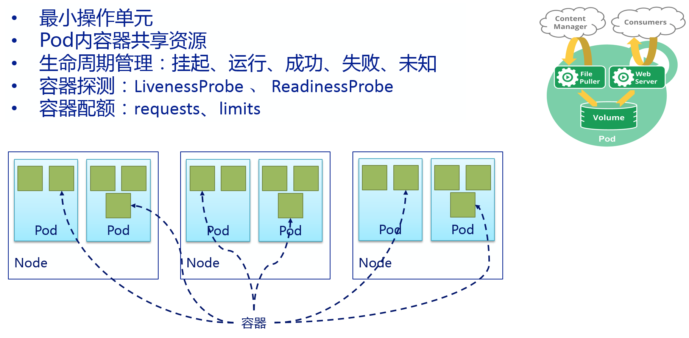

<!-- toc -->
## 理解Pod
Pod是Kubernetes的里可部署的和管理的最小单元，一个或多个容器构成一个Pod，通常Pod里的容器运行相同的应用。Pod包含的容器都运行在同一个宿主机上，看作一个统一管理单元。
一个Pod代表着集群中运行的一个进程
Pod中封装着应用的容器（也可以是好几个容器），存储、独立的网络IP(一个pod中的多个container共享网络,localhost)，管理容器如何运行的策略选项。
Pod代表着部署的一个单位：kubernetes中应用的一个实例，可能由一个或者多个容器组合在一起共享资源。
每个Pod中都有一个pause容器，pause容器做为Pod的网络接入点，Pod中其他的容器会使用容器映射模式启动并接入到这个pause容器。属于同一个Pod的所有容器共享网络的namespace。
Docker是kubernetes中最常用的容器运行时，但是Pod也支持其他容器运行时,如RKT

在Kubrenetes集群中Pod有如下两种使用方式：
- 一个Pod中运行一个容器
  - 这种使用方式中最常见的用法，可以把Pod想象成是单个容器的封装，kuberentes管理的是Pod而不是直接管理容器。
- 在一个Pod中同时运行多个容器
  - 一个Pod中也可以同时封装几个需要紧密耦合互相协作的容器，它们之间共享资源
  - 这些在同一个Pod中的容器可以互相协作成为一个service单位容器共享文件，另一个“sidecar”容器来更新这些文件。Pod将这些容器的存储资源作为一个实体来管理。
  - 同时要理解sidecar这个k8s非常有高度的架构，也是后面istio的基石
  - 另外，和主容器同时存在的我们往往会忽略的一个容器叫init container，这个在后面再具体阐述

## pod的生命周期
Pod的生命周期，通过模板定义Pod，然后分配到一个Node上运行，在Pod所包含的容器运行结束后Pod也结束。
在整个过程中，Pod的状态：
- 挂起 ︰ Pod已被提交到Master，但一个或多个容器镜像尚未创建。包括调度和下载镜像，可能需要一段时间。
- 运行 ︰ Pod已绑定到的节点，和所有容器镜像已创建完成。至少一个容器是仍在运行，或正在启动或重新启动。
- 成功 ︰ Pod的所有容器已经成功的终止，并不会重新启动。
- 失败 ︰ Pod的所有容器已经都终止，至少一个容器已都终止失败 （以非零退出状态退出）。
- 未知 ︰ 出于某种原因的Pod状态无法获得，通常由于在与主机的Pod通信错误。

## Pod中如何管理多个容器

Pod中可以共享两种资源：网络和存储。

### 网络
每个Pod都会被分配一个唯一的IP地址。Pod中的所有容器共享网络空间，包括IP地址和端口。Pod内部的容器可以使用 localhost 互相通信。Pod中的容器与外界通信时，必须分配共享网络资源（例如使用宿主机的端口映射）。

### 存储
可以Pod指定多个共享的Volume。Pod中的所有容器都可以访问共享的volume。Volume也可以用来持久化Pod中的存储资源，以防容器重启后文件丢失。

## 使用Pod
我们很少在k8s集群中直接使用pod, 直接使用pod的这种方式我们又称这种pod叫做静态pod。
静态 Pod 直接由特定节点上的kubelet进程来管理，不通过 master 节点上的apiserver。无法与我们常用的控制器Deployment或者DaemonSet进行关联，它由kubelet进程自己来监控，当pod崩溃时重启该pod，kubelete也无法对他们进行健康检查。静态 pod 始终绑定在某一个kubelet，并且始终运行在同一个节点上。 kubelet会自动为每一个静态 pod 在 Kubernetes 的 apiserver 上创建一个镜像 Pod（Mirror Pod），因此我们可以在 apiserver 中查询到该 pod，但是不能通过 apiserver 进行控制（例如不能删除）。
