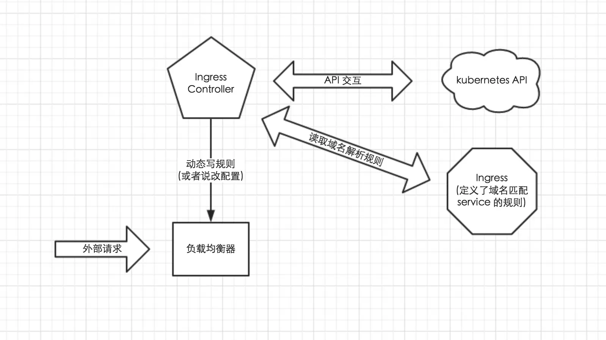

<!-- toc -->

# Kubernetes 服务暴露介绍
从 kubernetes 1.2 版本开始，kubernetes提供了 Ingress 对象来实现对外暴露服务；到目前为止 kubernetes 总共有以下几种暴露服务的方式:

- LoadBlancer Service
- NodePort Service
- External IPs
- Ingress

## LoadBlancer Service
LoadBlancer Service 是 kubernetes 深度结合云平台的一个组件；当使用 LoadBlancer Service 暴露服务时，实际上是通过向底层云平台申请创建一个负载均衡器来向外暴露服务；目前 LoadBlancer Service 支持的云平台已经相对完善，比如国外的 GCE、DigitalOcean，国内的 阿里云，私有云 Openstack 等等，由于 LoadBlancer Service 深度结合了云平台，所以只能在一些云平台上来使用

## NodePort Service
NodePort Service 顾名思义，实质上就是通过在集群的每个 node 上暴露一个端口，然后将这个端口映射到某个具体的 service 来实现的，虽然每个 node 的端口有很多(0~65535)，但是由于安全性和易用性(服务多了就乱了，还有端口冲突问题)实际使用可能并不多

## Ingress
Ingress 这个东西是 1.2 后才出现的，通过 Ingress 用户可以实现使用 nginx 等开源的反向代理负载均衡器实现对外暴露服务。

使用 Ingress 时一般会有三个组件：

- 反向代理负载均衡器
- Ingress Controller
- Ingress

### 反向代理负载均衡器
反向代理负载均衡器很简单，说白了就是 nginx、apache 什么的；在集群中反向代理负载均衡器可以自由部署，可以使用 Replication Controller、Deployment、DaemonSet 等等，不过个人喜欢以 DaemonSet 的方式部署，感觉比较方便

### Ingress Controller
Ingress Controller 实质上可以理解为是个监视器，Ingress Controller 通过不断地跟 kubernetes API 打交道，实时的感知后端 service、pod 等变化，比如新增和减少 pod，service 增加与减少等；当得到这些变化信息后，Ingress Controller 再结合下文的 Ingress 生成配置，然后更新反向代理负载均衡器，并刷新其配置，达到服务发现的作用

### Ingress
Ingress 简单理解就是个规则定义；比如说某个域名对应某个 service，即当某个域名的请求进来时转发给某个 service;这个规则将与 Ingress Controller 结合，然后 Ingress Controller 将其动态写入到负载均衡器配置中，从而实现整体的服务发现和负载均衡

### ingress工作流程
从上图中可以很清晰的看到，实际上请求进来还是被负载均衡器拦截，比如 nginx，然后 Ingress Controller 通过跟 Ingress 交互得知某个域名对应哪个 service，再通过跟 kubernetes API 交互得知 service 地址等信息；综合以后生成配置文件实时写入负载均衡器，然后负载均衡器 reload 该规则便可实现服务发现，即动态映射

了解了以上内容以后，这也就很好的说明了我为什么喜欢把负载均衡器部署为 Daemon Set；因为无论如何请求首先是被负载均衡器拦截的，所以在每个 node 上都部署一下，同时 hostport 方式监听 80 端口；那么就解决了其他方式部署不确定 负载均衡器在哪的问题，同时访问每个 node 的 80 都能正确解析请求；如果前端再 放个 nginx 就又实现了一层负载均衡
