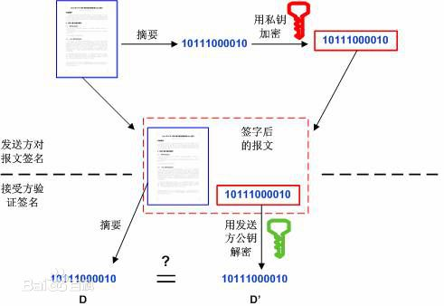

<!-- toc -->
# 一、基本概念
## 1.CA的基础术语

CA(Certification Authority)证书，指的是权威机构给我们颁发的证书。

密钥就是用来加解密用的文件或者字符串。密钥在非对称加密的领域里，指的是私钥和公钥，他们总是成对出现，其主要作用是加密和解密。常用的加密强度是2048bit。

RSA即非对称加密算法。非对称加密有两个不一样的密码，一个叫`私钥`，另一个叫`公钥`，用其中一个加密的数据只能用另一个密码解开，用自己的都解不了，也就是说用公钥加密的数据只能由私钥解开。

## 2.证书的编码格式
PEM(Privacy Enhanced Mail)，通常用于数字证书认证机构（Certificate Authorities，CA），扩展名为`.pem, .crt, .cer`, 和 `.key`。内容为Base64编码的ASCII码文件，有类似"-----BEGIN CERTIFICATE-----" 和 "-----END CERTIFICATE-----"的头尾标记。服务器认证证书，中级认证证书和私钥都可以储存为PEM格式（认证证书其实就是公钥）。Apache和nginx等类似的服务器使用PEM格式证书。

DER(Distinguished Encoding Rules)，与PEM不同之处在于其使用二进制而不是Base64编码的ASCII。扩展名为`.der`，但也经常使用.cer用作扩展名，所有类型的认证证书和私钥都可以存储为DER格式。Java使其典型使用平台。

## 3.证书签名请求CSR

CSR(Certificate Signing Request)，它是向CA机构申请数字×××书时使用的请求文件。在生成请求文件前，我们需要准备一对对称密钥。私钥信息自己保存，请求中会附上公钥信息以及`国家`，`城市`，`域名`，`Email`等信息，CSR中还会附上`签名信息`。当我们准备好CSR文件后就可以提交给CA机构，等待他们给我们签名，签好名后我们会收到crt文件，即证书。

> 注意：CSR并不是证书。而是向权威证书颁发机构获得签名证书的申请。

把CSR交给权威证书颁发机构,权威证书颁发机构对此进行签名,完成。保留好CSR,当权威证书颁发机构颁发的证书过期的时候,你还可以用同样的CSR来申请新的证书,key保持不变。


## 4.数字签名

数字签名就是"非对称加密+摘要算法"，其目的不是为了加密，而是用来防止他人篡改数据。

其核心思想是：比如A要给B发送数据，A先用摘要算法得到数据的指纹，然后用A的私钥加密指纹，加密后的指纹就是A的签名，B收到数据和A的签名后，也用同样的摘要算法计算指纹，然后用A公开的公钥解密签名，比较两个指纹，如果相同，说明数据没有被篡改，确实是A发过来的数据。假设C想改A发给B的数据来欺骗B，因为篡改数据后指纹会变，要想跟A的签名里面的指纹一致，就得改签名，但由于没有A的私钥，所以改不了，如果C用自己的私钥生成一个新的签名，B收到数据后用A的公钥根本就解不开。

常用的摘要算法有MD5、SHA1、SHA256。

使用私钥对需要传输的文本的摘要进行加密，得到的密文即被称为该次传输过程的签名。


## 5.数字证书和公钥
数字证书则是由证书认证机构（CA）对证书申请者真实身份验证之后，用CA的根证书对申请人的一些基本信息以及申请人的公钥进行签名（相当于加盖发证书机 构的公章）后形成的一个数字文件。
实际上，数字证书就是经过CA认证过的公钥，除了公钥，还有其他的信息，比如Email，国家，城市，域名等。

# 二、CFSSL工具
## 1.CFSSL介绍
项目地址： https://github.com/cloudflare/cfssl
下载地址： https://pkg.cfssl.org/
参考链接： https://blog.cloudflare.com/how-to-build-your-own-public-key-infrastructure/

CFSSL是CloudFlare开源的一款PKI/TLS工具。 CFSSL 包含一个命令行工具 和一个用于 签名，验证并且捆绑TLS证书的 HTTP API 服务。 使用Go语言编写。

CFSSL包括：
* 一组用于生成自定义 TLS PKI 的工具
* cfssl程序，是CFSSL的命令行工具
* multirootca程序是可以使用多个签名密钥的证书颁发机构服务器
* mkbundle程序用于构建证书池
* cfssljson程序，从cfssl和multirootca程序获取JSON输出，并将证书，密钥，CSR和bundle写入磁盘

PKI借助数字证书和公钥加密技术提供可信任的网络身份。通常，证书就是一个包含如下身份信息的文件：
* 证书所有组织的信息
* 公钥
* 证书颁发组织的信息
* 证书颁发组织授予的权限，如证书有效期、适用的主机名、用途等
* 使用证书颁发组织私钥创建的数字签名

## 2.安装cfssl
```
wget https://pkg.cfssl.org/R1.2/cfssl_linux-amd64
wget https://pkg.cfssl.org/R1.2/cfssljson_linux-amd64
wget https://pkg.cfssl.org/R1.2/cfssl-certinfo_linux-amd64
chmod +x cfssl_linux-amd64 cfssljson_linux-amd64 cfssl-certinfo_linux-amd64
mv cfssl_linux-amd64 /usr/local/bin/cfssl
mv cfssljson_linux-amd64 /usr/local/bin/cfssljson
mv cfssl-certinfo_linux-amd64 /usr/bin/cfssl-certinfo

当然也可以将cfssk放在指定的目录，在环境变量中配置好加入PATH就行
```
## 3.cfssl工具命令介绍：
* bundle: 创建包含客户端证书的证书包
* genkey: 生成一个key(私钥)和CSR(证书签名请求)
* scan: 扫描主机问题
* revoke: 吊销证书
* certinfo: 输出给定证书的证书信息， 跟cfssl-certinfo 工具作用一样
* gencrl: 生成新的证书吊销列表
* selfsign: 生成一个新的自签名密钥和 签名证书
* print-defaults: 打印默认配置，这个默认配置可以用作模板
* serve: 启动一个HTTP API服务
* gencert: 生成新的key(密钥)和签名证书
    * -ca：指明ca的证书
    * -ca-key：指明ca的私钥文件
    * -config：指明请求证书的json文件
    * -profile：与-config中的profile对应，是指根据config中的profile段来生成证书的相关信息
* ocspdump
* ocspsign
* info: 获取有关远程签名者的信息
* sign: 签名一个客户端证书，通过给定的CA和CA密钥，和主机名
* ocsprefresh
* ocspserve


## 4.cfssl常用命令：
* cfssl gencert -initca ca-csr.json | cfssljson -bare ca ## 初始化ca
* cfssl gencert -initca -ca-key key.pem ca-csr.json | cfssljson -bare ca ## 使用现有私钥, 重新生成
* cfssl certinfo -cert ca.pem
* cfssl certinfo -csr ca.csr
