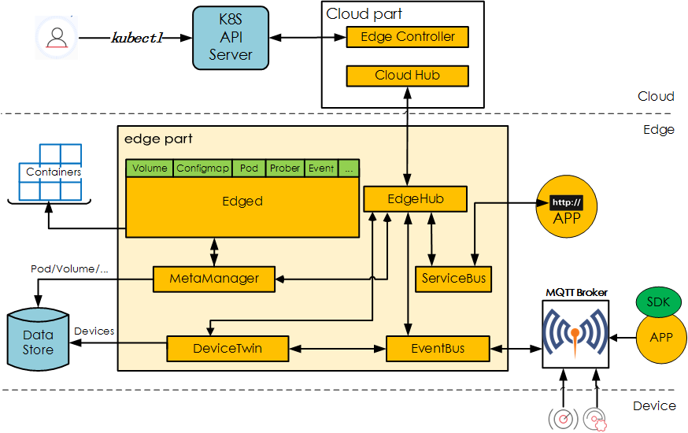

<!-- toc -->

# kubeedge介绍
KubeEdge 是华为开源用来打通云与边的一套解决方案。它可将k8s容器编排和管理扩展到边缘端设备。 它基于Kubernetes构建，为网络和应用程序提供核心基础架构支持，并在云端和边缘端部署应用，同步元数据。KubeEdge 还支持 MQTT 协议，允许开发人员编写客户逻辑，并在边缘端启用设备通信的资源约束。

## 架构
架构如图:

kubeedge分为云端(cloud)和边缘端(edge)

KubeEdge 由以下组件构成：

### 云端组件
- [CloudHub](https://github.com/kubeedge/kubeedge/blob/master/docs/modules/cloud/cloudhub.md): CloudHub 是一个 Web Socket 服务端，负责监听云端的变化, 缓存并发送消息到 EdgeHub。
- [EdgeController](https://github.com/kubeedge/kubeedge/blob/master/docs/modules/cloud/controller.md): EdgeController 是一个扩展的 Kubernetes 控制器，管理边缘节点和 Pods 的元数据确保数据能够传递到指定的边缘节点。

### 边缘端组件

- [Edged](https://github.com/kubeedge/kubeedge/blob/master/docs/modules/edge/edged.md): Edged 是运行在边缘节点的代理，用于管理容器化的应用程序。
- [EdgeHub](https://github.com/kubeedge/kubeedge/blob/master/docs/modules/edge/edgehub.md): EdgeHub 是一个 Web Socket 客户端，负责与边缘计算的云服务（例如 KubeEdge 架构图中的 Edge Controller）交互，包括同步云端资源更新、报告边缘主机和设备状态变化到云端等功能。
- [MetaManager](https://github.com/kubeedge/kubeedge/blob/master/docs/modules/edge/metamanager.md): MetaManager 是消息处理器，位于 Edged 和 Edgehub 之间，它负责向轻量级数据库（SQLite）存储/检索元数据。
- [EventBus](https://github.com/kubeedge/kubeedge/blob/master/docs/modules/edge/eventbus.md): EventBus 是一个与 MQTT 服务器（mosquitto）交互的 MQTT 客户端，为其他组件提供订阅和发布功能。
- [DeviceTwin](https://github.com/kubeedge/kubeedge/blob/master/docs/modules/edge/devicetwin.md): DeviceTwin 负责存储设备状态并将设备状态同步到云，它还为应用程序提供查询接口。

## Kubeedge的优势

- 打通边缘计算
  - 通过在边缘端运行业务逻辑，可以在本地保护和处理大量数据。KubeEdge 减少了边和云之间的带宽请求，加快响应速度，并保护客户数据隐私。

- 简化开发
  开发人员可以编写常规的基于 http 或 mqtt 的应用程序，容器化并在边缘或云端任何地方运行。

- Kubernetes 原生支持k8s

使用 KubeEdge 用户可以在边缘节点上编排应用、管理设备并监控应用程序/设备状态，就如同在云端操作 Kubernetes 集群一样。

### 丰富的应用程序

用户可以轻松地将复杂的机器学习、图像识别、事件处理等高层应用程序部署到边缘端。

## 介绍

KubeEdge 由以下组件构成:

- [Edged](https://github.com/kubeedge/kubeedge/blob/master/docs/modules/edge/edged.md): Edged 是运行在边缘节点的代理，用于管理容器化的应用程序。
- [EdgeHub](https://github.com/kubeedge/kubeedge/blob/master/docs/modules/edge/edgehub.md): EdgeHub 是一个 Web Socket 客户端，负责与边缘计算的云服务（例如 KubeEdge 架构图中的 Edge Controller）交互，包括同步云端资源更新、报告边缘主机和设备状态变化到云端等功能。
- [CloudHub](https://github.com/kubeedge/kubeedge/blob/master/docs/modules/cloud/cloudhub.md): CloudHub 是一个 Web Socket 服务端，负责监听云端的变化, 缓存并发送消息到 EdgeHub。
- [EdgeController](https://github.com/kubeedge/kubeedge/blob/master/docs/modules/cloud/controller.md): EdgeController 是一个扩展的 Kubernetes 控制器，管理边缘节点和 Pods 的元数据确保数据能够传递到指定的边缘节点。
- [EventBus](https://github.com/kubeedge/kubeedge/blob/master/docs/modules/edge/eventbus.md): EventBus 是一个与 MQTT 服务器（mosquitto）交互的 MQTT 客户端，为其他组件提供订阅和发布功能。
- [DeviceTwin](https://github.com/kubeedge/kubeedge/blob/master/docs/modules/edge/devicetwin.md): DeviceTwin 负责存储设备状态并将设备状态同步到云，它还为应用程序提供查询接口。
- [MetaManager](https://github.com/kubeedge/kubeedge/blob/master/docs/modules/edge/metamanager.md): MetaManager 是消息处理器，位于 Edged 和 Edgehub 之间，它负责向轻量级数据库（SQLite）存储/检索元数据。
