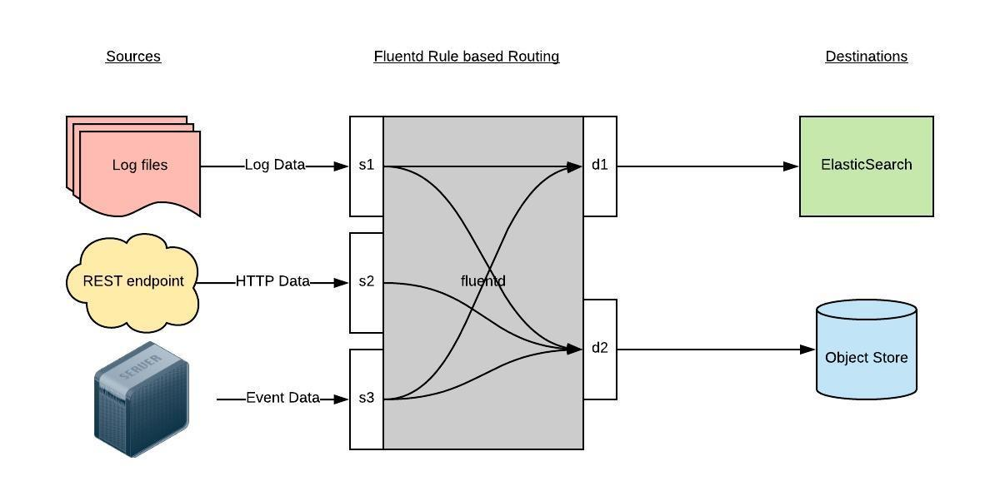

<!-- toc -->

# 概述
Kubernetes 中比较流行的日志收集解决方案是 Elasticsearch、Fluentd 和 Kibana（EFK）技术栈，也是官方现在比较推荐的一种方案。

- `Elasticsearch` 是一个实时的、分布式的可扩展的搜索引擎，允许进行全文、结构化搜索，它通常用于索引和搜索大量日志数据，也可用于搜索许多不同类型的文档。

- `Kibana` 是 Elasticsearch 的一个功能强大的数据可视化 Dashboard，Elasticsearch 通常与 Kibana 一起部署，Kibana 允许通过 web 界面来浏览 Elasticsearch 日志数据。

- `Fluentd`是一个流行的开源数据收集器，我们将在 Kubernetes 集群节点上安装 Fluentd，通过获取容器日志文件、过滤和转换日志数据，然后将数据传递到 Elasticsearch 集群，在该集群中对其进行索引和存储。


# 部署 Elasticsearch 集群

这里我们使用3个 Elasticsearch Pod 来避免高可用下多节点集群中出现的“脑裂”问题，当一个或多个节点无法与其他节点通信时会产生“脑裂”，可能会出现几个主节点。

>更多 Elasticsearch 集群脑裂问题，可以查看文档
https://www.elastic.co/guide/en/elasticsearch/reference/current/modules-node.html#split-brain

一个关键点是参数`discover.zen.minimum_master_nodes=N/2+1`，其中N是 Elasticsearch 集群中符合主节点的节点数，比如我们这里3个节点，意味着N应该设置为2。这样，如果一个节点暂时与集群断开连接，则另外两个节点可以选择一个新的主节点，并且集群可以在最后一个节点尝试重新加入时继续运行，在扩展 Elasticsearch 集群时，一定要记住这个参数。


## 创建elasticsearch 的headless service
首先创建一个名为 elasticsearch 的无头服务，新建文件 elasticsearch-svc.yaml，文件内容如下：
```
kind: Service
apiVersion: v1
metadata:
  name: elasticsearch
  namespace: logging
  labels:
    app: elasticsearch
spec:
  selector:
    app: elasticsearch
  clusterIP: None
  ports:
    - port: 9200
      name: rest
    - port: 9300
      name: inter-node
```
定义了一个名为 elasticsearch 的 Service，指定标签app=elasticsearch，当我们将 Elasticsearch StatefulSet 与此服务关联时，服务将返回带有标签app=elasticsearch的 Elasticsearch Pods 的 DNS A 记录，然后设置clusterIP=None，将该服务设置成无头服务。最后，我们分别定义端口9200、9300，分别用于与 REST API 交互，以及用于节点间通信。

现在我们已经为 Pod 设置了无头服务和一个稳定的域名.elasticsearch.logging.svc.cluster.local，接下来我们通过 StatefulSet 来创建具体的 Elasticsearch 的 Pod 应用。

## 创建Elasticsearch 的 Pod 应用


Kubernetes StatefulSet 允许我们为 Pod 分配一个稳定的标识和持久化存储，Elasticsearch 需要稳定的存储来保证 Pod 在重新调度或者重启后的数据依然不变，所以需要使用 StatefulSet 来管理 Pod。

> 要了解更多关于 StaefulSet 的信息，可以查看官网关于 StatefulSet 的相关文档：https://kubernetes.io/docs/concepts/workloads/controllers/statefulset/。


```
apiVersion: apps/v1
kind: StatefulSet
metadata:
  name: es-cluster
  namespace: logging
spec:
  serviceName: elasticsearch
  replicas: 3
  selector:
    matchLabels:
      app: elasticsearch
  template:
    metadata:
      labels:
        app: elasticsearch
    spec:
      containers:
      - name: elasticsearch
        image: 192.168.3.27:8888/library/elasticsearch-oss:6.6.2
        resources:
            limits:
              cpu: 1000m
            requests:
              cpu: 100m
        ports:
        - containerPort: 9200
          name: rest
          protocol: TCP
        - containerPort: 9300
          name: inter-node
          protocol: TCP
        volumeMounts:
        - name: data
          mountPath: /usr/share/elasticsearch/data
        env:
          - name: cluster.name
            value: k8s-logs
          - name: node.name
            valueFrom:
              fieldRef:
                fieldPath: metadata.name
          - name: discovery.zen.ping.unicast.hosts
            value: "es-cluster-0.elasticsearch,es-cluster-1.elasticsearch,es-cluster-2.elasticsearch"
          - name: discovery.zen.minimum_master_nodes
            value: "2"
          - name: ES_JAVA_OPTS
            value: "-Xms512m -Xmx512m"
      initContainers:
      - name: fix-permissions
        image: busybox
        command: ["sh", "-c", "chown -R 1000:1000 /usr/share/elasticsearch/data"]
        securityContext:
          privileged: true
        volumeMounts:
        - name: data
          mountPath: /usr/share/elasticsearch/data
      - name: increase-vm-max-map
        image: busybox
        command: ["sysctl", "-w", "vm.max_map_count=262144"]
        securityContext:
          privileged: true
      - name: increase-fd-ulimit
        image: busybox
        command: ["sh", "-c", "ulimit -n 65536"]
        securityContext:
          privileged: true
  volumeClaimTemplates:
  - metadata:
      name: data
      labels:
        app: elasticsearch
    spec:
      accessModes: [ "ReadWriteOnce" ]
      storageClassName: nfs-dynamic-class
      resources:
        requests:
          storage: 10Gi
```

### pod模板的一些内容描述
该部分是定义 StatefulSet 中的 Pod，我们这里使用一个-oss后缀的镜像，该镜像是 Elasticsearch 的开源版本，如果你想使用包含X-Pack之类的版本，可以去掉该后缀。然后暴露了9200和9300两个端口，注意名称要和上面定义的 Service 保持一致。然后通过 volumeMount 声明了数据持久化目录，下面我们再来定义 VolumeClaims。最后就是我们在容器中设置的一些环境变量了：

- cluster.name：Elasticsearch 集群的名称，我们这里命名成 k8s-logs。
- node.name：节点的名称，通过metadata.name来获取。这将解析为 es-cluster-[0,1,2]，取决于节点的指定顺序。
- discovery.zen.ping.unicast.hosts：此字段用于设置在 Elasticsearch 集群中节点相互连接的发现方法。我们使用 unicastdiscovery 方式，它为我们的集群指定了一个静态主机列表。由于我们之前配置的无头服务，我们的 Pod 具有唯一的 DNS 域es-cluster-[0,1,2].elasticsearch.logging.svc.cluster.local，因此我们相应地设置此变量。由于都在同一个 namespace 下面，所以我们可以将其缩短为es-cluster-[0,1,2].elasticsearch。要了解有关 Elasticsearch 发现的更多信息，请参阅 Elasticsearch 官方文档：https://www.elastic.co/guide/en/elasticsearch/reference/current/modules-discovery.html。
- discovery.zen.minimum_master_nodes：我们将其设置为(N/2) + 1，N是我们的群集中符合主节点的节点的数量。我们有3个 Elasticsearch 节点，因此我们将此值设置为2（向下舍入到最接近的整数）。要了解有关此参数的更多信息，请参阅官方 Elasticsearch 文档：https://www.elastic.co/guide/en/elasticsearch/reference/current/modules-node.html#split-brain。
- ES_JAVA_OPTS：这里我们设置为-Xms512m -Xmx512m，告诉JVM使用512 MB的最小和最大堆。您应该根据群集的资源可用性和需求调整这些参数。要了解更多信息，请参阅设置堆大小的相关文档：https://www.elastic.co/guide/en/elasticsearch/reference/current/heap-size.html。

### 几个初始化容器
这里我们定义了几个在主应用程序之前运行的 Init 容器，这些初始容器按照定义的顺序依次执行，执行完成后才会启动主应用容器。

- 第一个名为 fix-permissions 的容器用来运行 chown 命令，将 Elasticsearch 数据目录的用户和组更改为1000:1000（Elasticsearch 用户的 UID）。因为默认情况下，Kubernetes 用 root 用户挂载数据目录，这会使得 Elasticsearch 无法方法该数据目录，可以参考 Elasticsearch 生产中的一些默认注意事项相关文档说明：https://www.elastic.co/guide/en/elasticsearch/reference/current/docker.html#_notes_for_production_use_and_defaults。

- 第二个名为 increase-vm-max-map 的容器用来增加操作系统对mmap计数的限制，默认情况下该值可能太低，导致内存不足的错误，要了解更多关于该设置的信息，可以查看 Elasticsearch 官方文档说明：https://www.elastic.co/guide/en/elasticsearch/reference/current/vm-max-map-count.html。

- 最后一个初始化容器是用来执行ulimit命令增加打开文件描述符的最大数量的。

此外 Elastisearch Notes for Production Use 文档还提到了由于性能原因最好禁用 swap，当然对于 Kubernetes 集群而言，最好也是禁用 swap 分区的。

### 测试是否安装成功
添加成功后，可以看到 logging 命名空间下面的所有的资源对象：
```
[root@master monitor]# kubectl get pod -n  logging
NAME                      READY     STATUS    RESTARTS   AGE
es-cluster-0              1/1       Running   42         19h
es-cluster-1              1/1       Running   0          19h
es-cluster-2              1/1       Running   0          18h
fluentd-es-6xgxd          1/1       Running   0          16h
fluentd-es-nt8d2          1/1       Running   0          16h
kibana-5bff696ff4-mkp4l   1/1       Running   0          18h
```

Pods 部署完成后，我们可以通过请求一个 REST API 来检查 Elasticsearch 集群是否正常运行。使用下面的命令将本地端口9200转发到 Elasticsearch 节点（如es-cluster-0）对应的端口：
```
[root@master monitor]#  kubectl port-forward es-cluster-0 9200:9200 --namespace=logging
Forwarding from 127.0.0.1:9200 -> 9200
Forwarding from [::1]:9200 -> 9200

Handling connection for 9200
Handling connection for 9200
```

然后，在另外的终端窗口中，执行如下请求：
```
[root@master ~]# curl http://localhost:9200/_cluster/state?pretty |more
  % Total    % Received % Xferd  Average Speed   Time    Time     Time  Current
                                 Dload  Upload   Total   Spent    Left  Speed
  0     0    0     0    0     0      0      0 --:--:-- --:--:-- --:--:--     0{
  "cluster_name" : "k8s-logs",
  "compressed_size_in_bytes" : 22679,
  "cluster_uuid" : "p_AQ83sITaKreerPObVMag",
  "version" : 3259,
  "state_uuid" : "vpG1GH2bT9mSbwF9nqTlzw",
  "master_node" : "0SkArt-FTVih5fzWQkGEMw",
  "blocks" : { },
  "nodes" : {
    "0SkArt-FTVih5fzWQkGEMw" : {
      "name" : "es-cluster-1",
      "ephemeral_id" : "wxjSdWb5SNqqSowx_d-UkQ",
      "transport_address" : "10.2.35.139:9300",
      "attributes" : { }
    },
    "YeC_0S6eR7KeKcylEtneJg" : {
      "name" : "es-cluster-0",
      "ephemeral_id" : "9FaV_urNT8GCuOU32di89A",
      "transport_address" : "10.2.16.37:9300",
      "attributes" : { }
    },
    "ynGIAwAUSOa8yfJs2sbWlw" : {
      "name" : "es-cluster-2",
      "ephemeral_id" : "gKFv1069QZ6S-ELVXNkWsQ",
      "transport_address" : "10.2.35.140:9300",
      "attributes" : { }
    }
  },
...
...
...
```

看到上面的信息就表明我们名为 k8s-logs 的 Elasticsearch 集群成功创建了3个节点：es-cluster-0，es-cluster-1，和es-cluster-2，当前主节点是 es-cluster-0。


# 部署kibana
Elasticsearch 集群启动成功了，接下来我们可以来部署 Kibana 服务，新建一个名为 kibana.yaml 的文件，对应的文件内容如下：

```
apiVersion: v1
kind: Service
metadata:
  name: kibana
  namespace: logging
  labels:
    app: kibana
spec:
  ports:
  - port: 5601
  type: NodePort
  selector:
    app: kibana

---
apiVersion: apps/v1
kind: Deployment
metadata:
  name: kibana
  namespace: logging
  labels:
    app: kibana
spec:
  selector:
    matchLabels:
      app: kibana
  template:
    metadata:
      labels:
        app: kibana
    spec:
      containers:
      - name: kibana
        image: 192.168.3.27:8888/library/kibana-oss:6.6.2
        resources:
          limits:
            cpu: 1000m
          requests:
            cpu: 100m
        env:
          - name: ELASTICSEARCH_URL
            value: http://elasticsearch:9200
        ports:
        - containerPort: 5601
```

上面我们定义了两个资源对象，一个 Service 和 Deployment，为了测试方便，我们将 Service 设置为了 NodePort 类型，Kibana Pod 中配置都比较简单，唯一需要注意的是我们使用 `ELASTICSEARCH_URL` 这个环境变量来设置Elasticsearch 集群的端点和端口，直接使用 Kubernetes DNS 即可，此端点对应服务名称为 elasticsearch，由于是一个 headless service，所以该域将解析为3个 Elasticsearch Pod 的 IP 地址列表。

```
#  kubectl get svc --namespace=logging
NAME            TYPE        CLUSTER-IP    EXTERNAL-IP   PORT(S)             AGE
elasticsearch   ClusterIP   None          <none>        9200/TCP,9300/TCP   19h
kibana          NodePort    10.1.184.32   <none>        5601:26299/TCP      18h
```

如果 Pod 已经是 Running 状态了，证明应用已经部署成功了，然后可以通过 NodePort 来访问 Kibana 这个服务，在浏览器中打开http://<任意节点IP>:26299 即可，如果看到如下欢迎界面证明 Kibana 已经成功部署到了 Kubernetes集群之中。


# 部署fluented

Fluentd 是一个高效的日志聚合器，是用 Ruby 编写的，并且可以很好地扩展。对于大部分企业来说，Fluentd 足够高效并且消耗的资源相对较少，另外一个工具Fluent-bit更轻量级，占用资源更少，但是插件相对 Fluentd 来说不够丰富，所以整体来说，Fluentd 更加成熟，使用更加广泛，所以我们这里也同样使用 Fluentd 来作为日志收集工具。

## 工作原理
Fluentd 通过一组给定的数据源抓取日志数据，处理后（转换成结构化的数据格式）将它们转发给其他服务，比如 Elasticsearch、对象存储等等。Fluentd 支持超过300个日志存储和分析服务，所以在这方面是非常灵活的。主要运行步骤如下：

- 首先 Fluentd 从多个日志源获取数据
- 结构化并且标记这些数据
- 然后根据匹配的标签将数据发送到多个目标服务去




## 配置
一般来说我们是通过一个配置文件来告诉 Fluentd 如何采集、处理数据的，下面简单和大家介绍下 Fluentd 的配置方法。

## 安装
### configMap
```
# cat fluted-cm.yaml
kind: ConfigMap
apiVersion: v1
metadata:
  name: fluentd-config
  namespace: logging
  labels:
    addonmanager.kubernetes.io/mode: Reconcile
data:
  system.conf: |-
    <system>
      root_dir /tmp/fluentd-buffers/
    </system>
  containers.input.conf: |-
    <source>
      @id fluentd-containers.log
      @type tail
      path /var/log/containers/*.log
      pos_file /var/log/es-containers.log.pos
      time_format %Y-%m-%dT%H:%M:%S.%NZ
      localtime
      tag raw.kubernetes.*
      format json
      read_from_head true
    </source>
    # Detect exceptions in the log output and forward them as one log entry.
    <match raw.kubernetes.**>
      @id raw.kubernetes
      @type detect_exceptions
      remove_tag_prefix raw
      message log
      stream stream
      multiline_flush_interval 5
      max_bytes 500000
      max_lines 1000
    </match>
  system.input.conf: |-
    # Logs from systemd-journal for interesting services.
    <source>
      @id journald-docker
      @type systemd
      filters [{ "_SYSTEMD_UNIT": "docker.service" }]
      <storage>
        @type local
        persistent true
      </storage>
      read_from_head true
      tag docker
    </source>
    <source>
      @id journald-kubelet
      @type systemd
      filters [{ "_SYSTEMD_UNIT": "kubelet.service" }]
      <storage>
        @type local
        persistent true
      </storage>
      read_from_head true
      tag kubelet
    </source>
  forward.input.conf: |-
    # Takes the messages sent over TCP
    <source>
      @type forward
    </source>
  output.conf: |-
    # Enriches records with Kubernetes metadata
    <filter kubernetes.**>
      @type kubernetes_metadata
    </filter>
    <match **>
      @id elasticsearch
      @type elasticsearch
      @log_level info
      include_tag_key true
      host elasticsearch
      port 9200
      logstash_format true
      request_timeout    30s
      <buffer>
        @type file
        path /var/log/fluentd-buffers/kubernetes.system.buffer
        flush_mode interval
        retry_type exponential_backoff
        flush_thread_count 2
        flush_interval 5s
        retry_forever
        retry_max_interval 30
        chunk_limit_size 2M
        queue_limit_length 8
        overflow_action block
      </buffer>
    </match>

```

### deployment
```
apiVersion: v1
kind: ServiceAccount
metadata:
  name: fluentd-es
  namespace: logging
  labels:
    k8s-app: fluentd-es
    kubernetes.io/cluster-service: "true"
    addonmanager.kubernetes.io/mode: Reconcile
---
kind: ClusterRole
apiVersion: rbac.authorization.k8s.io/v1
metadata:
  name: fluentd-es
  labels:
    k8s-app: fluentd-es
    kubernetes.io/cluster-service: "true"
    addonmanager.kubernetes.io/mode: Reconcile
rules:
- apiGroups:
  - ""
  resources:
  - "namespaces"
  - "pods"
  verbs:
  - "get"
  - "watch"
  - "list"
---
kind: ClusterRoleBinding
apiVersion: rbac.authorization.k8s.io/v1
metadata:
  name: fluentd-es
  labels:
    k8s-app: fluentd-es
    kubernetes.io/cluster-service: "true"
    addonmanager.kubernetes.io/mode: Reconcile
subjects:
- kind: ServiceAccount
  name: fluentd-es
  namespace: logging
  apiGroup: ""
roleRef:
  kind: ClusterRole
  name: fluentd-es
  apiGroup: ""
---
apiVersion: apps/v1
kind: DaemonSet
metadata:
  name: fluentd-es
  namespace: logging
  labels:
    k8s-app: fluentd-es
    version: v2.2.0
    kubernetes.io/cluster-service: "true"
    addonmanager.kubernetes.io/mode: Reconcile
spec:
  selector:
    matchLabels:
      k8s-app: fluentd-es
      version: v2.2.0
  template:
    metadata:
      labels:
        k8s-app: fluentd-es
        kubernetes.io/cluster-service: "true"
        version: v2.2.0
      # This annotation ensures that fluentd does not get evicted if the node
      # supports critical pod annotation based priority scheme.
      # Note that this does not guarantee admission on the nodes (#40573).
      annotations:
        scheduler.alpha.kubernetes.io/critical-pod: ''
    spec:
      priorityClassName: system-node-critical
      serviceAccountName: fluentd-es
      containers:
      - name: fluentd-es
        image: 192.168.3.27:8888/library/fluentd-elasticsearch:v2.2.0
        env:
        - name: FLUENTD_ARGS
          value: --no-supervisor -q
        resources:
          limits:
            memory: 500Mi
          requests:
            cpu: 100m
            memory: 200Mi
        volumeMounts:
        - name: varlog
          mountPath: /var/log
        - name: varlibdockercontainers
          mountPath: /var/lib/docker/containers
          readOnly: true
        - name: config-volume
          mountPath: /etc/fluent/config.d
      nodeSelector:
        beta.kubernetes.io/fluentd-ds-ready: "true"
      tolerations:
      - key: node-role.kubernetes.io/master
        operator: Exists
        effect: NoSchedule
      terminationGracePeriodSeconds: 30
      volumes:
      - name: varlog
        hostPath:
          path: /var/log
      - name: varlibdockercontainers
        hostPath:
          path: /var/lib/docker/containers
      - name: config-volume
        configMap:
          name: fluentd-config
```

将上面创建的 fluentd-config 这个 ConfigMap 对象通过 volumes 挂载到了 Fluentd 容器中，另外为了能够灵活控制哪些节点的日志可以被收集，所以我们这里还添加了一个 nodSelector 属性：
```
nodeSelector:
  beta.kubernetes.io/fluentd-ds-ready: "true"
```

默认情况下 master 节点有污点，所以要想也收集 master 节点的日志，则需要添加上容忍：
```
tolerations:
- key: node-role.kubernetes.io/master
  operator: Exists
  effect: NoSchedule
```

还需要注意的是docker容器的根目录位置


创建完成后，查看对应的 Pods 列表，检查是否部署成功：
```
#  kubectl get pods -n logging
NAME                      READY     STATUS    RESTARTS   AGE
es-cluster-0              1/1       Running   42         19h
es-cluster-1              1/1       Running   0          19h
es-cluster-2              1/1       Running   0          19h
fluentd-es-6xgxd          1/1       Running   0          17h
fluentd-es-nt8d2          1/1       Running   0          17h
kibana-5bff696ff4-mkp4l   1/1       Running   0          18h
```


# 参考
https://github.com/kubernetes/kubernetes/tree/master/cluster/addons/fluentd-elasticsearch
