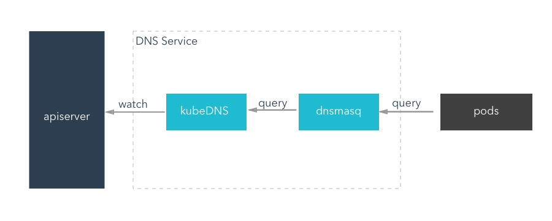

<!-- toc -->

# 内部服务发现


## 每个pod内部自己生成的环境变量
每个pod创建后，它内部会根据k8s的规则自己生成相应的环境变量，如下：
查看名为`nginxtest`的pod
```
[root@master ~]# kubectl get pod -o wide | grep nginxtest
nginxtest-7b46d4c47f-dhjxp                  1/1       Running     0          60d       10.2.35.57    192.168.3.28
nginxtest-7b46d4c47f-mvrg6                  1/1       Running     0          60d       10.2.35.58    192.168.3.28
nginxtest-7b46d4c47f-nbgff                  1/1       Running     0          60d       10.2.16.54    192.168.3.3
nginxtest-7b46d4c47f-z8h6m                  1/1       Running     0          60d       10.2.16.55    192.168.3.3
```

随便进入其中一个pod
```
[root@master ~]# kubectl exec -it nginxtest-7b46d4c47f-dhjxp /bin/bash
root@nginxtest-7b46d4c47f-dhjxp:/#
```

显示这个pod的环境变量
```
root@nginxtest-7b46d4c47f-dhjxp:/# env
DNFS_PORT_22_TCP_PROTO=tcp
DEVPORTAL_WEB_PORT_80_TCP_ADDR=10.1.172.163
FOO_PORT_32323_TCP=tcp://10.1.226.80:32323
FOO_SERVICE_PORT=32323
FOO_SERVICE_HOST=10.1.226.80
DNFS_PORT_22_TCP=tcp://10.1.62.34:22
JENKINS_SERVICE_PORT_HTTP=80
FOO_PORT_32323_TCP_ADDR=10.1.226.80
JENKINS_PORT_80_TCP_PORT=80
HOSTNAME=nginxtest-7b46d4c47f-dhjxp
NJS_VERSION=1.15.8.0.2.7-1~stretch
DNFS_SERVICE_PORT_WEB=80
JENKINS_PORT_50000_TCP=tcp://10.1.210.74:50000
JENKINS_SERVICE_PORT_AGENT=50000
NGINX_VERSION=1.15.8-1~stretch
FOO_PORT=tcp://10.1.226.80:32323
JENKINS_SERVICE_HOST=10.1.210.74
NGINX_PORT_80_TCP=tcp://10.1.180.137:80
KUBERNETES_PORT_443_TCP_PROTO=tcp
KUBERNETES_PORT_443_TCP_ADDR=10.1.0.1
NGINX_PORT=tcp://10.1.180.137:80
DNFS_PORT_22_TCP_ADDR=10.1.62.34
DNFS_PORT_80_TCP_PORT=80
JENKINS_PORT_50000_TCP_PROTO=tcp
KUBERNETES_PORT=tcp://10.1.0.1:443
FOO_PORT_32323_TCP_PROTO=tcp
PWD=/
HOME=/root
DNFS_SERVICE_PORT_ADMIN=22
NGINX_SERVICE_PORT=80
KUBERNETES_SERVICE_PORT_HTTPS=443
KUBERNETES_PORT_443_TCP_PORT=443
FOO_PORT_32323_TCP_PORT=32323
DEVPORTAL_WEB_PORT_80_TCP_PORT=80
DEVPORTAL_WEB_PORT_80_TCP=tcp://10.1.172.163:80
NGINX_PORT_80_TCP_ADDR=10.1.180.137
JENKINS_PORT_80_TCP_ADDR=10.1.210.74
DNFS_SERVICE_HOST=10.1.62.34
DEVPORTAL_WEB_PORT=tcp://10.1.172.163:80
DNFS_PORT_80_TCP_ADDR=10.1.62.34
NGINX_PORT_80_TCP_PORT=80
JENKINS_PORT=tcp://10.1.210.74:80
KUBERNETES_PORT_443_TCP=tcp://10.1.0.1:443
DNFS_PORT=tcp://10.1.62.34:80
DEVPORTAL_WEB_SERVICE_HOST=10.1.172.163
DNFS_PORT_80_TCP_PROTO=tcp
DEVPORTAL_WEB_SERVICE_PORT_WEB=80
DEVPORTAL_WEB_PORT_80_TCP_PROTO=tcp
TERM=xterm
JENKINS_PORT_80_TCP=tcp://10.1.210.74:80
NGINX_PORT_80_TCP_PROTO=tcp
JENKINS_PORT_50000_TCP_PORT=50000
SHLVL=1
KUBERNETES_SERVICE_PORT=443
DNFS_PORT_80_TCP=tcp://10.1.62.34:80
PATH=/usr/local/sbin:/usr/local/bin:/usr/sbin:/usr/bin:/sbin:/bin
DEVPORTAL_WEB_SERVICE_PORT=80
DNFS_SERVICE_PORT=80
DNFS_PORT_22_TCP_PORT=22
KUBERNETES_SERVICE_HOST=10.1.0.1
NGINX_SERVICE_HOST=10.1.180.137
JENKINS_PORT_50000_TCP_ADDR=10.1.210.74
JENKINS_SERVICE_PORT=80
JENKINS_PORT_80_TCP_PROTO=tcp
_=/usr/bin/env
```

其中，和k8s集群有关的环境变量为：
```
root@nginxtest-7b46d4c47f-dhjxp:/# env | grep KUBE
KUBERNETES_PORT_443_TCP_PROTO=tcp
KUBERNETES_PORT_443_TCP_ADDR=10.1.0.1
KUBERNETES_PORT=tcp://10.1.0.1:443
KUBERNETES_SERVICE_PORT_HTTPS=443
KUBERNETES_PORT_443_TCP_PORT=443
KUBERNETES_PORT_443_TCP=tcp://10.1.0.1:443
KUBERNETES_SERVICE_PORT=443
KUBERNETES_SERVICE_HOST=10.1.0.1
```

## 使用init container 的方式给pod赋予变量
正因为上面的原理,所以在以前,我们如果需要提前给容器富裕变量的时候,可以使用init container来预制pod的环境变量.

```

```

但是这个有一个弊端,就是依赖的服务必须在 Pod 启动之前就存在，不然是不会被注入到环境变量中的。

## 使用 coredns/kubedns 服务发现
我们真正的使用其实是利用 `coredns/kubedns` 来发现服务。这个和我们日常用到的DNS域名解析非常相似。
DNS是根据域名来访问相应的ip，而k8s中的DNS也是根据相应的域名去获取相应的pod的ip，从而最终的目的端还是我们需要访问的pod。


> 在以前我都以为在k8s集群中垮namespace是不能互相访问的，但在使用了coredns之后，才知道是可以跨namespace访问的。


下面使用瑞士军刀`busybox`做这个测试：
在default namespace下面创建这个busybox的deployment
```
[root@master ~]#  kubectl run --rm -i --tty test-dns --image=busybox /bin/sh
If you don't see a command prompt, try pressing enter.
/ #
```

查看它的dns解析
```
/ # cat /etc/resolv.conf
nameserver 10.1.0.2
search default.svc.cluster.local. svc.cluster.local. cluster.local. openstacklocal
options ndots:5
/ #
```

使用k8s提供的规则来进行svc的访问,域名格式为：

- 普通的 Service：会生成 servicename.namespace.svc.cluster.local 的域名，会解析到 Service 对应的 ClusterIP 上，在 Pod 之间的调用可以简写成 servicename.namespace，如果处于同一个命名空间下面，甚至可以只写成 servicename 即可访问
- Headless Service：无头服务，就是把 clusterIP 设置为 None 的，会被解析为指定 Pod 的 IP 列表，同样还可以通过 podname.servicename.namespace.svc.cluster.local 访问到具体的某一个 Pod。

```
# kubectl get svc --all-namespaces |grep nginx                         3d
default            ingress-nginx             NodePort    10.1.119.103   <none>        80:21616/TCP,443:28213/TCP       38d
default            nginxtest                 NodePort    10.1.169.229   <none>        80:24495/TCP                     60d
orz                mynginx                   ClusterIP   10.1.27.58     <none>        80/TCP                           4h
```
上面显示我有两个nginx服务,分别在default和orz namespace,所以在busybox这个pod中,我的访问方式为:

访问同一个namespace下的nginxtest:
```
/ # wget -q -O- nginxtest
<!DOCTYPE html>
<html>
<head>
<title>Welcome to nginx!</title>
<style>
    body {
        width: 35em;
        margin: 0 auto;
        font-family: Tahoma, Verdana, Arial, sans-serif;
    }
</style>
</head>
<body>
<h1>Welcome to nginx!</h1>
<p>If you see this page, the nginx web server is successfully installed and
working. Further configuration is required.</p>

<p>For online documentation and support please refer to
<a href="http://nginx.org/">nginx.org</a>.<br/>
Commercial support is available at
<a href="http://nginx.com/">nginx.com</a>.</p>

<p><em>Thank you for using nginx.</em></p>
</body>
</html>
/ #
/ #
```

访问非同一个namespace是mynginx
```
/ # wget -q -O- mynginx.orz
<!DOCTYPE html>
<html>
<head>
<title>Welcome to nginx!</title>
<style>
    body {
        width: 35em;
        margin: 0 auto;
        font-family: Tahoma, Verdana, Arial, sans-serif;
    }
</style>
</head>
<body>
<h1>Welcome to nginx!</h1>
<p>If you see this page, the nginx web server is successfully installed and
working. Further configuration is required.</p>

<p>For online documentation and support please refer to
<a href="http://nginx.org/">nginx.org</a>.<br/>
Commercial support is available at
<a href="http://nginx.com/">nginx.com</a>.</p>

<p><em>Thank you for using nginx.</em></p>
</body>
</html>
/ #
```

其实,真正的访问的地址应该解析为了:
```
default下的nginx
nginx.default.svc.cluster.local

orz下的mynginx
mynginx.orz.svc.cluster.local
```

## CoreDNS/KubeDNS的原理
在k8s集群中提供的这个DNS 服务不是一个独立的系统服务，而是作为一种 addon 插件而存在，也就是说不是 Kubernetes 集群必须安装的，当然我们强烈推荐安装，可以将这个插件看成是一种运行在 Kubernetes 集群上的一直比较特殊的应用，现在比较推荐的两个插件：kube-dns 和 CoreDNS。


下面以kubedns说明下工作原理
kubedns里面有3个container,分别是:
- kubedns: kubedns 基于 SkyDNS 库，通过 apiserver 监听 Service 和 Endpoints 的变更事件同时也同步到本地 Cache，实现了一个实时的 Kubernetes 集群内 Service 和 Pod 的 DNS服务发现
- dnsmasq: dsnmasq 容器则实现了 DNS 的缓存功能(在内存中预留一块默认大小为 1G 的地方，保存当前最常用的 DNS 查询记录，如果缓存中没有要查找的记录，它会到 kubedns 中查询，并把结果缓存起来)，通过监听 ConfigMap 来动态生成配置
- sider: sidecar 容器实现了可配置的 DNS 探测，并采集对应的监控指标暴露出来供 prometheus 使用




CoreDNS 实现的功能和 KubeDNS 是一致的，不过 CoreDNS 的所有功能都集成在了同一个容器中，在k8s 1.11.0版本中官方已经推荐使用 CoreDNS了，生产环境中可以安装 CoreDNS 来代替 KubeDNS，其他使用方法都是一致的：https://coredns.io/


## 自定义域和上下游域名服务器
DNS Pod 具有静态 IP 并作为 Kubernetes 服务暴露出来。该静态 IP 被分配后，kubelet 会将使用 --cluster-dns = <dns-service-ip>参数配置的 DNS 传递给每个容器。DNS 名称也需要域名，本地域可以使用参数--cluster-domain = <default-local-domain>在 kubelet 中配置。

dnsmasq 容器通过监听 ConfigMap 来动态生成配置，可以自定义存根域和上下游域名服务器。
例如，下面的 ConfigMap 建立了一个 DNS 配置，它具有一个单独的存根域和两个上游域名服务器：
```
apiVersion: v1
kind: ConfigMap
metadata:
  name: kube-dns
  namespace: kube-system
data:
  stubDomains: |
    {"qmxccs.local": ["1.2.3.4"]}
  upstreamNameservers: |
    ["8.8.8.8", "8.8.4.4"]
```

按如上说明，具有.qmxccs.local后缀的 DNS 请求被转发到 DNS 1.2.3.4。Google 公共 DNS 服务器 为上游查询提供服务。下表描述了具有特定域名的查询如何映射到它们的目标 DNS 服务器：

| 域名  |  响应查询的服务器 |
|---|---|
| kubernetes.default.svc.cluster.local  |  kube-dns |
| mircosvc.yfzx.qmxccs.local  |  自定义 DNS (1.2.3.4) |
| www.google.com  |  上游 DNS (8.8.8.8, 8.8.4.4，其中之一) |


## 为每个 Pod 设置 DNS 策略
我们还可以为每个 Pod 设置 DNS 策略。 当前 Kubernetes 支持两种 Pod 特定的 DNS 策略：“Default” 和 “ClusterFirst”。 可以通过 dnsPolicy 标志来指定这些策略。

注意：Default 不是默认的 DNS 策略。如果没有显式地指定dnsPolicy，将会使用 ClusterFirst

## 说说无头服务
上面说了下Headless Service：无头服务，就是把 clusterIP 设置为 None 的，会被解析为指定 Pod 的 IP 列表，同样还可以通过 podname.servicename.namespace.svc.cluster.local 访问到具体的某一个 Pod。
这个主要的应用场景两个:
- statefulset ：比如在k8s集群上的yfzx这个namespace上部署了一套redis，那么访问的时候，可以是
```
redis-0.yfzx.svc.cluster.local
redis-1.yfzx.svc.cluster.local
```

- k8s集群外部署的服务，接入到k8s集群中
  - service中设置clusterip=none
