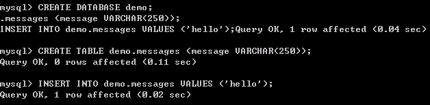
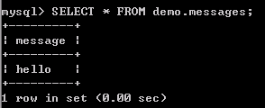

# 四、研究基于kubernetes的基础组件构建方式及使用
MySQL是非常常用的基础组件，在kubernetes集群中有三种部署方式：
- deployment
- StatefulSet
- headless

前置条件：
因为MySQL是一种需要持久化存储的服务，所以我们需要先将存储部署好。
存储请详见

## 1.deployment方式部署MySQL
deployment：deployment更多的适用于无状态服务，而MySQL为有状态的服务，所以一般建议deployment这种方式是做测试的时候使用，在此不再过多的描述。仅以一个yaml文件示例：
```
# mysql deployment示例
apiVersion: apps/v1
kind: Deployment
metadata:
  name: mysql
spec:
  selector:
    matchLabels:
      app: mysql
  strategy:
    type: Recreate
  template:
    metadata:
      labels:
        app: mysql
    spec:
      terminationGracePeriodSeconds: 10
      containers:
      - name: mysql
        image: mysql:5.7
        env:
        - name: MYSQL_ROOT_PASSWORD
          valueFrom:
            secretKeyRef:
              name: mysql-secret
              key: ROOT_PASSWORD
        ports:
        - containerPort: 3306
          name: mysql
        volumeMounts:
        - name: mysql-persistent-storage
          mountPath: /var/lib/mysql
      volumes:
      - name: mysql-persistent-storage
        persistentVolumeClaim:
          claimName: mysql-pvc

---
# pvc示例
apiVersion: v1
kind: PersistentVolumeClaim
metadata:
  name: mysql-pvc
spec:
  accessModes:
    - ReadWriteOnce
  resources:
    requests:
      storage: 10Gi
---
# service示例
apiVersion: v1
kind: Service
metadata:
  name: mysql
  labels:
    app: mysql
spec:
  ports:
  - name: mysql
    port: 3306
  selector:
    app: mysql
```

## 2. statefulset方式部署MySQL
MySQL是一种有状态的服务，所以当需要部署在kubernetes集群中的时候，我们建议采用statefulset这种控制器。

### 2.1 StatefulSet 是什么
StatefulSet是Kubernetes提供的管理有状态应用的负载管理控制器API。在Pods管理的基础上，保证Pods的顺序和一致性。与Deployment一样，StatefulSet也是使用容器的Spec来创建Pod，与之不同StatefulSet创建的Pods在生命周期中会保持持久的标记（例如Pod Name）。

StatefulSet适用于具有以下特点的应用：

- 具有固定的网络标记（主机名）
- 具有持久化存储
- 需要按顺序部署和扩展
- 需要按顺序终止及删除
- 需要按顺序滚动更新

>注意:
StatefulSet创建顺序是从0到N-1，终止顺序则是相反。如果需要对StatefulSet扩容，则之前的N个Pod必须已经存在。如果要终止一个Pod，则它的后序Pod必须全部终止。
在Kubernetes 1.7版本后，放松了顺序的保证策略，对应的参数为 .spec.podManagementPolicy

### 2.2 statefuleset + MySQL示例

此示例由一个ConfigMap、两个Service和一个StatefulSet所组成。

#### 2.2.1 configmap
```
apiVersion: v1
kind: ConfigMap
metadata:
  name: mysql
  labels:
    app: mysql
data:
  master.cnf: |
    # Apply this config only on the master.
    [mysqld]
    log-bin
    log_bin_trust_function_creators=1
    lower_case_table_names=1
  slave.cnf: |
    # Apply this config only on slaves.
    [mysqld]
    super-read-only
    log_bin_trust_function_creators=1
```

#### 2.2.2 services
```
# Headless service for stable DNS entries of StatefulSet members.
apiVersion: v1
kind: Service
metadata:
  name: mysql
  labels:
    app: mysql
spec:
  ports:
  - name: mysql
    port: 3306
  clusterIP: None
  selector:
    app: mysql
---
# Client service for connecting to any MySQL instance for reads.
# For writes, you must instead connect to the master: mysql-0.mysql.
apiVersion: v1
kind: Service
metadata:
  name: mysql-read
  labels:
    app: mysql
spec:
  ports:
  - name: mysql
    port: 3306
  selector:
    app: mysql
```

#### 2.2.3 statefuleset
```
apiVersion: apps/v1
kind: StatefulSet
metadata:
  name: mysql
spec:
  selector:
    matchLabels:
      app: mysql
  serviceName: mysql
  replicas: 3
  template:
    metadata:
      labels:
        app: mysql
    spec:
      initContainers:
      - name: init-mysql
        image: mysql:5.7
        command:
        - bash
        - "-c"
        - |
          set -ex
          # Generate mysql server-id from pod ordinal index.
          [[ `hostname` =~ -([0-9]+)$ ]] || exit 1
          ordinal=${BASH_REMATCH[1]}
          echo [mysqld] > /mnt/conf.d/server-id.cnf
          # Add an offset to avoid reserved server-id=0 value.
          echo server-id=$((100 + $ordinal)) >> /mnt/conf.d/server-id.cnf
          # Copy appropriate conf.d files from config-map to emptyDir.
          if [[ $ordinal -eq 0 ]]; then
            cp /mnt/config-map/master.cnf /mnt/conf.d/
          else
            cp /mnt/config-map/slave.cnf /mnt/conf.d/
          fi
        volumeMounts:
        - name: conf
          mountPath: /mnt/conf.d
        - name: config-map
          mountPath: /mnt/config-map
      - name: clone-mysql
        image: gcr.io/google-samples/xtrabackup:1.0
        command:
        - bash
        - "-c"
        - |
          set -ex
          # Skip the clone if data already exists.
          [[ -d /var/lib/mysql/mysql ]] && exit 0
          # Skip the clone on master (ordinal index 0).
          [[ `hostname` =~ -([0-9]+)$ ]] || exit 1
          ordinal=${BASH_REMATCH[1]}
          [[ $ordinal -eq 0 ]] && exit 0
          # Clone data from previous peer.
          ncat --recv-only mysql-$(($ordinal-1)).mysql 3307 | xbstream -x -C /var/lib/mysql
          # Prepare the backup.
          xtrabackup --prepare --target-dir=/var/lib/mysql
        volumeMounts:
        - name: data
          mountPath: /var/lib/mysql
          subPath: mysql
        - name: conf
          mountPath: /etc/mysql/conf.d
      containers:
      - name: mysql
        image: mysql:5.7
        env:
        - name: MYSQL_ALLOW_EMPTY_PASSWORD
          value: "1"
        ports:
        - name: mysql
          containerPort: 3306
        volumeMounts:
        - name: data
          mountPath: /var/lib/mysql
          subPath: mysql
        - name: conf
          mountPath: /etc/mysql/conf.d
        resources:
          requests:
            cpu: 500m
            memory: 1Gi
        livenessProbe:
          exec:
            command: ["mysqladmin", "ping"]
          initialDelaySeconds: 30
          periodSeconds: 10
          timeoutSeconds: 5
        readinessProbe:
          exec:
            # Check we can execute queries over TCP (skip-networking is off).
            command: ["mysql", "-h", "127.0.0.1", "-e", "SELECT 1"]
          initialDelaySeconds: 5
          periodSeconds: 2
          timeoutSeconds: 1
      - name: xtrabackup
        image: gcr.io/google-samples/xtrabackup:1.0
        ports:
        - name: xtrabackup
          containerPort: 3307
        command:
        - bash
        - "-c"
        - |
          set -ex
          cd /var/lib/mysql
          # Determine binlog position of cloned data, if any.
          if [[ -f xtrabackup_slave_info ]]; then
            # XtraBackup already generated a partial "CHANGE MASTER TO" query
            # because we're cloning from an existing slave.
            mv xtrabackup_slave_info change_master_to.sql.in
            # Ignore xtrabackup_binlog_info in this case (it's useless).
            rm -f xtrabackup_binlog_info
          elif [[ -f xtrabackup_binlog_info ]]; then
            # We're cloning directly from master. Parse binlog position.
            [[ `cat xtrabackup_binlog_info` =~ ^(.*?)[[:space:]]+(.*?)$ ]] || exit 1
            rm xtrabackup_binlog_info
            echo "CHANGE MASTER TO MASTER_LOG_FILE='${BASH_REMATCH[1]}',\
                  MASTER_LOG_POS=${BASH_REMATCH[2]}" > change_master_to.sql.in
          fi
          # Check if we need to complete a clone by starting replication.
          if [[ -f change_master_to.sql.in ]]; then
            echo "Waiting for mysqld to be ready (accepting connections)"
            until mysql -h 127.0.0.1 -e "SELECT 1"; do sleep 1; done
            echo "Initializing replication from clone position"
            # In case of container restart, attempt this at-most-once.
            mv change_master_to.sql.in change_master_to.sql.orig
            mysql -h 127.0.0.1 <<EOF
          $(<change_master_to.sql.orig),
            MASTER_HOST='mysql-0.mysql',
            MASTER_USER='root',
            MASTER_PASSWORD='',
            MASTER_CONNECT_RETRY=10;
          START SLAVE;
          EOF
          fi
          # Start a server to send backups when requested by peers.
          exec ncat --listen --keep-open --send-only --max-conns=1 3307 -c \
            "xtrabackup --backup --slave-info --stream=xbstream --host=127.0.0.1 --user=root"
        volumeMounts:
        - name: data
          mountPath: /var/lib/mysql
          subPath: mysql
        - name: conf
          mountPath: /etc/mysql/conf.d
        resources:
          requests:
            cpu: 100m
            memory: 100Mi
      volumes:
      - name: conf
        emptyDir: {}
      - name: config-map
        configMap:
          name: mysql
  volumeClaimTemplates:
  - metadata:
      name: data
    spec:
      accessModes: ["ReadWriteOnce"]
      resources:
        requests:
          storage: 10Gi
```

#### 2.2.4 配置文件说明

StatefulSet控制器按Pod的序号索引一次启动一个Pod，控制器每个Pod指派一个唯一的、稳定的名称，名称的格式为<statefulset-name>-<ordinal-index>。在此示例中，Pod的名称为mysql-0，此节点为master主节点；mysql-1和mysql-2，这两个节点为slave从节点。

1.创建配置文件
- 在开始启动Pod规格中的任何容器之前，Pod首先会按照YAML配置中定义的顺序运行初始化容器。
- 第一个初始化容器为init-mysql，将以顺序索引创建MySQL配置文件。
- 脚本从Pod名称的结尾处获取并确定它的顺序索引，顺序索引通过hostname命令获取。然后，它会按照顺序保存在conf.d目录下的server-id.cnf文件中。此行为将StatefulSet控制器提供的唯一和稳定的身份标识转为mysql服务Id的域。在init-mysql容器中，脚本使用来自于ConfigMap中master.cnf或slave.cnf。
- 在此例子的拓扑关系中，存在一个MySQL master节点和多个MySQL slave节点，脚本简单的指派顺序0给主节点。这能够保证MySQL主节点在创建从节点之前就已经准备就绪。

2.克隆已存在的数据
- 一般来说，当一个新的Pod加入进来作为从节点时，必须假设MySQL master已经有关于它的数据。也假设slave副本的日志必须重新开始的。这些假设对于StatefulSet的扩缩容是很关键。
- 第二个初始化容器是clone-mysql，它在空的PersistentVolume上执行克隆从节点Pod的行为。这意味着它将从已在运行的Pod中拷贝数据，因此，它的当前状态能够与从master开始的副本节点一致。
- MySQL自身并没有提供能够做到上述能力的机制，因此，此例子使用开源的Percona XtraBackup工具来实现。在克隆的过程中，为了对MySQL主节点影响的最小化，脚本会要求每一个新的Pod从顺序索引值小的Pod中进行克隆。这样做的原因是，StatefulSet控制器需要一直保证Pod N需要在Pod N+1之前准备就绪。

3.启动副本
- 在初始化容器完成后，容器将正常运行。MySQL Pod由运行实际mysqld服务的MySQL容器组成，xtrabacekup容器只是作为备份的工具。xtrabackup负责监控克隆数据文件，并确定是否在从节点初始化MySQL副本。如果需要，它将等待MySQL就绪，然后执行 CHANGE MASTER TO和START SLAVE命令。
- 一旦一个从节点开始复制，它将记住MySQL master，并自动进行重新连接，因为从节点寻找主节点作为稳定DNS名称（mysql-0.mysql），它们自动的发现主节点。最后，在启动副本后，xtrabackup容器也监听来自于其它Pod对数据克隆的请求。

#### 2.2.5 部署环境验证

```
[root@master ~]# kubectl get sts -n kube-public
NAME      DESIRED   CURRENT   AGE
mysql     1         1         24d
# kubectl get pods -l app=mysql --watch --namespace=kube-public
NAME               READY     STATUS    RESTARTS   AGE
mysql-0            2/2       Running   0          24d
mysql-1            2/2       Running   0          24d
mysql-2            2/2       Running   0          24d
```
通过运行一个临时的容器(使用mysql:5.7镜像)，使用MySQL 客户端发送测试请求给MySQL master节点（主机名为mysql-0.mysql；跨命名空间的话，主机名请使用mysql-0.mysql.kube-public）
```
# kubectl run mysql-client --image=mysql:5.7 -it --rm --restart=Never -- mysql -h mysql-0.mysql.kube-public

CREATE DATABASE demo;
CREATE TABLE demo.messages (message VARCHAR(250));
INSERT INTO demo.messages VALUES ('hello');
```

在master节点上创建demo数据库，并创建一个只有message字段的demo.messages的表，并为message字段插入hello值。


使用主机名为mysql-read来发送测试请求给服务器：
```
# kubectl run mysql-client --image=mysql:5.7 -i -t --rm --restart=Never -- mysql -h mysql-read.kube-public
```



#### 2.2.6 扩容slave的数量
执行扩容命令
```
kubectl scale statefulset mysql --replicas=5 --namespace=kube-publi
```
查看新的Pod
```
# kubectl get pods -l app=mysql --watch --namespace=kube-public
NAME               READY     STATUS    RESTARTS   AGE
mysql-0            2/2       Running   0          24d
mysql-1            2/2       Running   0          24d
mysql-2            2/2       Running   0          24d
mysql-3            2/2       Running   0          10m
mysql-4            2/2       Running   0          10m
```

>参考:
《Replication》：https://dev.mysql.com/doc/refman/5.7/en/replication.html
《Replication Solutions》：https://dev.mysql.com/doc/refman/5.7/en/replication-solutions.html
《MySQL Master-Slave Replication on the Same Machine》：https://www.toptal.com/mysql/mysql-master-slave-replication-tutorial
《Run a Replicated Stateful Application》：https://kubernetes.io/docs/tasks/run-application/run-replicated-stateful-application/

## 3. headless方式部署MySQL
除了用statefulset的方式部署MySQL外，对于在集群外的MySQL还可以通过headless的方式接入到kubernetes集群中进行统一的管理。

示例:
首先在集群外的某个主机上安装myql，并能在集群所在的机器上访问。这里在192.168.3.9这台机器用docker安装了mysql，docker的启动命令如下，绑定主机端口3306，并用以上方法同样进行设置。

配置后，执行如下命令，若将库文件存储在宿主机，再增加`-v <dir>:/var/lib/mysql`，将宿主机目录挂载到容器中。

```
docker run -d -p 3306:3306 -v /root/mysql/my.cnf:/etc/mysql/my.cnf -e MYSQL_ROOT_PASSWORD=mysql --name docker-mysql mysql
```

新建mysql-out-svc.yaml
```
apiVersion: v1
kind: Service
metadata:
  name: mysql-out-svc
spec:
  clusterIP: None
  ports:
    - port: 3306
      protocol: TCP
      targetPort: 3306
---
apiVersion: v1
kind: Endpoints
metadata:
  name: mysql-out-svc
subsets:
  - addresses:
      - ip: "192.168.3.9"
    ports:
      - port: 3306
```
创建这个service+endpoint后, 就将部署在集群外的MySQL服务接入到了kubernetes集群之中
```
[root@master ~]# kubectl get svc
NAME            TYPE        CLUSTER-IP     EXTERNAL-IP   PORT(S)                        AGE
devportal-web   NodePort    10.1.172.163   <none>        80:33333/TCP                   29d
dnfs            NodePort    10.1.62.34     <none>        80:32080/TCP,22:32022/TCP      76d
jenkins         NodePort    10.1.210.74    <none>        80:30001/TCP,50000:20990/TCP   36d
kubernetes      ClusterIP   10.1.0.1       <none>        443/TCP                        77d
mysqlepsvc      ClusterIP   None           <none>        3306/TCP                       69d
mysql-out-svc   ClusterIP   None           <none>        3306/TCP                       67d

[root@master ~]# kubectl describe service mysql-out-svc
Name:              mysql-out-svc
Namespace:         default
Labels:            <none>
Annotations:       <none>
Selector:          <none>
Type:              ClusterIP
IP:                None
Port:              <unset>  3306/TCP
TargetPort:        3306/TCP
Endpoints:         192.168.3.9:3306
Session Affinity:  None
Events:            <none>

```
在集群内访问的时候，遵循kubernetes架构设计，采用fqdn的规则，用域名进行访问（前提需要部署core-dns或者kube-dns），例如：`mysql-out-svc.default.svc.cluster.local`


## 基准测试及相关概念

## 在项目中怎么使用MySQL
这个需要写limit那几点
### 存储的配置

### service

### headless


## 测试数据
