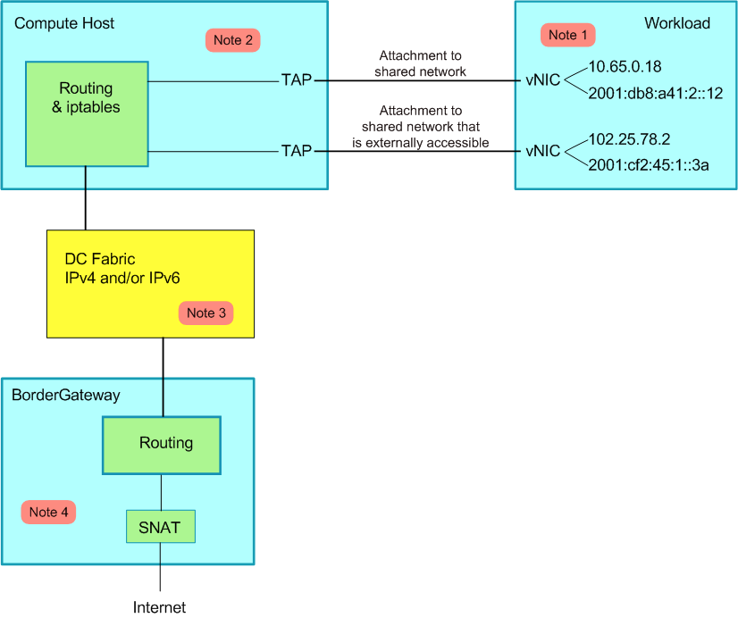
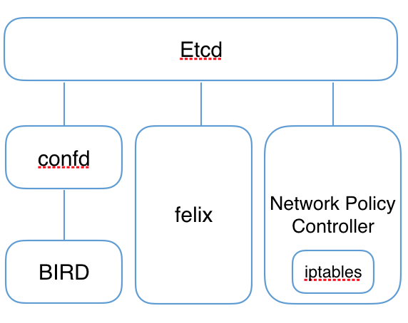
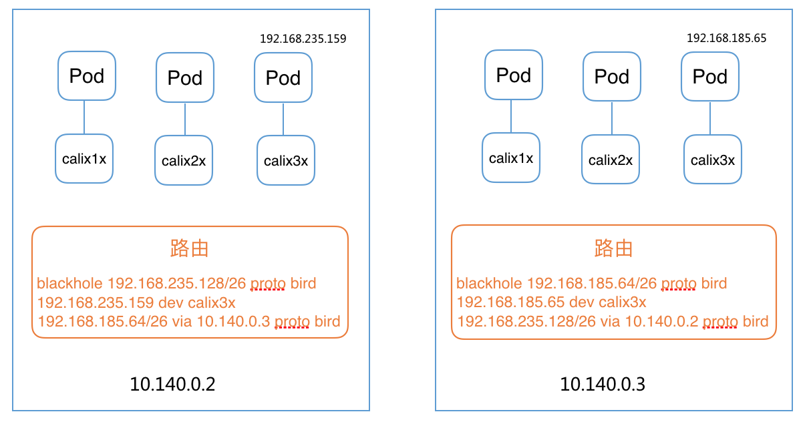

<!-- toc -->

# Calico

[Calico](https://www.projectcalico.org/) 是一个纯三层的数据中心网络方案（不需要 Overlay），并且与 OpenStack、Kubernetes、AWS、GCE 等 IaaS 和容器平台都有良好的集成。

Calico 在每一个计算节点利用 Linux Kernel 实现了一个高效的 vRouter 来负责数据转发，而每个 vRouter 通过 BGP 协议负责把自己上运行的 workload 的路由信息像整个 Calico 网络内传播——小规模部署可以直接互联，大规模下可通过指定的 BGP route reflector 来完成。 这样保证最终所有的 workload 之间的数据流量都是通过 IP 路由的方式完成互联的。Calico 节点组网可以直接利用数据中心的网络结构（无论是 L2 或者 L3），不需要额外的 NAT，隧道或者 Overlay Network。

此外，Calico 基于 iptables 还提供了丰富而灵活的网络 Policy，保证通过各个节点上的 ACLs 来提供 Workload 的多租户隔离、安全组以及其他可达性限制等功能。

## Calico 架构


Calico 主要由 Felix、etcd、BGP client 以及 BGP Route Reflector 组成

1.  Felix，Calico Agent，跑在每台需要运行 Workload 的节点上，主要负责配置路由及 ACLs 等信息来确保 Endpoint 的连通状态；
2.  etcd，分布式键值存储，主要负责网络元数据一致性，确保 Calico 网络状态的准确性；
3.  BGP Client（BIRD）, 主要负责把 Felix 写入 Kernel 的路由信息分发到当前 Calico 网络，确保 Workload 间的通信的有效性；
4.  BGP Route Reflector（BIRD），大规模部署时使用，摒弃所有节点互联的 mesh 模式，通过一个或者多个 BGP Route Reflector 来完成集中式的路由分发。
5.  calico/calico-ipam，主要用作 Kubernetes 的 CNI 插件



## IP-in-IP

Calico 控制平面的设计要求物理网络得是 L2 Fabric，这样 vRouter 间都是直接可达的，路由不需要把物理设备当做下一跳。为了支持 L3 Fabric，Calico 推出了 IPinIP 的选项。

## Calico CNI

见 <https://github.com/projectcalico/cni-plugin>。

## Calico CNM

Calico 通过 Pool 和 Profile 的方式实现了 docker CNM 网络：

1.  Pool，定义可用于 Docker Network 的 IP 资源范围，比如：10.0.0.0/8 或者 192.168.0.0/16；
2.  Profile，定义 Docker Network Policy 的集合，由 tags 和 rules 组成；每个 Profile 默认拥有一个和 Profile 名字相同的 Tag，每个 Profile 可以有多个 Tag，以 List 形式保存。

具体实现见 <https://github.com/projectcalico/libnetwork-plugin>，而使用方法可以参考 [https://docs.projectcalico.org/master/getting-started/docker/](https://docs.projectcalico.org/master/getting-started/docker/)。

## Calico Kubernetes

对于使用 kubeadm 创建的 Kubernetes 集群，使用以下配置安装 calico 时需要配置

- `--pod-network-cidr=192.168.0.0/16`
- `--service-cidr=10.96.0.0/12` （不能与 Calico 网络重叠）

然后运行

```sh
kubectl apply -f https://docs.projectcalico.org/v3.1/getting-started/kubernetes/installation/hosted/rbac-kdd.yaml
kubectl apply -f https://docs.projectcalico.org/v3.1/getting-started/kubernetes/installation/hosted/kubernetes-datastore/calico-networking/1.7/calico.yaml
```

更详细的自定义配置方法见 [https://docs.projectcalico.org/v3.0/getting-started/kubernetes](https://docs.projectcalico.org/v3.0/getting-started/kubernetes)。

这会在 Pod 中启动 Calico-etcd，在所有 Node 上启动 bird6、felix 以及 confd，并配置 CNI 网络为 calico 插件：





```sh
# Calico 相关进程
$ ps -ef | grep calico | grep -v grep
root      9012  8995  0 14:51 ?        00:00:00 /bin/sh -c /usr/local/bin/etcd --name=calico --data-dir=/var/etcd/calico-data --advertise-client-urls=http://$CALICO_ETCD_IP:6666 --listen-client-urls=http://0.0.0.0:6666 --listen-peer-urls=http://0.0.0.0:6667
root      9038  9012  0 14:51 ?        00:00:01 /usr/local/bin/etcd --name=calico --data-dir=/var/etcd/calico-data --advertise-client-urls=http://10.146.0.2:6666 --listen-client-urls=http://0.0.0.0:6666 --listen-peer-urls=http://0.0.0.0:6667
root      9326  9325  0 14:51 ?        00:00:00 bird6 -R -s /var/run/calico/bird6.ctl -d -c /etc/calico/confd/config/bird6.cfg
root      9327  9322  0 14:51 ?        00:00:00 confd -confdir=/etc/calico/confd -interval=5 -watch --log-level=debug -node=http://10.96.232.136:6666 -client-key= -client-cert= -client-ca-keys=
root      9328  9324  0 14:51 ?        00:00:00 bird -R -s /var/run/calico/bird.ctl -d -c /etc/calico/confd/config/bird.cfg
root      9329  9323  1 14:51 ?        00:00:04 calico-felix
```

```sh
# CNI 网络插件配置
$ cat /etc/cni/net.d/10-calico.conf
{
    "name": "k8s-pod-network",
    "cniVersion": "0.1.0",
    "type": "calico",
    "etcd_endpoints": "http://10.96.232.136:6666",
    "log_level": "info",
    "ipam": {
        "type": "calico-ipam"
    },
    "policy": {
        "type": "k8s",
         "k8s_api_root": "https://10.96.0.1:443",
         "k8s_auth_token": "<token>"
    },
    "kubernetes": {
        "kubeconfig": "/etc/cni/net.d/calico-kubeconfig"
    }
}

$ cat /etc/cni/net.d/calico-kubeconfig
# Kubeconfig file for Calico CNI plugin.
apiVersion: v1
kind: Config
clusters:
- name: local
  cluster:
    insecure-skip-tls-verify: true
users:
- name: calico
contexts:
- name: calico-context
  context:
    cluster: local
    user: calico
current-context: calico-context
```



## Calico 的不足

- 既然是三层实现，当然不支持 VRF
- 不支持多租户网络的隔离功能，在多租户场景下会有网络安全问题
- Calico 控制平面的设计要求物理网络得是 L2 Fabric，这样 vRouter 间都是直接可达的

** 参考文档 **

- https://xuxinkun.github.io/2016/07/22/cni-cnm/
- https://www.projectcalico.org/
- http://blog.dataman-inc.com/shurenyun-docker-133/
