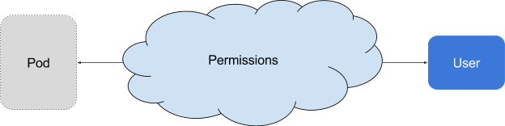
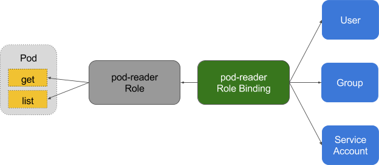

<!-- toc -->

## 官方文档：
https://kubernetes.io/docs/reference/access-authn-authz/authorization/

## 授权模式

- webhook: 它与集群外的 HTTP(S) 服务交互。
- ABAC: 它执行静态文件中定义的策略。
- RBAC: 它使用 rbac.authorization.k8s.io API Group实现授权决策，允许管理员通过 Kubernetes API 动态配置策略。
- Node: 它确保 Kubelet 只能访问自己节点上的资源。

## 鉴权的作用
鉴权的作用是，决定一个用户是否有权使用 Kubernetes API 做某些事情。它除了会影响 kubectl 等组件之外，还会对一些运行在集群内部并对集群进行操作的软件产生作用，例如使用了 Kubernetes 插件的 Jenkins，或者是利用 Kubernetes API 进行软件部署的 Helm。ABAC 和 RBAC 都能够对访问策略进行配置。

ABAC（Attribute Based Access Control）本来是不错的概念，但是在 Kubernetes 中的实现比较难于管理和理解（怪我咯），而且需要对 Master 所在节点的 SSH 和文件系统权限，而且要使得对授权的变更成功生效，还需要重新启动 API Server。

而 RBAC 的授权策略可以利用 kubectl 或者 Kubernetes API 直接进行配置。RBAC 可以授权给用户，让用户有权进行授权管理，这样就可以无需接触节点，直接进行授权管理。RBAC 在 Kubernetes 中被映射为 API 资源和操作。

## 原理图

在 RBAC 中定义了两个对象，用于描述在用户和资源之间的连接权限。

* 角色
角色是一系列的权限的集合，例如一个角色可以包含读取 Pod 的权限和列出 Pod 的权限， ClusterRole 跟 Role 类似，但是可以在集群中到处使用（ Role 是 namespace 一级的）。

* 角色绑定
RoleBinding 把角色映射到用户，从而让这些用户继承角色在 namespace 中的权限。ClusterRoleBinding 让用户继承 ClusterRole 在整个集群中的权限。

可参考： [关于 RoleBinding 和 ClusterRoleBinding ]( https://kubernetes.io/docs/admin/authorization/rbac/#rolebinding-and-clusterrolebinding)
