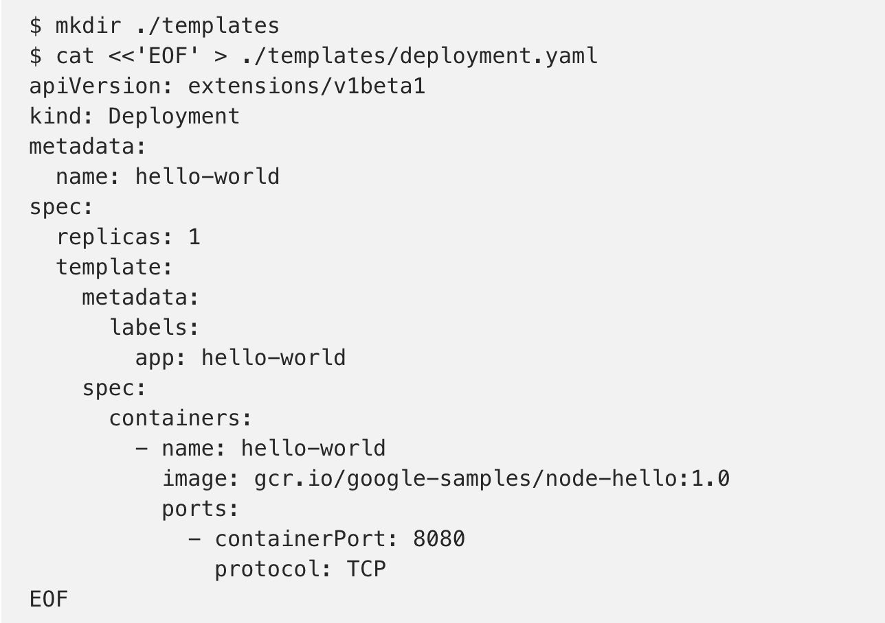
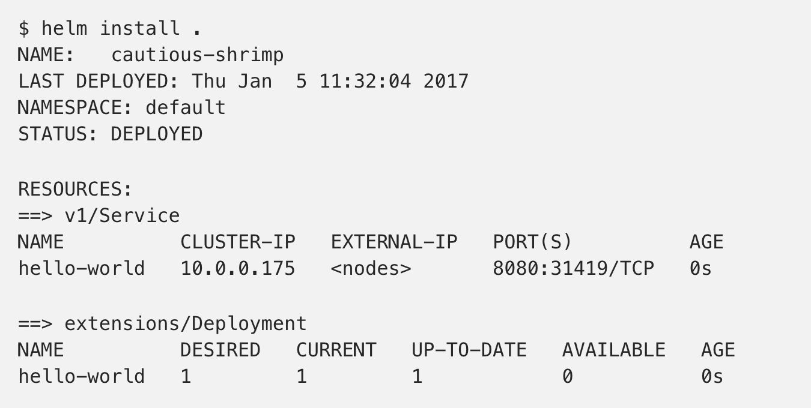
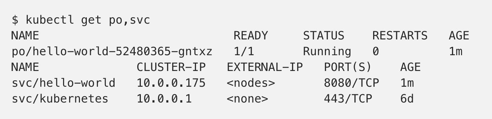
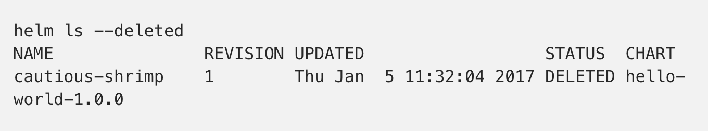
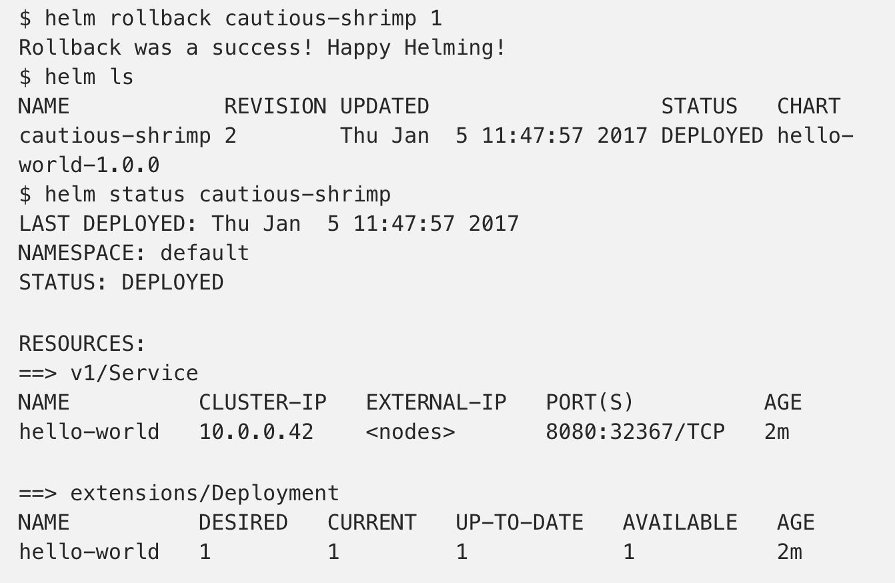
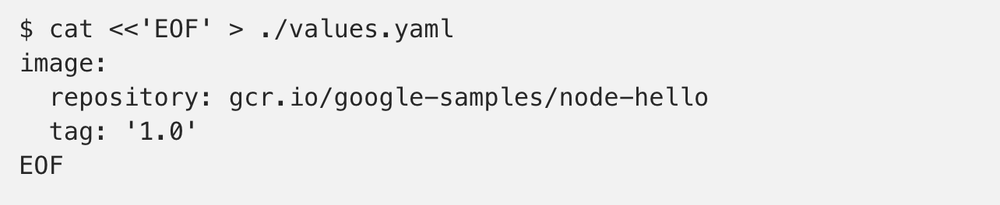
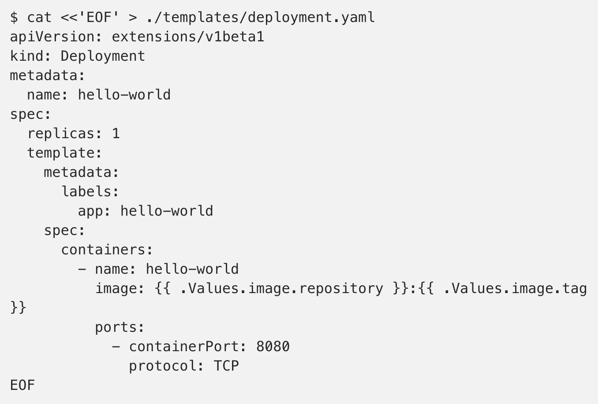

<!-- toc -->
## 什么是 Helm Charts
Helm Charts是 Kubernetes 项目中的一个子项目（https://github.com/kubernetes/helm）目的是提供 Kubernetes 的包管理平台。Helm 能够帮你管理 Kubernetes 的应用集合。Helm Charts 能够帮你定义，安装，升级最复杂的 Kubernetes 应用集合。Helm Charts 很容易创建，做版本化，共享和发布，最新版本的 Helm 由 CNCF 进行维护，目前在业界已经有大量的公司在使用 Helm，其中包括谷歌，微软，Bitnami 等大型企业。
Helm 由两部分组成：
* Helm 客户端。它用来创建，拉取，搜索和验证 Charts，初始化 Tiller 服务。
* Tiller server。跑在 Kubernetes 集群之内，管理这些应用的发布。

## 为什么需要 Helm Charts？
很多Kubernetes 的使用者在部署一些通用组件时，例如数据库，CI 工具，缓存组件，负载均衡等等，通常会需求一些业界统一的最佳实践进行应用的配置。

目前市面上有很多仓库提供这样的最佳实践，例如：Kubernetes 的contrib repository，Helm Charts Repository (https://github.com/kubernetes/charts)，Bitnami Charts Repository. 面对如此众多的来源，用户更希望有一个统一的入口去管理所有 Helm Charts仓库，于是就有了 Helm 私有仓库的诞生。
它的好处在于：
1. 管理复杂的应用集合Charts 能够描述最复杂的应用，提供可重复，幂等性的安装，以及提供统一的认证中心服务。
2. 容易升级为团队提供实时的镜像升级，以及自定义 webhook，解决镜像升级的痛点。
3. 企业内部共享Charts能够很容易的进行版本化，共享，在企业内部提供私有Heml 仓库服务，解决了从官方源拉镜像速度奇慢的痛点。
4. 回滚使用 Helm 可以方便的进行应用的回滚，回到之前的 Release 版本。

目前在Kubernetes Charts repository有两个主要的目录Stable 和Incubator，Stable 里有近百种应用，例如：Artifactory, Jenkins，Mysql，MariaDB，Consul,Gitlab, Grafana,Nginx 等等。Incubator 里也有cassandra，Kafka，zk 等等知名软件，并且 Stable 仓库会持续的更新，提供更为便捷的应用配置管理。

## 如何使用 Helm Charts？
### 部署一个应用

helm install . 会使用./templates 目录下的Kubernetes manifests 去创建一个部署(deployment)和服务(service):

### 删除一个 Release
Helm delete RELEASE_NAME

### 回滚一个 Release
使用 helm rollback RELEASE_NAME REVISION_NUMBER 可以恢复一个被删除的 Release

### 使用模版管理Release
如果管理 Release？每次发布 Release，你不可能手动的去修改 yaml 文件去发布，Helm Chart提供了 模版的方式去实现。Helm Charts 的模版由 Go模版语言实现，并提供了数十种公共模版供用户使用。模版的值是从 value.yaml文件读取，例如：

一个模版文件写出来会是下面的样子，deployment.yaml:

其中模版中的变量是从 value.yaml 文件中读取。你也可以使用helm install —set image.tag=’latest’命令去覆盖 value.yaml 文件中的值。

> 参考：
http://blog.51cto.com/13995002/2287546
[Kubernetes上如何使用Helm](http://blog.51cto.com/ygqygq2/2170054)
[使用Helm部署Prometheus和Grafana监控Kubernetes](http://blog.51cto.com/ygqygq2/2174311)
