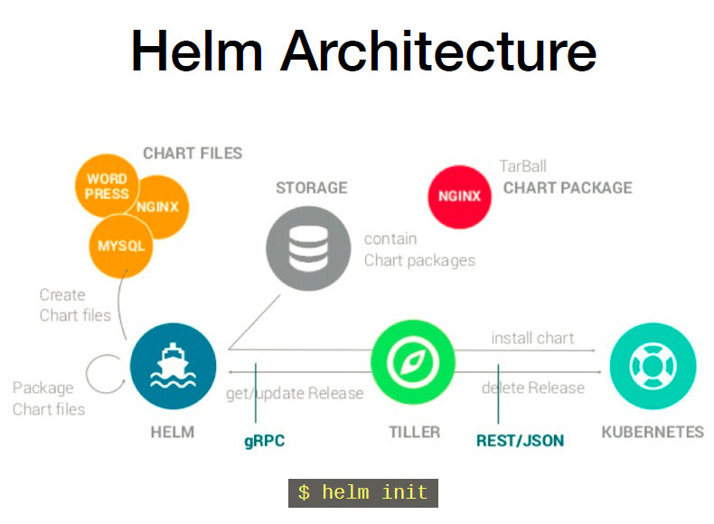

<!-- toc --> 
*****
## 一、helm介绍

### 1.什么是 Helm Charts
Helm Charts是 Kubernetes 项目中的一个子项目（https://github.com/kubernetes/helm） 目的是提供 Kubernetes 的包管理平台。Helm 能够帮你管理 Kubernetes 的应用集合。Helm Charts 能够帮你定义，安装，升级最复杂的 Kubernetes 应用集合。Helm Charts 很容易创建，做版本化，共享和发布，最新版本的 Helm 由 CNCF 进行维护，目前在业界已经有大量的公司在使用 Helm，其中包括谷歌，微软，Bitnami 等大型企业。
Helm 由两部分组成：
* Helm 客户端。它用来创建，拉取，搜索和验证 Charts，初始化 Tiller 服务。
* Tiller server。跑在 Kubernetes 集群之内，管理这些应用的发布。

### 2.为什么需要 Helm Charts
很多Kubernetes 的使用者在部署一些通用组件时，例如数据库，CI 工具，缓存组件，负载均衡等等，通常会需求一些业界统一的最佳实践进行应用的配置。

目前市面上有很多仓库提供这样的最佳实践，例如：Kubernetes 的contrib repository，Helm Charts Repository (https://github.com/kubernetes/charts)，Bitnami Charts Repository. 面对如此众多的来源，用户更希望有一个统一的入口去管理所有 Helm Charts仓库，于是就有了 Helm 私有仓库的诞生。
它的好处在于：
1. 管理复杂的应用集合Charts 能够描述最复杂的应用，提供可重复，幂等性的安装，以及提供统一的认证中心服务。
2. 容易升级为团队提供实时的镜像升级，以及自定义 webhook，解决镜像升级的痛点。
3. 企业内部共享Charts能够很容易的进行版本化，共享，在企业内部提供私有Heml 仓库服务，解决了从官方源拉镜像速度奇慢的痛点。
4. 回滚使用 Helm 可以方便的进行应用的回滚，回到之前的 Release 版本。

目前在Kubernetes Charts repository有两个主要的目录Stable 和Incubator，Stable 里有近百种应用，例如：Artifactory, Jenkins，Mysql，MariaDB，Consul,Gitlab, Grafana,Nginx 等等。Incubator 里也有cassandra，Kafka，zk 等等知名软件，并且 Stable 仓库会持续的更新，提供更为便捷的应用配置管理。

## 二、安装helm
### 1.获取安装包
在官网获取helm的最新版本或者其他版本 https://github.com/helm/helm/releases
我在这儿选择了最新的版本`helm-v2.11.0`
```
[root@master src]# wget https://storage.googleapis.com/kubernetes-helm/helm-v2.11.0-linux-amd64.tar.gz
[==================================================>] 19,149,273  6.58MB/s   in 2.8s   
2018-10-19 15:27:50 (6.58 MB/s) - ‘helm-v2.11.0-linux-amd64.tar.gz’ saved [19149273/19149273]
```

然后就是解压，将二进制包放在`/usr/local/bin`或者`/etc/kubernetes/bin`下
需要说明的是，这一步其实就是安装helm的client端

### 2.安装server
接下来就是初始化helm server
因为gfw的原因，所以需要要使用阿里云提供的镜像仓库，可以去 https://dev.aliyun.com/  查看
初始化命令：
```
 helm init --upgrade -i \
 registry.cn-hangzhou.aliyuncs.com/google_containers/tiller:v2.11.0 \
--stable-repo-url https://kubernetes.oss-cn-hangzhou.aliyuncs.com/charts
```
上面的命令实质就是在k8s上部署了一个deployment，这个deployment的名字 tiller，它其实就是helm的服务端。
查看一下这个pod
```
[root@master ~]# kubectl get pod -n kube-system |grep till
tiller-deploy-cd5cf5bb6-xbjfl           1/1       Running   0          2m
```
服务端和客户端安装好之后，看看版本:
```
[root@master ~]# helm version
Client: &version.Version{SemVer:"v2.11.0", GitCommit:"2e55dbe1fdb5fdb96b75ff144a339489417b146b", GitTreeState:"clean"}
Server: &version.Version{SemVer:"v2.11.0", GitCommit:"2e55dbe1fdb5fdb96b75ff144a339489417b146b", GitTreeState:"clean"}
```
注意：如果tiller的镜像不能正常的拉取或启动的话，会显示如下：
```
[root@master bin]#  helm version
Client: &version.Version{SemVer:"v2.11.0", GitCommit:"2e55dbe1fdb5fdb96b75ff144a339489417b146b", GitTreeState:"clean"}
Error: could not find a ready tiller pod
```
提示：
> 所谓client端其实就是那个helm二进制包
> 所谓server端其实就是那个pod（helm tiller）
> 另外，需要在每个node节点需要安装socat
        ```
        yum install -y socat
        否则，会报类似的错误：
        unable to do port forwarding: socat not found.
        Error: cannot connect to Tiller
        ```