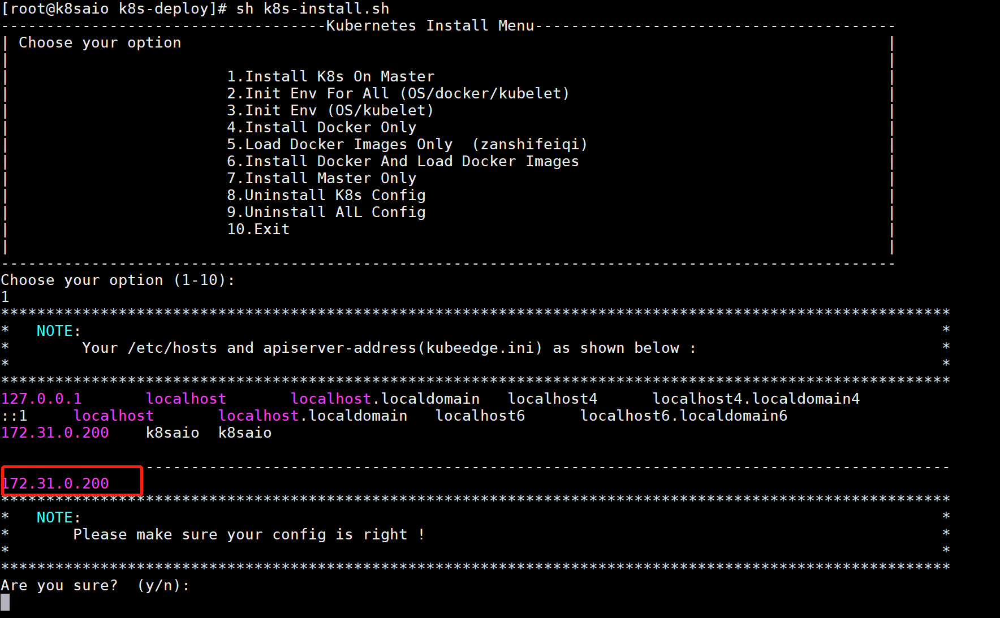

centos7.5环境下测试通过版本：1.15.8，1.18.2

默认使用calico网络插件。

安装步骤：
1.安装git
```
yum install -y git
```

2.clone仓库
```
git clone https://github.com/googlebabaio/k8s-deploy.git
```

3.进入目录修改配置文件kubedeploy.ini
```
cd k8s-deploy
vi kubedeplo.ini
```

要修改的是2个地方：
- APISERVER_ADVERTISE_ADDRESS：修改apiserver的地址
- KUBERNETES_VERSION：修改为我们想要安装的版本号

示例如下：
```
APISERVER_ADVERTISE_ADDRESS=172.31.0.200
KUBERNETES_VERSION=1.18.2
```


4.进行安装

```
sh k8s-install.sh
```

执行后，会有一个检查的提示，告诉我们apiserver的地址是否是我们想要的，如果不是，参考第3步进行修改。


接下来就是等待了。


如果没有被墙，那应该是很快速就会好的。

5.其他节点的加入
在上面输出最后已经有note提示了，在其他node节点只需要执行：
```
kubeadm join 172.31.0.200 :6443 --token ocoflu.grf7kbj2csus7vbi  \                                *
--discovery-token-ca-cert-hash sha256:54cef6226b401e67b6d3536610e70f3934f1f7516ec2abc09eb57dce1744e4ed
```

如果这个token过期 ，可以用下面的命令重新在master节点生成：
```
[root@k8saio k8s-deploy]# kubeadm token create --print-join-command
W0428 10:16:56.415683   17222 configset.go:202] WARNING: kubeadm cannot validate component configs for API groups [kubelet.config.k8s.io kubeproxy.config.k8s.io]
kubeadm join 172.31.0.200:6443 --token ejasko.vci77t0d5ev4ovgp     --discovery-token-ca-cert-hash sha256:54cef6226b401e67b6d3536610e70f3934f1f7516ec2abc09eb57dce1744e4ed
```

6.master去除污点
如果只需要一个master节点做测试，或者需要在master节点部署pod，则需要将master节点的污点去掉，命令如下；
去除污点:


```
[root@k8saio k8s-deploy]# kubectl describe nodes k8saio | grep Taints
Taints:             node-role.kubernetes.io/master:NoSchedule
[root@k8saio k8s-deploy]# kubectl taint node k8saio node-role.kubernetes.io/master-
node/k8saio untainted
[root@k8saio k8s-deploy]# kubectl describe nodes k8saio | grep Taints
Taints:             <none>
```

注意：k8saio是我的master节点的hostname，你需要换成自己master节点的名字。

加上污点:
```
kubectl taint node node01 node-role.kubernetes.io/master="":NoSchedule
```
