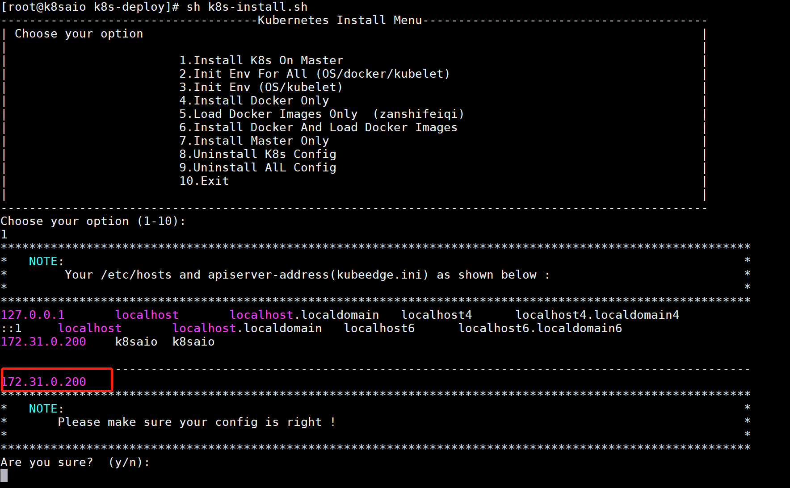
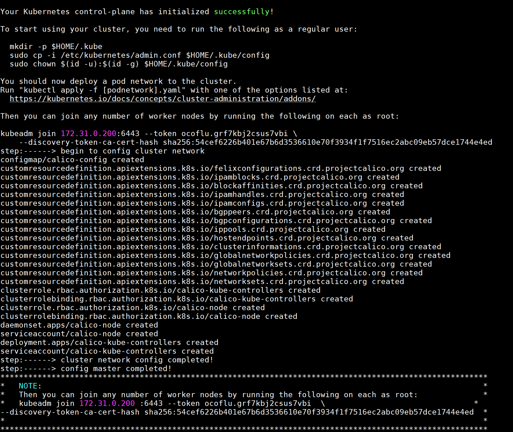
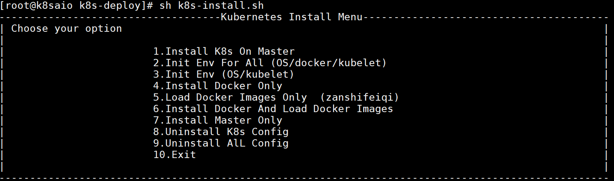

# 概述

本项目是为内网或者不方便fq上互联网而写的 **离线安装kubernetes** 的脚本。只需填写apiserver的地址，即可安装一套k8s集群的master节点。对于需要加入集群的node节点，只需要按照安装结束后，`kubeadm join`的提示命令执行即可。

- 目前支持操作系统版本: centos7.5+
- 支持k8s版本: 1.14.1, 1.15.4 ,1.16.8, 1.18.2
- 提供的网络插件2选1: calico(默认)和flannel
- docker的版本为：19.03.8

>本项目提供的是安装脚本，而相关的包需要去baidu网盘下载。

## 离线包说明
离线包下载地址：
```
链接：https://pan.baidu.com/s/1XPAUitQvggLqb-R6cW43vg
提取码：mta6
```

离线包目录：
```
# tree k8spkg -L 1
k8spkg
|-- docker            //docker离线安装包
|-- images            //k8s相关镜像
|-- kube-calico.yaml  //calico的yaml文件
|-- kube-flannel.yaml //flannel的yaml文件
|-- rpm               //kubectl、kubelet、kubeadm的rpm包
`-- tools             //一些工具脚本
```

## 参数文件说明
kubedeploy.ini
```
POD_NETWORK_CIDR=10.244.0.0/16   //pod的网络地址
SERVICE_CIDR=10.2.0.0/16  //svc的网络地址
APISERVER_ADVERTISE_ADDRESS=192.168.4.6  //apiserver的地址
KUBERNETES_VERSION=1.18.2  //k8s的版本
CNIOPTION=calico  //网络插件，支持calico(默认)和flannel
```


# 使用方法
1.下载离线包到`/usr/local/src`

2.解压
```shell
tar -zxvf k8spkg.tgz
```

3.下载离线安装程序
```
git clone https://github.com/googlebabaio/k8s-deploy-offline.git
```

4.修改配置文件
```
cd k8s-deploy-offline
vi kubedeploy.ini
```

要修改的是2个地方：
- APISERVER_ADVERTISE_ADDRESS：修改apiserver的地址
- KUBERNETES_VERSION：修改为我们想要安装的版本号

示例如下：
```
APISERVER_ADVERTISE_ADDRESS=172.31.0.200
KUBERNETES_VERSION=1.18.2
```


5.执行安装
```
sh k8s-install.sh
```

执行后，会有一个检查的提示，告诉我们apiserver的地址是否是我们想要的，如果不是，参考第4步进行修改。


接下来就是等待了。


如果没有其他什么问题，那应该是很快速就会好的。

6.其他节点的加入

其他节点要加入到集群中，首先需要做一个初始化：


如图所示，在执行 k8s-install.sh 的时候选择第2个选项，即可以把node节点做初始化，包括：
- OS的初始化
- 安装docker
- 装载镜像
- 安装kubelet

在节点初始化完成后，在node节点接着执行join的命令：
```shell
kubeadm join 172.31.0.200 :6443 --token ocoflu.grf7kbj2csus7vbi  \
--discovery-token-ca-cert-hash sha256:54cef6226b401e67b6d3536610e70f3934f1f7516ec2abc09eb57dce1744e4ed
```

如果这个token过期 ，可以用下面的命令重新在master节点生成：
```shell
[root@k8saio k8s-deploy]# kubeadm token create --print-join-command
W0428 10:16:56.415683   17222 configset.go:202] WARNING: kubeadm cannot validate component configs for API groups [kubelet.config.k8s.io kubeproxy.config.k8s.io]
kubeadm join 172.31.0.200:6443 --token ejasko.vci77t0d5ev4ovgp     --discovery-token-ca-cert-hash sha256:54cef6226b401e67b6d3536610e70f3934f1f7516ec2abc09eb57dce1744e4ed
```

6.master去除污点
如果只需要一个master节点做测试，或者需要在master节点部署pod，则需要将master节点的污点去掉，命令如下；
去除污点:


```
[root@k8saio k8s-deploy]# kubectl describe nodes k8saio | grep Taints
Taints:             node-role.kubernetes.io/master:NoSchedule
[root@k8saio k8s-deploy]# kubectl taint node k8saio node-role.kubernetes.io/master-
node/k8saio untainted
[root@k8saio k8s-deploy]# kubectl describe nodes k8saio | grep Taints
Taints:             <none>
```

注意：k8saio是我的master节点的hostname，你需要换成自己master节点的名字。

加上污点:
```
kubectl taint node node01 node-role.kubernetes.io/master="":NoSchedule
```


# roadmap


# 参考

1.docker离线安装包：
https://download.docker.com/linux/static/stable/x86_64/


2.下载kubelet、kubeadm、kubectl
```
yum install --downloadonly --downloaddir=. -y kubelet-1.18.2 kubeadm-1.18.2 kubectl-1.18.2 --disableexcludes=kubernetes
```
