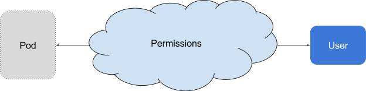
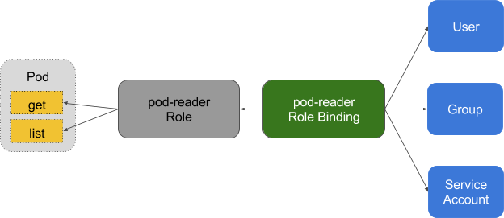

<!-- toc -->

## 官方文档：
https://kubernetes.io/docs/reference/access-authn-authz/authorization/

## 鉴权模式

* Node - A special-purpose authorizer that grants permissions to kubelets based on the pods they are scheduled to run. To learn more about using the Node authorization mode, see Node Authorization.
* ABAC - Attribute-based access control (ABAC) defines an access control paradigm whereby access rights are granted to users through the use of policies which combine attributes together. The policies can use any type of attributes (user attributes, resource attributes, object, environment attributes, etc). To learn more about using the ABAC mode, see ABAC Mode.
* RBAC - Role-based access control (RBAC) is a method of regulating access to computer or network resources based on the roles of individual users within an enterprise. In this context, access is the ability of an individual user to perform a specific task, such as view, create, or modify a file. To learn more about using the RBAC mode, see RBAC Mode
    * When specified RBAC (Role-Based Access Control) uses the rbac.authorization.k8s.io API group to drive authorization decisions, allowing admins to dynamically configure permission policies through the Kubernetes API.
    * To enable RBAC, start the apiserver with `--authorization-mode=RBAC`.
* Webhook - A WebHook is an HTTP callback: an HTTP POST that occurs when something happens; a simple event-notification via HTTP POST. A web application implementing WebHooks will POST a message to a URL when certain things happen. To learn more about using the Webhook mode, see Webhook Mode.
Checking API Access

## 鉴权的作用
鉴权的作用是，决定一个用户是否有权使用 Kubernetes API 做某些事情。它除了会影响 kubectl 等组件之外，还会对一些运行在集群内部并对集群进行操作的软件产生作用，例如使用了 Kubernetes 插件的 Jenkins，或者是利用 Kubernetes API 进行软件部署的 Helm。ABAC 和 RBAC 都能够对访问策略进行配置。

ABAC（Attribute Based Access Control）本来是不错的概念，但是在 Kubernetes 中的实现比较难于管理和理解（怪我咯），而且需要对 Master 所在节点的 SSH 和文件系统权限，而且要使得对授权的变更成功生效，还需要重新启动 API Server。

而 RBAC 的授权策略可以利用 kubectl 或者 Kubernetes API 直接进行配置。RBAC 可以授权给用户，让用户有权进行授权管理，这样就可以无需接触节点，直接进行授权管理。RBAC 在 Kubernetes 中被映射为 API 资源和操作。

## 原理图

在 RBAC 中定义了两个对象，用于描述在用户和资源之间的连接权限。

* 角色
角色是一系列的权限的集合，例如一个角色可以包含读取 Pod 的权限和列出 Pod 的权限， ClusterRole 跟 Role 类似，但是可以在集群中到处使用（ Role 是 namespace 一级的）。

* 角色绑定
RoleBinding 把角色映射到用户，从而让这些用户继承角色在 namespace 中的权限。ClusterRoleBinding 让用户继承 ClusterRole 在整个集群中的权限。

可参考： [关于 RoleBinding 和 ClusterRoleBinding ]( https://kubernetes.io/docs/admin/authorization/rbac/#rolebinding-and-clusterrolebinding)
