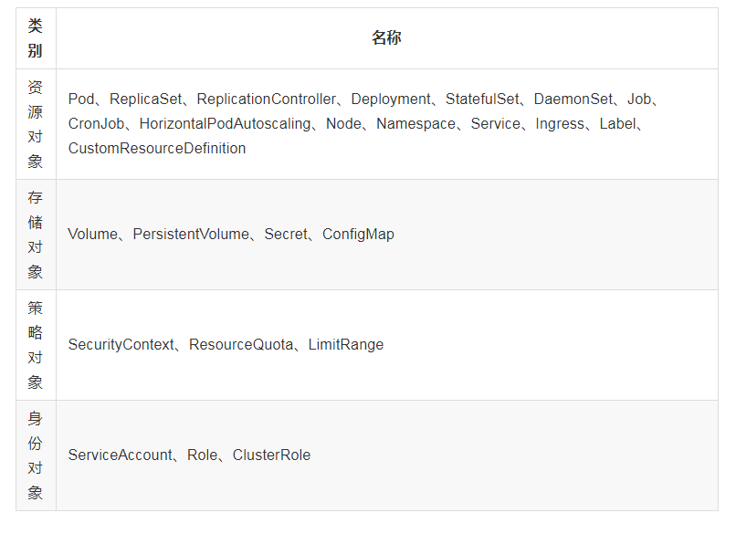

## Objects

* Pod
* Node
* Namespace
* Service
* Volume
* PersistentVolume
* Deployment
* Secret
* StatefulSet
* DaemonSet
* ServiceAccount
* ReplicationController
* ReplicaSet
* Job
* CronJob
* SecurityContext
* ResourceQuota
* LimitRange
* HorizontalPodAutoscaling
* Ingress
* ConfigMap
* Label
* CustomResourceDefinition
* Role
* ClusterRole