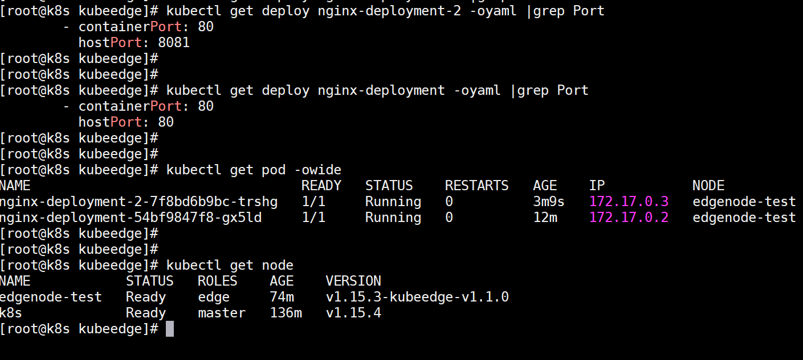

<!-- toc -->

配置kubeedge-1.1版本


# 部署云端
首先申请云端的服务器，我们在这儿申请一台香港的服务器就可以了（因为安装过程中会去google服务器上拖k8s的相关镜像）。

> PS: 离线版稍后发布

## 1.安装k8s集群
```
yum install -y git

mkdir /softdb

cd /softdb

git clone https://github.com/googlebabaio/k8s-deploy.git

cd k8s-deploy

chmod +x *.sh
```

修改 `kubedeploy.ini`中相关的配置信息，主要是注意apiserver的地址和kubenetes的版本
修改完成后，执行： `sh k8s-install.sh` 选择第1项`1.Install K8s On Master`即可，静静地等待1分钟，应该k8s-master节点即可安装完成。


## 2.配置golang环境
goroot
```
/usr/local/go
```

gopath
```
mkdir -p /sure/goproject
cd /sure/goproject
mkdir src pkg bin
```

下载解压
```
cd /softdb
wget https://dl.google.com/go/go1.12.10.linux-amd64.tar.gz
tar -C /usr/local -zxvf go1.12.10.linux-amd64.tar.gz
```

编辑环境变量
vim /etc/profile
```
export GOROOT=/usr/local/go
export PATH=$PATH:$GOROOT/bin
export GOPATH=/sure/goproject
```
source /etc/profile

## 3.配置kubeedge云端
### 获取指定的1.1版本的源码
```
git clone  --branch release-1.1 https://github.com/kubeedge/kubeedge.git $GOPATH/src/github.com/kubeedge/kubeedge

cd $GOPATH/src/github.com/kubeedge/kubeedge
```

### 生成证书
```
# $GOPATH/src/github.com/kubeedge/kubeedge/build/tools/certgen.sh genCertAndKey edge
```

> 注意：生成的证书放在 `/etc/kubeedge` 下面

### 编译成二进制文件

```
gcc --version

cd $GOPATH/src/github.com/kubeedge/kubeedge/

make all WHAT=cloudcore
```

### 创建device的crd
```
cd $GOPATH/src/github.com/kubeedge/kubeedge/build/crds/devices
kubectl create -f devices_v1alpha1_devicemodel.yaml
kubectl create -f devices_v1alpha1_device.yaml
```

### 将编译好的二进制文件和配置模板复制到  `~/cmd` 下
```
cd $GOPATH/src/github.com/kubeedge/kubeedge/cloud
mkdir -p ~/cmd/conf
cp cloudcore ~/cmd/
cp -rf conf/* ~/cmd/conf/
```

### 修改配置文件
```
cd ~/cmd/conf
vim controller.yaml
```

注意修改的几个地方：
- kubeconfig ： 不需要配置第一个master，只需要把kubeconfig的地址填上，注意填绝对路径
- port 是准备开放的websocket的端口
- ca/cert/key ： 用脚本生成的证书的地址
```
controller:
  kube:
    master:     # kube-apiserver address (such as:http://localhost:8080)
    namespace: ""
    content_type: "application/vnd.kubernetes.protobuf"
    qps: 5
    burst: 10
    node_update_frequency: 10
    kubeconfig: "/root/.kube/config"
cloudhub:
  protocol_websocket: true # enable websocket protocol
  port: 10000 # open port for websocket server
  protocol_quic: true # enable quic protocol
  quic_port: 10001 # open prot for quic server
  max_incomingstreams: 10000 # the max incoming stream for quic server
  enable_uds: true # enable unix domain socket protocol
  uds_address: unix:///var/lib/kubeedge/kubeedge.sock # unix domain socket address
  address: 0.0.0.0
  ca: /etc/kubeedge/ca/rootCA.crt
  cert: /etc/kubeedge/certs/edge.crt
  key: /etc/kubeedge/certs/edge.key
  keepalive-interval: 30
  write-timeout: 30
  node-limit: 10
devicecontroller:
  kube:
    master:        # kube-apiserver address (such as:http://localhost:8080)
    namespace: ""
    content_type: "application/vnd.kubernetes.protobuf"
    qps: 5
    burst: 10
    kubeconfig: "/root/.kube/config"
```

run起来
```
cd ~/cmd/
nohup ./cloudcore &
```

### 创建一个node
```
mkdir ~/cmd/yaml
cp $GOPATH/src/github.com/kubeedge/kubeedge/build/node.json ~/cmd/yaml
```

修改其中的`metadata.name` ，之后的node的name要和这个一样
```
{
  "kind": "Node",
  "apiVersion": "v1",
  "metadata": {
    "name": "edge-node",
    "labels": {
      "name": "edge-node",
      "node-role.kubernetes.io/edge": ""
    }
  }
}
```

提交创建
```
kubectl apply -f ~/cmd/yaml/node.json
```

# 部署边端

## 1.安装环境
```
yum install -y git

mkdir /softdb

cd /softdb

git clone https://github.com/googlebabaio/k8s-deploy.git

cd k8s-deploy

chmod +x *.sh
```

修改 `kubedeploy.ini`中相关的配置信息，主要是注意apiserver的地址和kubenetes的版本
修改完成后，执行： `sh k8s-install.sh` 选择第2项`2.Init Env For All`即可，静静地等待1分钟，node节点的环境即可安装完成。
```

## 2.配置golang环境
goroot
```
/usr/local/go
```

gopath
```
mkdir -p /sure/goproject
cd /sure/goproject
mkdir src pkg bin
```

下载解压
```
cd /softdb
wget https://dl.google.com/go/go1.12.10.linux-amd64.tar.gz
tar -C /usr/local -zxvf go1.12.10.linux-amd64.tar.gz
```

编辑环境变量
vim /etc/profile
```
export GOROOT=/usr/local/go
export PATH=$PATH:$GOROOT/bin
export GOPATH=/sure/goproject
```
source /etc/profile

> 说明：以上的环境配置只是为了编译二进制的edgecore，如果环境有限的话，可以直接去官网下载好二进制文件部署 https://github.com/kubeedge/kubeedge/releases

## 3.配置kubeedge边端
### 获取指定的1.1版本的源码
```
git clone  --branch release-1.1 https://github.com/kubeedge/kubeedge.git $GOPATH/src/github.com/kubeedge/kubeedge

cd $GOPATH/src/github.com/kubeedge/kubeedge
```

### 将云端的证书复制到相应的路径上
```
mkdir -p /etc/kubeedge

scp -r 云端:/etc/kubeedge /etc/kubeedge
```

编译二进制文件
```
cd $GOPATH/src/github.com/kubeedge/kubeedge
make all WHAT=edgecore
```

run mqtt
```
mosquitto -d -p 1883
```

编辑配置文件
```
mkdir ~/cmd/conf
cp $GOPATH/src/github.com/kubeedge/kubeedge/edge/conf/* ~/cmd/conf
vim ~/cmd/conf/edge.yaml
```

```
mqtt:
    server: tcp://127.0.0.1:1883 # external mqtt broker url.
    internal-server: tcp://127.0.0.1:1884 # internal mqtt broker url.
    mode: 0 # 0: internal mqtt broker enable only. 1: internal and external mqtt broker enable. 2: external mqtt broker
enable only.
    qos: 0 # 0: QOSAtMostOnce, 1: QOSAtLeastOnce, 2: QOSExactlyOnce.
    retain: false # if the flag set true, server will store the message and can be delivered to future subscribers.
    session-queue-size: 100 # A size of how many sessions will be handled. default to 100.

edgehub:
    websocket:
        url: wss://0.0.0.0:10000/e632aba927ea4ac2b575ec1603d56f10/edge-node/events
        certfile: /etc/kubeedge/certs/edge.crt
        keyfile: /etc/kubeedge/certs/edge.key
        handshake-timeout: 30 #second
        write-deadline: 15 # second
        read-deadline: 15 # second
    quic:
        url: 127.0.0.1:10001
        cafile: /etc/kubeedge/ca/rootCA.crt
        certfile: /etc/kubeedge/certs/edge.crt
        keyfile: /etc/kubeedge/certs/edge.key
        handshake-timeout: 30 #second
        write-deadline: 15 # second
        read-deadline: 15 # second
    controller:
        protocol: websocket # websocket, quic
        heartbeat: 15  # second
        project-id: e632aba927ea4ac2b575ec1603d56f10
        node-id: edge-node

edged:
    register-node-namespace: default
    hostname-override: edge-node
    interface-name: eth0
    edged-memory-capacity-bytes: 7852396000
    node-status-update-frequency: 10 # second
    device-plugin-enabled: false
    gpu-plugin-enabled: false
    image-gc-high-threshold: 80 # percent
    image-gc-low-threshold: 40 # percent
    maximum-dead-containers-per-container: 1
    docker-address: unix:///var/run/docker.sock
    runtime-type: docker
    remote-runtime-endpoint: unix:///var/run/dockershim.sock
    remote-image-endpoint: unix:///var/run/dockershim.sock
    runtime-request-timeout: 2
    podsandbox-image: kubeedge/pause:3.1 # kubeedge/pause:3.1 for x86 arch , kubeedge/pause-arm:3.1 for arm arch, kubeedge/pause-arm64 for arm64 arch
    image-pull-progress-deadline: 60 # second
    cgroup-driver: cgroupfs
    node-ip: ""
    cluster-dns: ""
    cluster-domain: ""

    mesh:
        loadbalance:
            strategy-name: RoundRobin
```


run起来
```
cp $GOPATH/src/github.com/kubeedge/kubeedge/edge/edgecore ~/cmd/
cd ~/cmd
./edgecore
# or
nohup ./edgecore > edgecore.log 2>&1 &
```

如果客户端安装了systemd的，可以用systemd来作为守护进程
```
sudo ln build/tools/edge.service /etc/systemd/system/edge.service
sudo systemctl daemon-reload
sudo systemctl start edgecore
sudo systemctl enable daemon-reload
```

# 测试
如果一切顺利的话，这个时候在云端用`kubectl get node` 是能看到边缘节点已经`ready`起来了

接下来只需要在云端部署一个应用，看边端是否能正常run起来即可

```
kubectl apply -f $GOPATH/src/github.com/kubeedge/kubeedge/build/deployment.yaml

kubectl get deploy
```

来一个展示如图：


