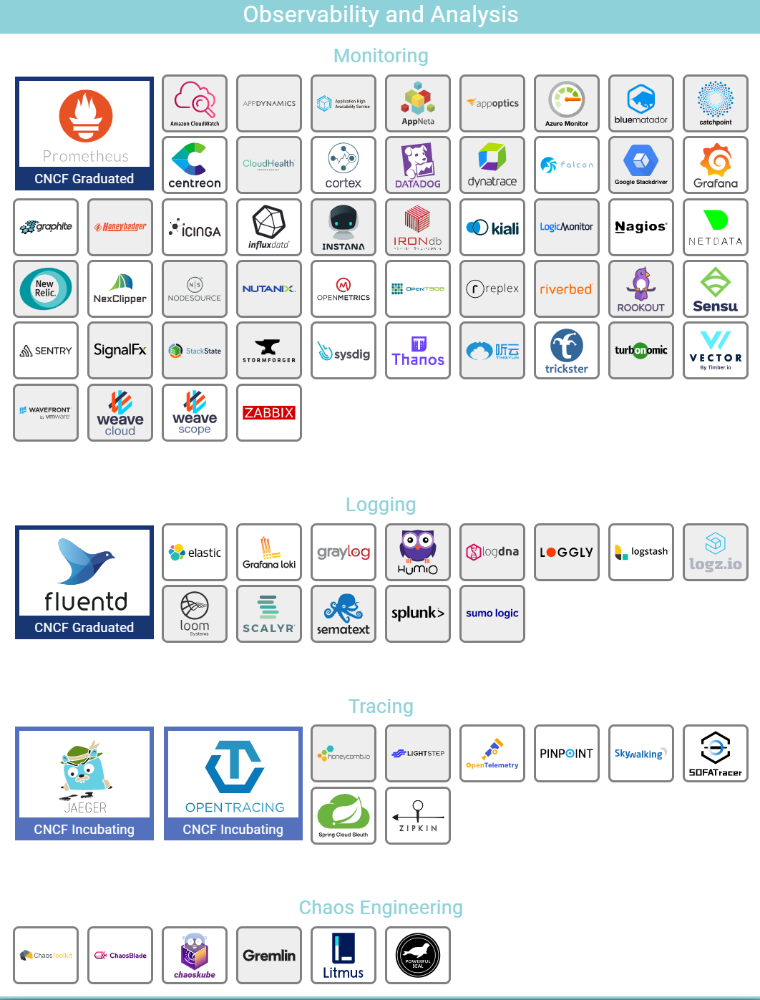

# 监控分为三个层面

- metrics
- logging
- trace

`metrics`指的是某个度量,我们认知钟对这个度量有个基线值,当超出了这个基线值,我们就应该关注

`logging`当有引起我们关注的`metrics`的时候,这个时候我们就应该"钻"下去。我们应该看看在过去几小时/几分钟/几十秒内到底发生了一些什么事情，这个时候就是`logging`开始发挥作用，它应该可以给出我们想要的回放。

`trace`，当有了`logging`，可能我们觉得还是不够的，这个时候就应该`trace`，这个过程是非常消耗资源的。

上面3给过程，我们用去看病来举例
当我们身体不适了，去医院找医生看病，这个时候医生给我们量了体温发现38.5°，这个就是`metrice`。然后医生开始询问我们昨天到今天吃了些什么、做了些什么事，我们一一做了回答，这个就是`logging`。这个时候医生心里可能已经有数了，但是现在医闹问题，所以还不敢轻易下结论，他就说你去查查血看看有没有病毒性感染，这个就是`trace`。

下面事cncf的一个监控层面的产品图：

