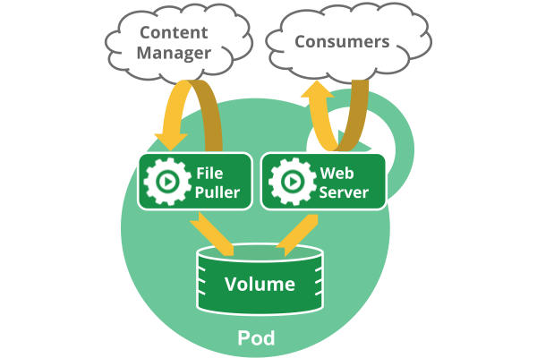

## 理解Pod
Pod是kubernetes中你可以创建和部署的最小单位
一个Pod代表着集群中运行的一个进程
Pod中封装着应用的容器（也可以是好几个容器），存储、独立的网络IP(一个pod中的多个container共享网络,localhost)，管理容器如何运行的策略选项。
Pod代表着部署的一个单位：kubernetes中应用的一个实例，可能由一个或者多个容器组合在一起共享资源。

Docker是kubernetes中最常用的容器运行时，但是Pod也支持其他容器运行时,如RKT

在Kubrenetes集群中Pod有如下两种使用方式：
- 一个Pod中运行一个容器
  - 这种使用方式中最常见的用法，可以把Pod想象成是单个容器的封装，kuberentes管理的是Pod而不是直接管理容器。
- 在一个Pod中同时运行多个容器
  - 一个Pod中也可以同时封装几个需要紧密耦合互相协作的容器，它们之间共享资源
  - 这些在同一个Pod中的容器可以互相协作成为一个service单位容器共享文件，另一个“sidecar”容器来更新这些文件。Pod将这些容器的存储资源作为一个实体来管理。
  - 同时要理解sidecar这个k8s非常有高度的架构，也是后面istio的基石
  - 另外，和主容器同时存在的我们往往会忽略的一个容器叫init container，这个在后面再具体阐述

### Pod中如何管理多个容器

Pod中可以共享两种资源：网络和存储。

#### 网络
每个Pod都会被分配一个唯一的IP地址。Pod中的所有容器共享网络空间，包括IP地址和端口。Pod内部的容器可以使用 localhost 互相通信。Pod中的容器与外界通信时，必须分配共享网络资源（例如使用宿主机的端口映射）。

#### 存储
可以Pod指定多个共享的Volume。Pod中的所有容器都可以访问共享的volume。Volume也可以用来持久化Pod中的存储资源，以防容器重启后文件丢失。

## 使用Pod
我们很少在k8s集群中直接使用pod, 直接使用pod的这种方式我们又称这种pod叫做静态pod。
静态 Pod 直接由特定节点上的kubelet进程来管理，不通过 master 节点上的apiserver。无法与我们常用的控制器Deployment或者DaemonSet进行关联，它由kubelet进程自己来监控，当pod崩溃时重启该pod，kubelete也无法对他们进行健康检查。静态 pod 始终绑定在某一个kubelet，并且始终运行在同一个节点上。 kubelet会自动为每一个静态 pod 在 Kubernetes 的 apiserver 上创建一个镜像 Pod（Mirror Pod），因此我们可以在 apiserver 中查询到该 pod，但是不能通过 apiserver 进行控制（例如不能删除）。
