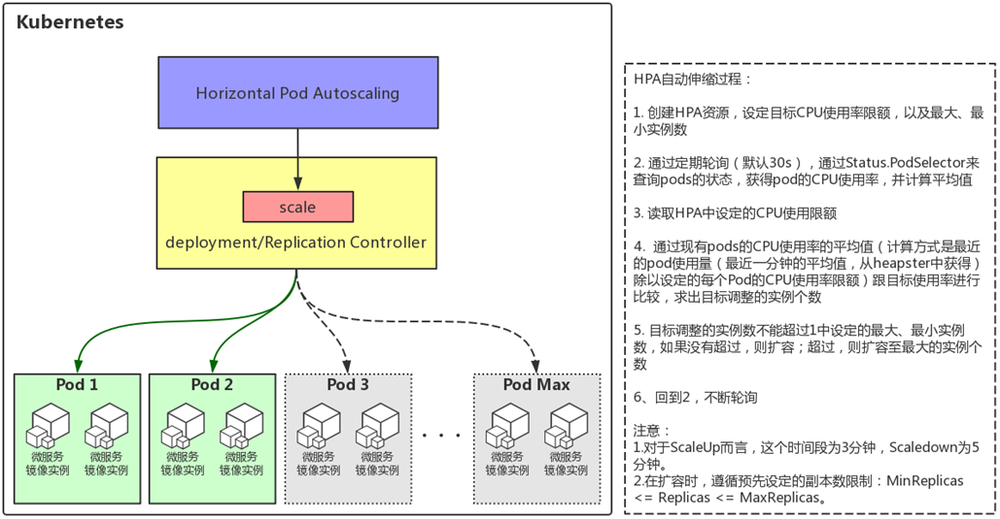

<!-- toc -->
## 一、压测工具ab介绍及安装
### 1.介绍
ab(apache benchmark) —— apache自带的一个测试工具，一般把apache压力测试称为AB测试。
> ab is a tool for benchmarking your Apache Hypertext Transfer Protocol (HTTP) server. It is designed to give you an impression of how your current Apache installation performs. This especially shows you how many requests per second your Apache installation is capable of serving.
>
文档地址：http://httpd.apache.org/docs/2.4/programs/ab.html

### 2.安装
```
[root@k8s-master ~]# yum -y install httpd-tools
[root@k8s-master ~]# ab -V
This is ApacheBench, Version 2.3 <$Revision: 1430300 $>
Copyright 1996 Adam Twiss, Zeus Technology Ltd, http://www.zeustech.net/
Licensed to The Apache Software Foundation, http://www.apache.org/
```

### 3.ab的使用
参数说明：
```
Usage: ab [options] [http[s]://]hostname[:port]/path
Options are:
    -n requests     Number of requests to perform
    -c concurrency  Number of multiple requests to make at a time
    -t timelimit    Seconds to max. to spend on benchmarking
                    This implies -n 50000
    -s timeout      Seconds to max. wait for each response
                    Default is 30 seconds
    -b windowsize   Size of TCP send/receive buffer, in bytes
    -B address      Address to bind to when making outgoing connections
    -p postfile     File containing data to POST. Remember also to set -T
    -u putfile      File containing data to PUT. Remember also to set -T
    -T content-type Content-type header to use for POST/PUT data, eg.
                    'application/x-www-form-urlencoded'
                    Default is 'text/plain'
    -v verbosity    How much troubleshooting info to print
    -w              Print out results in HTML tables
    -i              Use HEAD instead of GET
    -x attributes   String to insert as table attributes
    -y attributes   String to insert as tr attributes
    -z attributes   String to insert as td or th attributes
    -C attribute    Add cookie, eg. 'Apache=1234'. (repeatable)
    -H attribute    Add Arbitrary header line, eg. 'Accept-Encoding: gzip'
                    Inserted after all normal header lines. (repeatable)
    -A attribute    Add Basic WWW Authentication, the attributes
                    are a colon separated username and password.
    -P attribute    Add Basic Proxy Authentication, the attributes
                    are a colon separated username and password.
    -X proxy:port   Proxyserver and port number to use
    -V              Print version number and exit
    -k              Use HTTP KeepAlive feature
    -d              Do not show percentiles served table.
    -S              Do not show confidence estimators and warnings.
    -q              Do not show progress when doing more than 150 requests
    -g filename     Output collected data to gnuplot format file.
    -e filename     Output CSV file with percentages served
    -r              Don't exit on socket receive errors.
    -h              Display usage information (this message)
    -Z ciphersuite  Specify SSL/TLS cipher suite (See openssl ciphers)
    -f protocol     Specify SSL/TLS protocol
                    (SSL3, TLS1, TLS1.1, TLS1.2 or ALL)
```

常用参数
* -n ：总共的请求执行数，缺省是1；
* -c： 并发数，缺省是1；
* -t：测试所进行的总时间，秒为单位，缺省50000s
* -p：POST时的数据文件
* -w: 以HTML表的格式输出结果

### 4.示例：
```
ab -n 1000 -c 100 -w http://localhost/index.php >> /tmp/1.html
```

上面的测试用例表示100并发的情况下，共测试访问index.php脚本1000次，并将测试结果保存到/tmp/1.html文件中

分析测试结果，可知在该100并发访问的情况下，共测试访问1000次，失败了xxx次。进而可知该脚本在此环境是否可以满足100并发访问的要求，然后通过调节并发数并重新检查失败次数，可得出在多少并发下系统可正常工作。

结果详解：
```
Server Software:        Apache/2.4.18         服务器软件版本
Server Hostname:        www.06a.com        请求的URL
Server Port:            80                                 请求的端口号
Document Path:          /                                请求的服务器的路径
Document Length:        19590 bytes            页面长度   单位是字节
Concurrency Level:      200                          并发数
Time taken for tests:   124.509 seconds      一共使用了124s      
Complete requests:      1000                        请求的次数
Failed requests:        9                                   失败的请求     
   (Connect: 0, Receive: 0, Length: 9, Exceptions: 0)
Total transferred:      19669661 bytes          总共传输的字节数  http头信息
HTML transferred:       19472463 bytes       实际页面传递的字节数
Requests per second:    8.03 [#/sec] (mean) 每秒多少个请求
Time per request:       24901.805 [ms] (mean)  平均每个用户等待多长时间
Time per request:       124.509 [ms] (mean, across all concurrent requests)   服务器平均用多长时间处理
Transfer rate:          154.28 [Kbytes/sec] received  每秒获取多少数据
Connection Times (ms)
              min  mean[+/-sd] median   max
Connect:        0    1   3.0      0      62
Processing:  4679 17276 7877.7  15587   64050
Waiting:     4675 17273 7877.1  15586   64050
Total:       4679 17277 7877.8  15588   64051
Percentage of the requests served within a certain time (ms)
  50%  15588    50%的用户的请求15588ms内返回
  66%  21097
  75%  24071
  80%  25294
  90%  27939
  95%  29550
  98%  32122
  99%  34885
 100%  64051 (longest request)
```

## 二、hpa介绍
* HPA全称Horizontal Pod Autoscaling，即pod的水平自动扩展。
    * 自动扩展主要分为两种，其一为水平扩展，针对于实例数目的增减；其二为垂直扩展，即单个实例可以使用的资源的增减。HPA属于前者。
 * HPA是Kubernetes中实现POD水平自动伸缩的功能。
    * 云计算具有水平弹性的特性，这个是云计算区别于传统IT技术架构的主要特性。对于Kubernetes中的POD集群来说，HPA可以实现很多自动化功能，比如当POD中业务负载上升的时候，可以创建新的POD来保证业务系统稳定运行，当POD中业务负载下降的时候，可以销毁POD来提高资源利用率。
* HPA控制器默认每隔30秒就会运行一次。
    * 如果要修改间隔时间，可以设置horizontal-pod-autoscaler-sync-period参数。
* HPA的操作对象是RC、RS或Deployment对应的Pod
    * 根据观察到的CPU等实际使用量与用户的期望值进行比对，做出是否需要增减实例数量的决策。
* hpa的发展历程
    * 在Kubernetes v1.1中首次引入了hpa特性。hpa第一个版本基于观察到的CPU利用率，后续版本支持基于内存使用。
    * 在Kubernetes 1.6中引入了一个新的API自定义指标API，它允许HPA访问任意指标。
    * Kubernetes 1.7引入了聚合层，允许第三方应用程序通过注册为API附加组件来扩展Kubernetes API。自定义指标API以及聚合层使得像Prometheus这样的监控系统可以向HPA控制器公开特定于应用程序的指标。

HPA原理如下图：

## 三、基础测试环境配置

### 1.首先在k8s中安装heapster

### 2.创建deployment
```
[root@k8s-master ~]# kubectl run nginx --image=nginx --requests=cpu=100m
deployment.apps/nginx created
[root@k8s-master ~]# kubectl get pod
[root@k8s-master ~]# kubectl get pod -owide
NAME                     READY     STATUS    RESTARTS   AGE       IP          NODE        NOMINATED NODE
nginx-5bc844797f-htssr   1/1       Running   0          57s       10.2.52.5   k8s-node3   <none>
```

### 3.创建服务，并暴露服务
```
[root@k8s-master ~]# kubectl expose deployment nginx --target-port=80 --port=80 --type=NodePort
service/nginx exposed
[root@k8s-master ~]# kubectl get svc,pod | grep nginx
service/nginx        NodePort    10.1.73.58   <none>        80:33625/TCP   7s
pod/nginx-5bc844797f-htssr   1/1       Running   0          1m
```

### 4.访问测试一下
```
[root@k8s-master ~]# curl k8s-node3:33625
<!DOCTYPE html>
<html>
<head>
<title>Welcome to nginx!</title>
<style>
    body {
        width: 35em;
        margin: 0 auto;
        font-family: Tahoma, Verdana, Arial, sans-serif;
    }
</style>
</head>
<body>
<h1>Welcome to nginx!</h1>
<p>If you see this page, the nginx web server is successfully installed and
working. Further configuration is required.</p>

<p>For online documentation and support please refer to
<a href="http://nginx.org/">nginx.org</a>.<br/>
Commercial support is available at
<a href="http://nginx.com/">nginx.com</a>.</p>

<p><em>Thank you for using nginx.</em></p>
</body>
</html>
```
## 四、对CPU限制的HPA演示
### 1.创建hpa
设置最小replicas为1，最大为10，设置cpu的使用率不超过10%
```
[root@k8s-master ~]#  kubectl autoscale deployment nginx --max=10 --min=1 --cpu-percent=10
horizontalpodautoscaler.autoscaling/nginx autoscaled
[root@k8s-master ~]# kubectl get hpa
NAME      REFERENCE          TARGETS         MINPODS   MAXPODS   REPLICAS   AGE
nginx     Deployment/nginx   <unknown>/10%   1         10        0          4s
```
注意`TARGETS`这一列的值为 `<unknown>/10%`，troubleshooting一下
```
[root@k8s-master heapster]# kubectl describe hpa nginx
Name:                                                  nginx
Namespace:                                             default
Labels:                                                <none>
Annotations:                                           <none>
CreationTimestamp:                                     Wed, 10 Oct 2018 10:12:15 +0800
Reference:                                             Deployment/nginx
Metrics:                                               ( current / target )
  resource cpu on pods  (as a percentage of request):  0% (0) / 10%
Min replicas:                                          1
Max replicas:                                          10
Deployment pods:                                       1 current / 1 desired
Conditions:
  Type            Status  Reason            Message
  ----            ------  ------            -------
  AbleToScale     True    ReadyForNewScale  the last scale time was sufficiently old as to warrant a new scale
  ScalingActive   True    ValidMetricFound  the HPA was able to successfully calculate a replica count from cpu resource utilization (percentage of request)
  ScalingLimited  True    TooFewReplicas    the desired replica count is increasing faster than the maximum scale rate
Events:
  Type     Reason                        Age                 From                       Message
  ----     ------                        ----                ----                       -------
  Warning  FailedComputeMetricsReplicas  29m (x13 over 35m)  horizontal-pod-autoscaler  failed to get cpu utilization: unable to get metrics for resource cpu: unable to fetch metrics from r
esource metrics API: the server could not find the requested resource (get pods.metrics.k8s.io)  Warning  FailedGetResourceMetric       6m (x61 over 35m)   horizontal-pod-autoscaler  unable to get metrics for resource cpu: unable to fetch metrics from resource metrics API: the server
 could not find the requested resource (get pods.metrics.k8s.io)
```
参考：https://github.com/kubernetes/kubernetes/issues/57673
这个是因为controller没有加上`--horizontal-pod-autoscaler-use-rest-clients=false`导致的，给kube-controller-manager.service加上这一个选项后，重启启动apiserver

再次查询hpa，显示正常了：
```
[root@k8s-master ~]# kubectl get hpa
NAME      REFERENCE          TARGETS   MINPODS   MAXPODS   REPLICAS   AGE
nginx     Deployment/nginx   0%/10%    1         10        1          6h
```

### 2.使用ab对pod进行压力测试
```
[root@k8s-master ~]#  ab -c 1000 -n 1000000 http://192.168.3.22:33625/
This is ApacheBench, Version 2.3 <$Revision: 1430300 $>
Copyright 1996 Adam Twiss, Zeus Technology Ltd, http://www.zeustech.net/
Licensed to The Apache Software Foundation, http://www.apache.org/

Benchmarking 192.168.3.22 (be patient)
...
...
```

### 3.继续监控hpa
可以看到，当cpu的压力超过10%后，每过3分钟replicas会进行一次扩展来分担压力
```
[root@k8s-master ~]# kubectl get hpa --watch
NAME      REFERENCE          TARGETS   MINPODS   MAXPODS   REPLICAS   AGE
nginx     Deployment/nginx   0%/10%    1         10        1          6h
nginx     Deployment/nginx   30%/10%   1         10        1         6h
nginx     Deployment/nginx   30%/10%   1         10        3         6h
nginx     Deployment/nginx   70%/10%   1         10        3         6h
```

### 4.当测试完成后
```
[root@k8s-master ~]#  ab -c 1000 -n 1000000 http://192.168.3.22:33625/
This is ApacheBench, Version 2.3 <$Revision: 1430300 $>
Copyright 1996 Adam Twiss, Zeus Technology Ltd, http://www.zeustech.net/
Licensed to The Apache Software Foundation, http://www.apache.org/

Benchmarking 192.168.3.22 (be patient)
Completed 100000 requests
Completed 200000 requests
Completed 300000 requests
Completed 400000 requests
Completed 500000 requests
Completed 600000 requests
Completed 700000 requests
Completed 800000 requests
Completed 900000 requests
Completed 1000000 requests
Finished 1000000 requests


Server Software:        nginx/1.15.5
Server Hostname:        192.168.3.22
Server Port:            33625

Document Path:          /
Document Length:        612 bytes

Concurrency Level:      1000
Time taken for tests:   992.860 seconds
Complete requests:      1000000
Failed requests:        0
Write errors:           0
Total transferred:      845000000 bytes
HTML transferred:       612000000 bytes
Requests per second:    1007.19 [#/sec] (mean)
Time per request:       992.860 [ms] (mean)
Time per request:       0.993 [ms] (mean, across all concurrent requests)
Transfer rate:          831.13 [Kbytes/sec] received

Connection Times (ms)
              min  mean[+/-sd] median   max
Connect:        1  990 111.4   1003    3010
Processing:     0    3  23.5      1    2883
Waiting:        0    2  23.3      1    2883
Total:          1  992 104.8   1004    4321

Percentage of the requests served within a certain time (ms)
  50%   1004
  66%   1004
  75%   1005
  80%   1005
  90%   1005
  95%   1006
  98%   1006
  99%   1008
 100%   4321 (longest request)
```

HPA的变化：
1. 可以看到，当cpu的压力超过10%后，每过3分钟replicas会进行一次扩展来分担压力。
2. 在ab测试的过程，replicas已经被扩到最大的10个，但是cpu的使用率还是超过了10%，所以replicas的数量没有降下去
3. 当ab测试完成后，cpu的使用率开始下降，这个时候replcas的数量也慢慢从10降为7，最后降为1。
```
[root@k8s-master ~]# kubectl get hpa --watch
NAME      REFERENCE          TARGETS   MINPODS   MAXPODS   REPLICAS   AGE
nginx     Deployment/nginx   0%/10%    1         10        1         6h
nginx     Deployment/nginx   30%/10%   1         10        1         6h
nginx     Deployment/nginx   30%/10%   1         10        3         6h
nginx     Deployment/nginx   70%/10%   1         10        3         6h
nginx     Deployment/nginx   70%/10%   1         10        3         6h
nginx     Deployment/nginx   40%/10%   1         10        3         6h
nginx     Deployment/nginx   40%/10%   1         10        3         6h
nginx     Deployment/nginx   40%/10%   1         10        3         6h
nginx     Deployment/nginx   40%/10%   1         10        6         6h
nginx     Deployment/nginx   32%/10%   1         10        6         6h
nginx     Deployment/nginx   32%/10%   1         10        6         6h
nginx     Deployment/nginx   22%/10%   1         10        6         6h
nginx     Deployment/nginx   22%/10%   1         10        6         6h
nginx     Deployment/nginx   22%/10%   1         10        6         6h
nginx     Deployment/nginx   22%/10%   1         10        10        6h
nginx     Deployment/nginx   19%/10%   1         10        10        6h
nginx     Deployment/nginx   19%/10%   1         10        10        6h
nginx     Deployment/nginx   14%/10%   1         10        10        6h
nginx     Deployment/nginx   14%/10%   1         10        10        6h
nginx     Deployment/nginx   14%/10%   1         10        10        6h
nginx     Deployment/nginx   14%/10%   1         10        10        6h
nginx     Deployment/nginx   14%/10%   1         10        10        6h
nginx     Deployment/nginx   7%/10%    1         10        10        6h
nginx     Deployment/nginx   7%/10%    1         10        7         6h
nginx     Deployment/nginx   0%/10%    1         10        7         6h
nginx     Deployment/nginx   0%/10%    1         10        7         6h
nginx     Deployment/nginx   0%/10%    1         10        7         6h
nginx     Deployment/nginx   0%/10%    1         10        7         6h
nginx     Deployment/nginx   0%/10%    1         10        7         6h
nginx     Deployment/nginx   0%/10%    1         10        7         6h
nginx     Deployment/nginx   0%/10%    1         10        7         6h
nginx     Deployment/nginx   0%/10%    1         10        1         6h
nginx     Deployment/nginx   0%/10%    1         10        1         6h
```
