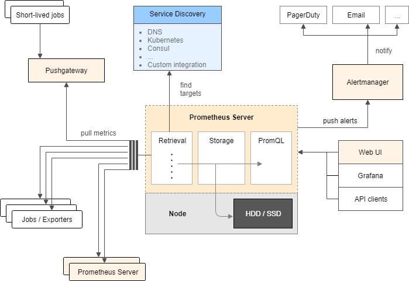

# 架构图



我们所说的安装Prometheus，指的是安装`prometheus server`这一部分

# 安装


## 二进制
下载地址： https://prometheus.io/download/
选择适合的版本和平台

安装非常简单，解压启动即可
```
wget https://github.com/prometheus/prometheus/releases/download/v2.13.1/prometheus-2.13.1.linux-amd64.tar.gz
tar -zxvf prometheus-2.13.1.linux-amd64.tar.gz
mv prometheus-2.13.1.linux-amd64 /usr/local/prometheus
```

## 启动
默认的启动加载的配置文件在Prometheus目录下的prometheus.yaml文件，当然也可用选项`--config.file=`来指定想要加载的配置选项

## docker
```
docker run --name prometheus -d -p 9090:9090 prom/prometheus
```

## 安装在kubernets中
参考：https://github.com/kubernetes/kubernetes/tree/master/cluster/addons/prometheus

# 监控方案
部署在外面的Prometheus通过联邦的模式进行对多个集群进行监控
https://www.kubernetes.org.cn/3418.html
